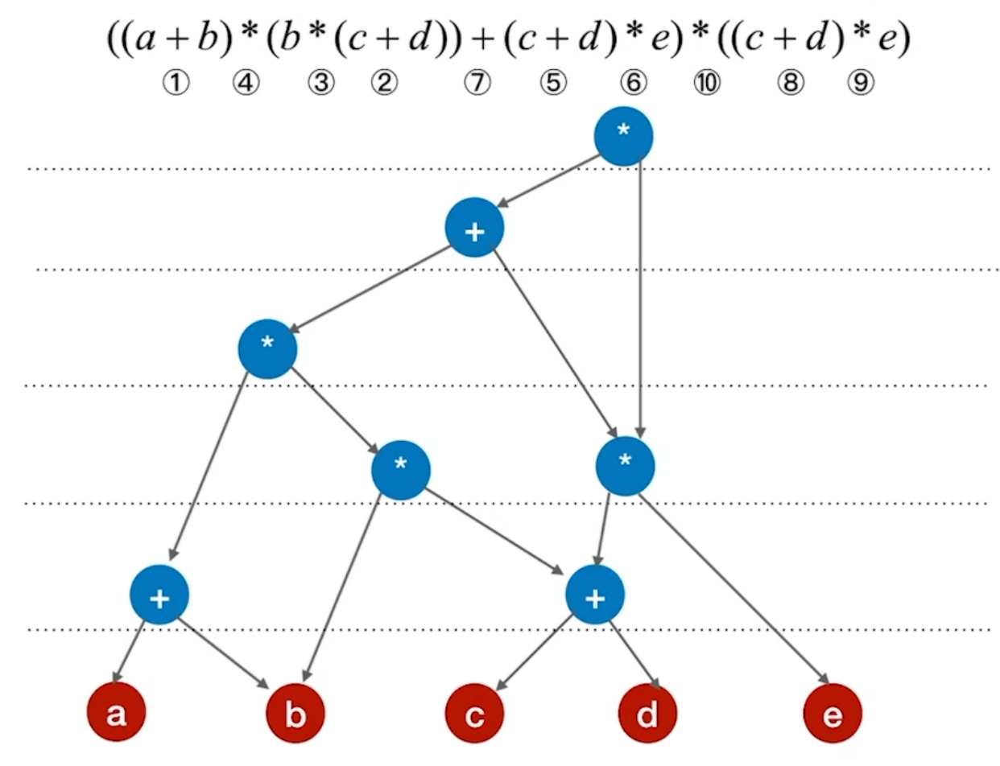

# 图

## 1 知识点

* 定义：图 $G$ 由顶点集 $V$ 和边集 $E$ 构成，记作 $G=(V，E)$
  * 树可以是空树，但顶点集 $V\neq\varnothing$。边集 $E$ 可以为 $\varnothing$
  * $\lvert V\rvert$ 表示顶点的个数，也称图的阶。$\lvert E\rvert$ 表示边的个数
* 基本术语
  * 有向图、无向图
    * 有向图的边带方向。有向边也称弧，弧是顶点的有序对，记为 $\langle a,b\rangle$
    * 无向图的边是双向的。边是顶点的无序对，记为 $(a,b)$
  * 简单图、多重图
    * 若图在两个顶点间不存在重复边，且无自环边，则为简单图。反正则为多重图
  * 顶点的度
    * 设 $n$ 为顶点的个数，$m$ 为边的个数
    * 无向图：顶点 $v$ 的度为依附于该顶点边的条数，记作 $\text{TD}(v)$。满足 $\sum^n_{i=1}{\text{TD}(v_i)}=2 m$
    * 有向图：顶点 $v$ 的度为该点的入度与出度之和，记作 $\text{TD}(v)=\text{ID}(v)+\text{OD}(v)$。入度为指向该点的边的条数，出度为该点指向别的点的边的条数。满足 $\sum^n_{i=1}{\text{ID}(v_i)}=\sum^n_{i=1}{\text{OD}(v_i)}=m$
  * 路径、回路
    * 路径：从顶点 $a$ 到顶点 $b$ 之间的顶点序列(或由顶点和相邻顶点序偶构成的边所形成的序列)
    * 回路：第一个和最后一个顶点相同的路径称为回路，也称环
    * 路径长度：路径上边的数量。$n$ 个顶点的图若有大于 $n-1$ 条边，则必有环
    * 距离：顶点 $a$ 到顶点 $b$ 之间的最短路径长度，不存在则为 $\infty$
    * 简单路径：路径中不出现重复顶点
    * 简单回路：除第一个和最后一个顶点外，路径中不再出现其他的重复顶点
  * 子图：对图 $G=(V，E)$，由顶点集 $V$ 的子集和边集 $E$ 的子集构成的合法的图称为 $G$ 的生成子图
  * 连通、强连通
    * 连通：无向图中从顶点 $a$ 到顶点 $b$ 的路径存在，则称顶点 $a$ 和顶点 $b$ 是连通的
    * 连通图：无向图中任意两个顶点连通，则称此图为连通图。否则为非连通图，非连通图至多有 $C^2_{n-1}$ 条边
    * 连通分量：无向图中的极大连通子图称为连通分量
    * 强连通：有向图中从顶点 $a$ 到顶点 $b$ 的路径、从顶点 $b$ 到顶点 $a$ 的路径同时存在，则称顶点 $a$ 和顶点 $b$ 是强连通的
    * 强连通图：有向图中任意两个顶点强连通，则称此图为强连通图。强连通图至少有 $n$ 条边(构成回路)
    * 强连通分量：有向图中的极大强连通子图称为强连通分量
  * 生成树、生成森林
    * 连通图的生成树是包含所有顶点的一个极小连通子图
      * 去掉一条边则变成非连通图
      * 增加一条边则出现一个环
    * 非连通图的生成森林是连通分量的生成树构成的森林
  * 完全图
    * 无向图：任意两个顶点间都存在边。称为完全图
    * 有向图：任意两个顶点间都存在方向相反的两条弧。称为有向完全图
    * ***连通图(强连通图)只要求连通(强连通)，即两个顶点间有路径能够达到，但不一定有直接的边(弧)相连。完全图则要求任意两个顶点间有直接边(弧)相连，条件比连通图(强连通图)更加严格***
* 存储
  * 邻接矩阵
    * 使用 $n$ 阶方阵 $A$ 存储图，其中，$n$ 为顶点个数

      $$
      A[i][j]=
      \begin{cases}
        w_{ij} &或 &1,&存在边\\
        0 &或 &\infty,&不存在边
      \end{cases}
      $$

      
  * 邻接表
    * 对每个顶点建立一个单链表，存储该顶点的 ***出边***
      
  * 十字链表
    * 顶点：`Vertex(data: Any, first_out_arc: Arc, first_in_arc: Arc)`
      * `data: Any`：顶点的数据
      * `first_out_arc: Arc`：指向以该顶点为弧尾的第一条弧，用于快速访问从该顶点出发的所有弧。
      * `first_in_arc: Arc`：指向以该顶点为弧头的第一条弧，用于快速访问指向该顶点的所有弧。
    * 弧：`Arc(tail_vertex_idx: int, head_vertex_idx: int, arc_weight: float, same_tail_next: Arc, same_head_next: Arc)`
      * `tail_vertex_idx: int`：弧尾顶点的索引，用于标识弧的起始顶点。
      * `head_vertex_idx: int`：弧头顶点的索引，用于标识弧的终止顶点。
      * `arc_weight: float`：弧的权重，用于存储弧的相关信息，如距离、成本等。
      * `same_tail_next: Arc`：指向具有相同弧尾的下一条弧，用于将所有具有相同弧尾的弧链接在一起，形成链表。
      * `same_head_next: Arc`：指向具有相同弧头的下一条弧，用于将所有具有相同弧头的弧链接在一起，形成链表。

      
  * 邻接多重表
    * 顶点：`Vertex(data: Any, first_edge: Edge)`
      * `data: Any`：顶点的数据，用于存储与顶点相关的信息，如顶点名称或其他属性。
      * `first_edge: Edge`：指向依附于该顶点的第一条边，用于快速访问从该顶点出发或指向该顶点的所有边。
    * 边：`Edge(vertex_i: int, vertex_j: int, edge_weight: float, i_next: Edge, j_next: Edge)`
      * `vertex_i: int`：弧依附的两个顶点的编号中的起始顶点编号。
      * `vertex_j: int`：弧依附的两个顶点的编号中的终止顶点编号。
      * `edge_weight: Any`：边的权重，存放该弧的相关信息，如权重、成本等。
      * `i_next: Edge`：指向依附于起始顶点 `vertex_i` 的下一条弧，用于将所有起始于同一顶点的弧链接在一起，形 成链表。
      * `j_next: Edge`：指向依附于终止顶点 `vertex_j` 的下一条弧，用于将所有终止于同一顶点的弧链接在一起，形成链表。

  * 总结

    | 存储方式 | 邻接矩阵 | 邻接表 | 十字链表 | 邻接多重表 |
    | - | -|-|-|-|
    | 空间复杂度 | $O(n^2)$ | 无向图：$O(n+2 m)$ </br> 有向图：$O(n+m)$ | $O(n+m)$ |$O(n+m)$ |
    | 找相邻边 | 遍历对应行或列的时间复杂度为 $O(n)$ | 找有向图的入度必须遍历整个邻接表 | 很方便 | 很方便 |
    | 删除边或顶点 | 删除边很方便，删除顶点需要大量移动数据 | 无向图中删除边或顶点都不方便 | 很方便 | 很方便 |
    | 适用于 | 稠密图 | 稀疏图和其他 | 只能存 ***有向图*** | 只能存 ***无向图*** |
    | 表示方式 | 唯一 | 不唯一 | 不唯一 | 不唯一 |

    其中，$n=\lvert V\rvert,m=\lvert E\rvert$
* 遍历
  * 广度优先遍历BFS
    * 使用队列实现，每次出队头结点并按顺序入队其相连结点
    * 广度优先生成树：按广度优先遍历产生的树
    * 使用邻接表的 $\text{BFS}$ 类似树的层次遍历
  * 深度优先遍历DFS
    * 使用栈实现，持续按顺序访问结点直至递归退出
    * 深度优先生成树：按深度优先遍历产生的树
    * 使用邻接表的 $\text{DFS}$ 类似树的先序遍历
    * ***可以判断有向图和无向图中是否存在环***
  * 图的连通性
    * 无向图：调用BFS或DFS的次数 $=$ 图的连通分量数
    * 有向图：若为强连通图或起始结点到其他结点均有路径，则只需要 $1$ 次
  * 总结

    ||BFS|DFS|
    |:-:|:-:|:-:|
    |时间复杂度|邻接矩阵：$O(n^2)$ </br> 邻接表：$O(n+m)$|邻接矩阵：$O(n^2)$ </br> 邻接表：$O(n+m)$|
    |空间复杂度|$O(n)$|$O(n)$|
    |表示方式|邻接矩阵：唯一 </br> 邻接表：不唯一|邻接矩阵：唯一 </br> 邻接表：不唯一|

    其中，$n=\lvert V\rvert,m=\lvert E\rvert$
* 应用
  * 最小生成树
    * $\text{Kruskal}$
      * 把边按边权升序排列
      * 每次选择一条边，若两端结点不在同一集合内则可以连接，否则不能连接(并查集)
      * 重复上一步，直至选出 $m - 1$ 条边
    * $\text{Prim}$
      * 选择一个初始结点作为初始子图 $G^{'}$
      * 从图 $G$ 中不在 $G^{'}$ 的结点中选出加入 $G^{'}$ 代价最小的结点进行连接
      * 重复上一步，直至选出 $m - 1$ 条边
    * 性质

      ||Kruskal|Prim|
      |:-:|:-:|:-:|
      |时间复杂度|$O(m\log_2{m})$|$O(n^2)$|

      其中，$n=\lvert V\rvert,m=\lvert E\rvert$
      * 若无向连通图中没有相同权值的边，则最小生成树唯一
      * 若无向连通图中有相同权值的边，但该图为树，则最小生成树也唯一。反之不唯一
      * 使用不同算法得到的图的最小生成树代价相等
  * 最短路
    * $\text{BFS}$
      * 以指定结点作起始结点，使用广度优先遍历
      * 使用`distance`和`path`数组记录最短路径和前驱结点下标
        * `distance: list[float]`：记录从指定结点开始的最短路长度
          * 初始化：`[infty] * n`
          * 遍历时：`distance[now] = distance[parent] + 1`
        * `path: list[int]`：记录从指定结点开始的最短路前驱
          * 初始化：`[-1] * n`
          * 遍历时：`path[now] = parent`
    * $\text{Dijkstra}$
      * 辅助数组定义
        * `final: list[bool]`：表示结点是否已处理得到最短路
        * `distance: list[float]`：表示从指定结点到目标结点的最短路长度
        * `path: list[int]`：表示当前结点的在最短路中的前驱结点
      * 流程
        * 初始化(设从结点 $v_0$ 开始)
          * `final[v] = True if vertex is v_0 else False`
          * `distance[v] = edge_weight[v_0][v]`
          * `path[v] = v_0 if dis != infty else -1`
        * $n-1$ 轮处理
          * 先找到满足`final[v_i] == Flase`且`distance`值最小的结点 $v_i$，设置`final[v_i] == True`
          * 再找到所有满足与 $v_i$ 一步邻接且`final[v_j] == False`的 $v_j$，判断`reslut = distance[v_j] > distance[v_i] + edge_weight[v_i][v_j]`
          * 若`result == True`，则更新`distance[v_j] = distance[v_i] + edge_weight[v_i][v_j]`，同时更新`path[v_j] = v_i`
          * 若`result == Flase`，则不进行任何操作
        * 循环上述操作，直至`final == [True] * n`
    * $\text{Floyd}$
      * 辅助数组定义
        * `A: list[list[float]]`：表示点到点的最短路长度
        * `path: list[list[int]]`：表示点到点的最短路前驱
      * 初始化
        * 初始为 $A^{-1},path^{-1}$。其中 $A^{-1}$ 为图初始情况的邻接矩阵，$path^{-1}$ 为元素全为 $-1$ 的 $n$ 阶方阵
      * 流程
        * 若 $A^{k-1}[i][j]>A^{k-1}[i][k]+A^{k-1}[k][j]$，则

          $$
          \begin{cases}
            A^{k}[i][j]=A^{k-1}[i][k]+A^{k-1}[k][j]\\
            path^k[i][j]=k
          \end{cases}
          $$

          以下为代码实现

          ```python
          for k in range(n):
            for i in range(n):
              for j in range(n):
                if A[i][j] > A[i][k] + A[k][j]:
                  A[i][j] = A[i][k] + A[k][j]
                  path[i][j] = k
          ```

    * 总结

      |特性|BFS|Dijkstra|Floyd|
      |:-:|:-:|:-:|:-:|
      |无权图|✔|✔|✔|
      |带权图|✖|✔|✔|
      |带负权值的图|✖|✖|✔|
      |带负权回路的图|✖|✖|✖|
      |时间复杂度|邻接矩阵：$O(n^2)$ </br> 邻接表：$O(n+e)$|$O(n^2)$|$O(n^3)$|
      |通常用于|求无权图的单源最短路径|求带权图的单源最短路径|求带权图中各顶点间的最短路径|

      其中，$n=\lvert V\rvert,m=\lvert E\rvert$
  * 有向无环图 $\text{DAG}$

    定义：不存在环的有向图
    * 构建表达式
      * 最底层排列操作数，注意操作数不能重复
      * 标出操作符的生效顺序，按生效顺序依次分层加入操作符
      * 自底向上合并具有两个相同操作数的同层操作符
        
    * 拓扑排序
      * 定义
        * $\text{AOV}$ 网：若使用有向无环图表示一个工程，其顶点表示活动，则使用有向边 $\langle V_i,V_j\rangle$ 表示活动 $V_i$ 必须先于 $V_j$ 进行。则将这种有向图称为“顶点表示活动的网络”，简称 $\text{AOV}$ 网
        * 拓扑排序：由一个  $\text{DAG}$ 的顶点组成的序列，满足 $\begin{cases}
          每个顶点只出现一次\\
          顶点次序满足 \text{AOV} 网中的次序
        \end{cases}$ 时称该序列为该 $\text{DAG}$ 的一个拓扑排序
        * 逆拓扑排序：使用与构建拓扑排序序列相反的方式获得的序列
      * 拓扑排序流程
        * 手算实现
          * 从 $\text{AOV}$ 网中选择一个入度为 $0$ 的顶点输出
          * 在网中删除该顶点及其出边
          * 重复上述步骤直至网空
        * 代码实现
          * 初始化一个普通队列，将 $\text{DAG}$ 中入度为 $0$ 的点入队
          * 每次出队队头顶点，逻辑上意味着删除了该顶点及其出边。重复上一步
          * 队空时则拓扑排序结束，拓扑排序序列即为出队顺序序列
      * 逆拓扑排序流程
        * 手算实现
          * 从 $\text{AOV}$ 网中选择一个出度为 $0$ 的顶点输出
          * 在网中删除该顶点及其入边
          * 重复上述步骤直至网空
        * 算法实现
          * 初始化一个普通栈，使用 $\text{DFS}$ 对 $\text{DAG}$ 进行遍历
          * 设置输出在递归下方，则得到的遍历序列即为逆拓扑排序序列
      * 性质
        * 拓扑序列、逆拓扑序列可能不唯一
        * 即使拓扑序列唯一，仍然不能唯一确定一个图
        * 必须是 $\text{DAG}$ 图才能进行拓扑排序，换句话说，有环的图不能进行拓扑排序。因此，拓扑排序可以检测图是否有环
        * 若使用邻接矩阵存储的图的拓扑排序序列有序，则邻接矩阵必为三角矩阵
    * 关键路径
      * 定义
        * $\text{AOE}$ 网：若使用有向无环图表示一个工程，其顶点表示事件，则使用有向边 $\langle V_i,V_j\rangle$ 表示活动，边权表示完成活动的开销。则将这种有向图称为“用边表示活动的网络”，简称 $\text{AOE}$ 网
          * 只有在顶点代表的事件发生后，从顶点出发的有向边代表的活动才能开始
          * 进入顶点的所有有向边代表的活动都完成时，该顶点代表的事件才能开始
        * 源点：$\text{AOE}$ 网中入度为 $0$ 的顶点
        * 汇点：$\text{AOE}$ 网中出度为 $0$ 的顶点
        * $\text{ES}$：事件的最早开始时间。事件 $k$ 的最早开始时间记作 $\text{ES}_k$
        * $\text{LS}$：事件的最晚开始时间。事件 $k$ 的最晚开始时间记作 $\text{LS}_k$
        * $a_k(\text{ES}_k,\text{LS}_k)$：活动的最早最晚开始时间
      * 流程
        * 正推：求所有事件的 $\text{ES}$
          * $\text{ES}_\text{源点}=0$
          * $\text{ES}_\text{next}=\max{(\text{ES}_\text{in}+\text{cost})}$
        * 逆推：求所有事件的 $\text{LS}$
          * $\text{LS}_\text{汇点}=\text{ES}_\text{源点}$
          * $\text{LS}_\text{prev}=\min{(\text{LS}_\text{out}-\text{cost})}$
        * 求活动的最早最晚开始时间

          设有向边 $\langle V_i,V_j\rangle$ 表示活动，$i,j$ 为事件，则活动的
          * 最早开始时间：$\text{ES}_i$
          * 最晚开始时间：$\text{LS}_j-\text{cost}$
          * 浮动时间：最晚开始时间 $-$ 最早开始时间。若浮动时间为 $0$，则该活动是关键活动
      * 性质
        * 关键路径是 $\text{AOE}$ 网中的最长路径
        * 关键路径不一定唯一，因此压缩工期时要同步压缩所有关键路径上的共享活动。此外压缩工期后，原本的关键路径可能变为非关键路径，非关键路径可能变成关键路径

## 2 题目

* 6.1习题
  * 01(路径)
  * 03(无向图遍历)
  * 05(完全图与连通图的区别)
  * 10(无向图最小连通边数)
  * 11(生成树)
  * 12(无向图连通分量)
  * 14(生成树个数)
  * 15(无向图生成森林)
* 6.2习题
  * 13(无向图建立邻接表时间复杂度)
  * 14(有向图删除顶点时间复杂度)
  * 15(有向图求入度时间复杂度)
* 6.3习题
  * 07(DFS)
  * 13(生成树)
* 6.4习题
  * 03(最小生成树)
  * 04(生成树)
  * 07(最短路)
  * 13(拓扑排序唯一性)
  * 14(拓扑排序唯一性)
  * 19(有序拓扑序列)
