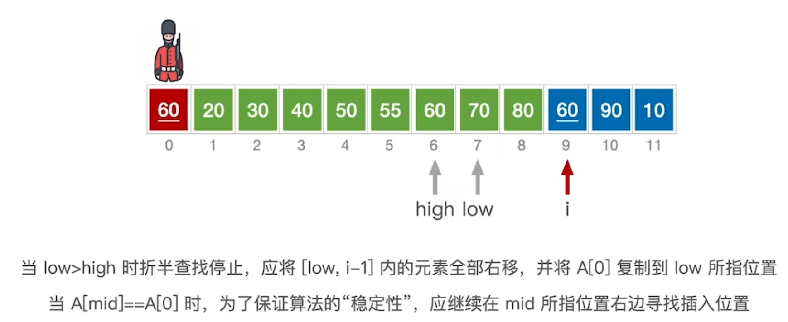
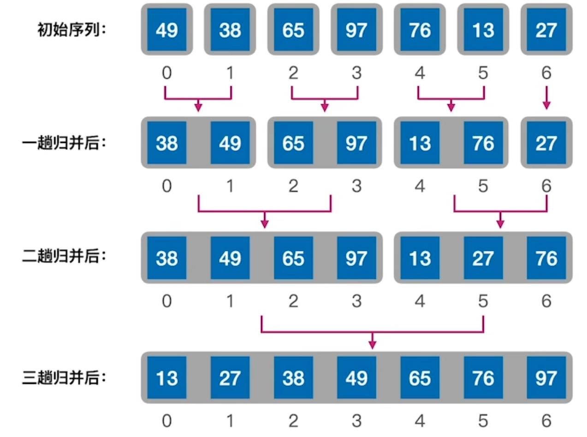
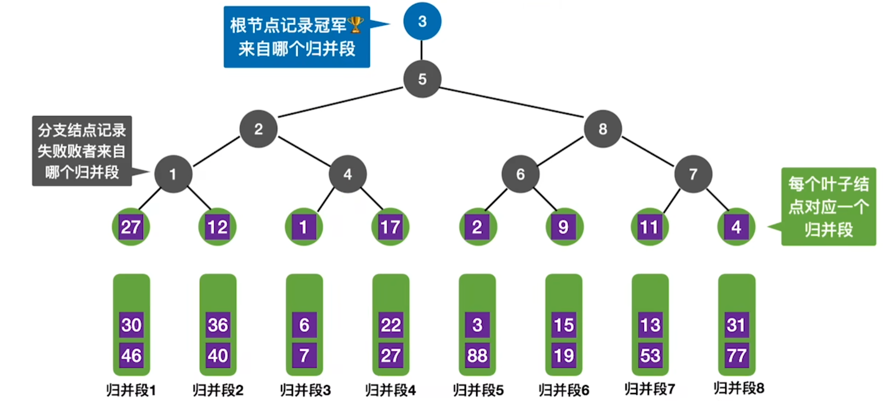
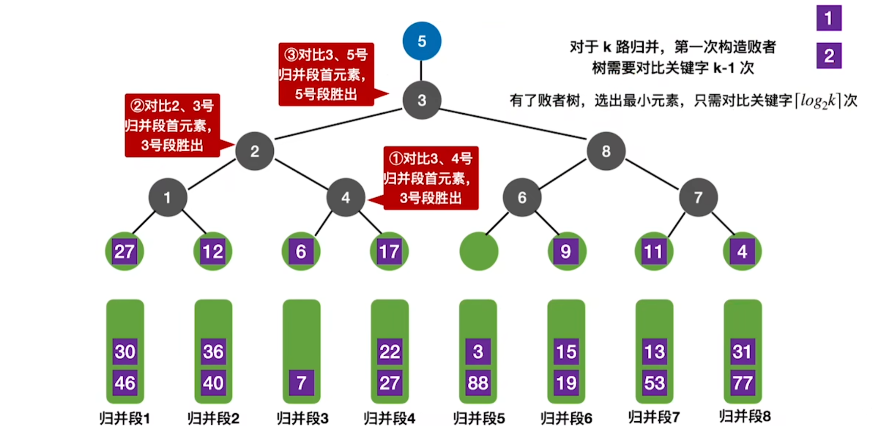
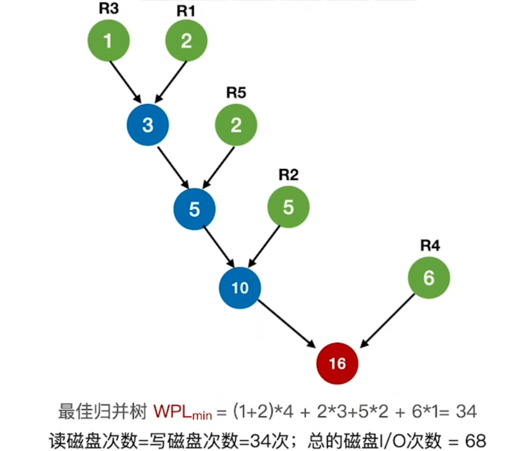
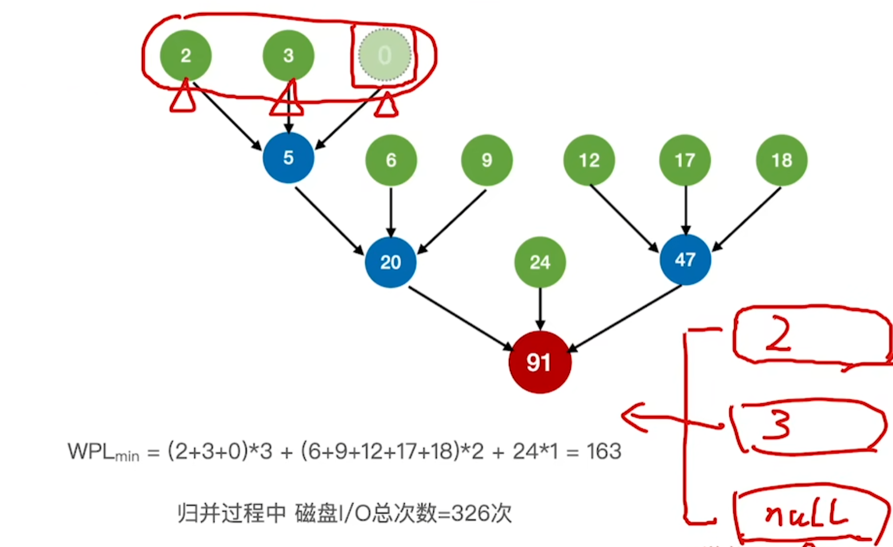

# 排序

## 1 知识点

* 内部排序：在内存中直接进行的排序，排序期间所有元素均在内存
* 外部排序：排序期间所有元素无法同时在内存中，必须在排序的过程中根据要求不断在内外存中移动
* 稳定性：若待排序表中有元素 $x_i=x_j(i<j)$。若在使用算法排序后 $x_i$ 仍在 $x_j$ 前面，则称算法稳定

### 1.1 插入排序

* 直接插入排序
  * 流程

    每次将一个待排序的关键字按顺序插入到前面已经排好序的序列中，直至全部关键字插入完成

    ```python
    # 按升序排序的直接插入排序实现
    def insert_sort(A: list[float]):
        # 设A[0]为第一个有序序列, 因此从A[1]开始操作
        for i in range(1, len(A)):
            # 如果前面的元素比现在的大
            if A[i - 1] > A[i]:
                # 先保存一下现在的元素
                temp = A[i]

                # 把前面所有比现在元素大的元素统一往后挪 1位
                # 只在A[j] > temp时才后移, 保证了稳定性
                j = i - 1
                while j >= 0 and A[j] > temp:
                    A[j + 1] = A[j]
                    j -= 1
                # 把现在的元素插入到合适的位置, A[0..i]构成一个有序序列
                # 当不满足while时表明A[j]<=temp, 此时j+1才是空位
                A[j + 1] = temp
    ```

  * 性能
    * 空间复杂度：$O(1)$
    * 时间复杂度
      * 最好：本来就有序
      * 最坏：原本完全逆序

      |最好|最坏|平均|
      |:-:|:-:|:-:|
      |$O(n)$|$O(n^2)$|$O(n^2)$|

    * 稳定性：稳定
    * 一趟：将第 $i$ 个元素插入到前 $i-1$ 个元素的有序序列中

* 折半插入排序
  * 流程

    在直接插入排序的基础上，使用折半插入找到现在元素应该插入的位置

    ```python
    # 按升序排序的折半插入排序实现
    def binary_insert_sort(A: list[float]):
        # 设A[0]为第一个有序序列, 因此从A[1]开始操作
        for i in range(1, len(A)):
            # 先保存一下现在的元素
            temp = A[i]

            # 折半查找A[0..i-1]中当前元素应该插入的位置
            low, high = 0, i - 1
            while low <= high:
                mid = (low + high) // 2
                if A[mid] > temp:
                    high = mid - 1
                # 等于时也将左界右移, 保证了稳定性
                else:
                    low = mid + 1

            # print(f'low={low}\thigh={high}')
            # print(A[:low+1], A[low:i], sep='\n')

            # 0............high, low............i-1............n-1
            #   有序序列     待插入位置   偏大序列     后续处理序列
            # A[low..i-1]就是比当前元素大的那一批, 统一后移
            # A[high + 1] == A[low], 这就是当前元素应该插入的位置
            for j in range(i - 1, low - 1, -1):
                A[j + 1] = A[j]
            # 把现在的元素插入到合适的位置, A[0..i]构成一个有序序列
            A[high + 1] = temp

            # print(A, end='\n\n')
    ```

    > 处理 $60$，将 $[low,i-1]$ 的元素后移一位，再在 $high+1$ 的位置插入本次处理的 $60$
    
  * 性能
    * 空间复杂度：$O(1)$
    * 时间复杂度
      * 最好：本来就有序
      * 最坏：原本完全逆序

      |最好|最坏|平均|
      |:-:|:-:|:-:|
      |$O(n)$|$O(n^2)$|$O(n^2)$|

    * 稳定性：稳定
    * 一趟：将第 $i$ 个元素插入到前 $i-1$ 个元素的有序序列中

    折半插入排序虽然比较次数是 $O(\log_2{n})$，比直接插入排序的比较次数 $O(n^2)$ 要好，但二者移动元素的次数都是 $O(n^2)$。再加上直接插入排序是顺序访问，对 $\text{CPU}$ 指令流水线的分支预测和 $\text{Cache}$ 的缓存预测更加友好，而不是像折半插入排序一样`mid`可能到处跳。因此总的来说折半插入排序提升并不明显

* 希尔排序
  * 流程

    使用变化增量 $\Delta d$ 来划分子表，每次在每个子表内进行 ***直接插入排序***

    ```python
    # 按升序排序的希尔排序实现
    def shell_sort(A: list[float]):
        # 初始步长
        d = len(A) // 2

        while d >= 1:
            # 从步长d开始遍历. 因为插入排序是从第2个逻辑元素开始的, 第一个逻辑元素下标是0
            # 每个子表对应物理下标第一个是0 + i, 第二个是i + d
            # i是1步长递增的, 并发地处理每个子表
            for i in range(0 + d, len(A)):
                temp = A[i]

                # 当前子表中当前元素的前驱. 插入排序为 d = 1时的处理, 推广到 j = i - d
                j = i - d
                # 直接插入查找
                while j >= 0 and A[j] > temp:
                    A[j + d] = A[j]
                    j -= d

                # 插入当前元素
                A[j + d] = temp

            # 减小步长
            d //= 2
    ```

  * 性能
    * 空间复杂度：$O(1)$
    * 时间复杂度

      |最好|最坏|平均|
      |:-:|:-:|:-:|
      |$O(?)$|$O(n^2)$|$O(n^{1.3})$|

    * 稳定性：不稳定
    * 一趟：以当前增量 $d$ 将数组划分为 $d$ 个子表，对所有子表都独立进行插入排序

### 1.2 交换排序

* 冒泡排序
  * 流程

    元素间两两比较交换，每次确定一个最值元素的最终位置，最多循环 $n-1$ 趟即可完成排序

    ```python
    # 按升序排序且从前往后的冒泡排序实现
    def bubble_sort_from_start(A: list[float]):
        # 外层循环控制趟数
        for i in range(len(A) - 1):
            # 标志位, 用于判断是否发生交换
            exchange_occur = False

            # 内层循环进行两两比较和交换
            # 外层每跑一趟, 最后都会增加 1个最大的元素. 所以最后 i个元素有序, 不用比较
            for j in range(len(A) - 1 - i):
                # 前>后, 交换
                if A[j] > A[j + 1]:
                    A[j], A[j + 1] = A[j + 1], A[j]
                    # 发生了交换, 更新标志位
                    exchange_occur = True
            
            # 如果这趟没有发生交换, 说明数组已经有序, 提前退出
            if not exchange_occur:
                break

    # 按升序排序且从后往前的冒泡排序实现
    def bubble_sort_from_end(A: list[float]):
        # 外层循环控制趟数
        for i in range(len(A) - 1):
            # 标志位, 用于判断是否发生交换
            exchange_occur = False

            # 内层循环进行两两比较和交换
            # 外层每跑一趟, 前面都会增加 1个最小的元素. 所以前面 i个元素有序, 不用比较
            for j in range(len(A) - 1, i, -1):
                # 前>后, 交换
                if A[j - 1] > A[j]:
                    A[j - 1], A[j] = A[j], A[j - 1]
                    # 发生了交换, 更新标志位
                    exchange_occur = True
            
            # 如果这趟没有发生交换, 说明数组已经有序, 提前退出
            if not exchange_occur:
                break
    ```

  * 性能
    * 空间复杂度：$O(1)$
    * 时间复杂度
      * 最好：本来就有序。内循环对比 $n-1$ 次直接结束算法，交换 $0$ 次
      * 最坏：原本完全逆序。对比次数 $=$ 交换次数 $=3\times$ 移动次数 $=(n-1)+(n-2)+\cdots+1=\dfrac{n(n-1)}{2}$。每次交换元素需要借助`temp`移动 $3$ 次

      |最好|最坏|平均|
      |:-:|:-:|:-:|
      |$O(n)$|$O(n^2)$|$O(n^2)$|

    * 稳定性：稳定
* 快速排序
  * 流程

    每次选取一个枢轴元素确定其最终位置，该元素左边区间内均小于它，右边区间内均大于大，再对枢轴元素两侧区间递归进行上述操作</br>

    ***将待排序序列与排序后的序列对比可以确定算法进行了几次划分(或几趟)***</br>

    ***一次划分：执行一次`partition()`函数，归位一个元素***</br>
    ***一趟排序(408定义)：对所有尚未确定最终位置的元素进行一遍处理，至少归位一个元素。具体有 2种情况：***
    * 第一趟归位元素`a`，若`a`在数组首端或末尾，则第二趟只对**剩下的所有元素组成的一个区间**处理，再归位一个元素`b`。前两趟共计归位 $2$ 个元素
    * 第一趟归位元素`a`，若`a`在数组中间，则第二趟对**剩下的所有元素组成的在`a`两端的左右两个区间**处理，第二趟归位元素`b, c`。前两趟共计归位 $3$ 个元素

    </br>

    ```python
    # 按升序排序的快速排序实现
    def quick_sort(A: list[float], low: int, high: int) -> None:
        # 当前区间有至少 2个元素. 1个元素或倒区间(low>high)没必要划分了
        if low < high:
            # 找到当前区间的枢轴元素下标
            pivot_idx = partition(A, low, high)
            # 递归处理枢轴元素左右区间
            quick_sort(A, low = low, high = pivot_idx - 1)
            quick_sort(A, low = pivot_idx + 1, high = high)

    # 划分函数
    def partition(A: list[float], low: int, high: int) -> int:
        # 保存枢轴元素, 在 low处挖坑
        pivot = A[low]

        # low和 high没相遇, 相遇说明当前区间扫描完毕
        while low < high:
            # 找到右区间第一个小于pivot的元素, 填到上一步在 low剩的坑, high就剩出来一个坑
            # 不带等号在遇到 A=[1, 1, 1]这样的重复列表会死循环. 下同
            while A[high] >= pivot and low < high:
                high -= 1
            A[low] = A[high]

            # 找到左区间第一个大于pivot的元素, 填到上一步在 high剩的坑, low就剩出来一个坑
            while A[low] <= pivot and low < high:
                low += 1
            A[high] = A[low]

        # 区间扫描完毕, 此时 low==high, 这个坑给 pivot归位
        A[low] = pivot
        return low
    ```

  * 性能
    * 空间复杂度

      $d$ 为递归深度，等价于将待排序数组转化为二叉树后的高度 $\lceil\log_2{(n+1)}\rceil\leq h\leq n$

      |最好|最坏|平均|
      |:-:|:-:|:-:|
      |$O(\log_2{n})$|$O(n)$|$O(d)$|

    * 时间复杂度

      |最好|最坏|平均|
      |:-:|:-:|:-:|
      |$O(n\log_2{n})$|$O(n^2)$|$O(n d)\xrightarrow{接近}O(n\log_2{n})$|

      待排序序列基本有序时最不利于快排发挥其长处

    * 稳定性：不稳定
    * 递归次数与每次划分是否平衡有关，划分后左右分区的长度差越小，递归次数越少，反之越多

### 1.3 选择排序

* 简单选择排序
  * 流程

    每次在待排序序列中选取一个最值元素加入序列一端的有序子序列</br>

    ```python
    # 按升序排序的简单选择排序实现
    def simple_select_sort(A: list[float]):
        # 只需处理前 n-1个元素, 最后一个元素必然是最大值
        for i in range(len(A) - 1):
            # 本趟的最小元素下标
            min_idx = i

            # 从[i+1:]序列中搜索最小元素
            for j in range(i + 1, len(A)):
                if A[j] < A[min_idx]:
                    min_idx = j

            # 搜索到最小元素了, 与当前元素交换
            if i != min_idx:
                A[i], A[min_idx] = A[min_idx], A[i]
    ```

  * 性能
    * 空间复杂度：$O(1)$
    * 时间复杂度：$O(n^2)$
      * 比较次数 $=(n-1)+(n-2)+\cdots+1=\dfrac{n(n-1)}{2}$，**与初始排列顺序无关**
    * 稳定性：不稳定
    * $n$ 个元素只需要 $n-1$ 趟
* 堆排序
  * 流程

    在 **完全二叉树** 的基础上使用 **大顶堆(根>左右子树)** 或 **小顶堆(根<左右子树)** 实现的排序 </br>

    ```python
    # 调整大顶堆
    def heap_adjust(A: list[float], root_idx: int, remain_length: int) -> list[float]:
        # 保存一下当前待调整的根元素
        temp = A[root_idx]

        # k的左孩子
        left_child_idx = 2 * root_idx + 1
        # 下一步可能下坠到的根节点
        next_root_idx = left_child_idx
        # 确保下坠过程不越界
        while next_root_idx < remain_length:
            # 找出最大的孩子, 同时也可能是下一步下坠到的根结点
            right_child_idx = left_child_idx + 1
            if right_child_idx < remain_length and A[right_child_idx] > A[left_child_idx]:
                next_root_idx = right_child_idx

            # 已经是大顶堆了, 不需要调整
            if temp >= A[next_root_idx]:
                break
            # 把大的孩子换到当前的根结点上, 同时当前的根下坠到孩子那
            else:
                A[root_idx] = A[next_root_idx]
                root_idx = next_root_idx

                # 更新 next_root_idx, 初始仍以 root_idx的左孩子作为下次可能的下沉结点
                left_child_idx = 2 * root_idx + 1
                next_root_idx = left_child_idx

        # 下沉后最终找到的符合当前元素的根位置, 把元素放入
        A[root_idx] = temp
        return A

    # 构建大顶堆
    def build_max_heap(A: list[float]) -> list[float]:
        # 倒着处理 [0, n//2-1]区间的分支节点
        for i in range(len(A) // 2 - 1, -1, -1):
            A = heap_adjust(A, i, len(A))

        return A

    # 使用大顶堆按升序排序的堆排序实现
    def heap_sort(A: list[float]) -> list[float]:
        A = build_max_heap(A)

        # 倒着处理 [1, n-1]区间的分支节点, 0不用处理, 因为后边的都处理完后, 0自然也有序了
        for i in range(len(A) - 1, 0, -1):
            # 0是大顶堆的根, 每次把这个最大的元素放到待排序序列的最后
            A[0], A[i] = A[i], A[0]
            # 重新构建大顶堆, 使 A[0]仍然是待排序序列中最大的元素
            A = heap_adjust(A, 0, i)
            """
            - 重点解释

            remain_length = i, 这样每次就会缩减待排序序列的长度
            因为每次都会把待排序序列中最大的一个元素放到最后, 因此最后 i个元素就是有序序列, 后续就不需要处理了
            下一次只需要处理 A[0:i](即 A[0..i-1])这个待排序序列
            """

        return A
    ```

    > ***大顶堆排序流程***
    >
    > 首先对待排序数组倒着将分支结点建堆
    >
    > 随后遍历 $n-1$ 次，因为最后一次只剩 $1$ 个元素，没必要操作了
    >
    > 每次遍历我们将堆顶最大的元素放到数组最后，就像冒泡一样沉底，然后用最省事的方法——取堆底元素补——此时的堆底元素不再是数组的最后一个元素，而是倒数第 $i$ 个元素，因为最后 $i$ 个元素已经有序不需要排了。补完后按下沉的方法维护堆
    >
    > 重复该操作，知道最大的 $n-1$ 个元素全部归位，自热最小的元素在堆顶。堆排序结束
    >
    > $$
    > \boxed{\begin{aligned}
    >   &\text{堆排序 = 建堆 + 重复“交换-缩小-下沉”} \\
    >   &\text{核心在于：} \\
    >   &\quad \text{① 自底向上建堆保证结构正确；} \\
    >   &\quad \text{② 用堆底元素填补堆顶，安全高效；} \\
    >   &\quad \text{③ 下沉操作局部修复，维持堆序。}
    > \end{aligned}}
    > $$

  * 堆的插入删除
    * 插入
      * 插入新元素先放到堆底，即顺序表末尾
      * 将新元素与其父节点对比，若不满足大顶堆(或小顶堆)的定义，则交换两个结点
      * 继续向上比较直至堆符合定义
    * 删除
      * 删除当前结点，并将堆底元素放到当前结点的位置
      * 先比较一次获得最大(或最小)孩子，将放过来的堆底元素与其最大(或最小)的孩子比较，若不满足大顶堆(或小顶堆)的定义，则与最大(或最小)的孩子交换，下坠到下一层
      * 继续向下比较直至堆符合定义
    * 说明
      * 建堆操作只操作分支结点是因为叶结点没有孩子，所以天然满足大顶堆；从后往前操作分支节点是为了先确保下层子树是大顶堆，这样上层的结点下沉时才能继续按大顶堆的性质操作。否则先操作前边的结点可能出现后边的结点(即下层的子树)根本不是大顶堆的情况，自然不能接着按大顶堆的性质去下沉
      * 删除结点取最后一个结点是因为不能随便取结点补，如果取到中间结点或子树的根节点，会导致堆不再满足完全二叉树的定义(出现空洞或者一度结点)，同时维护操作也极其麻烦。因此，直接使用长度`len - 1`索引取堆底结点最省事，而且删除它也不会导致堆不满足完全二叉树的问题，只需要再对堆顶下沉维护一次即可
  * 性能
    * 空间复杂度：$O(1)$
    * 时间复杂度：$O(n\log_2{n})=O_{建堆}(n)+O_\text{排序}(n\log_2{n})$
      * 建堆：$O_\text{建堆}(n)$
        * 一个结点每下沉一层，如果有两个孩子，需要对比 $2$ 次(左右孩子、结点与最大孩子)，否则只需要对比 $1$ 次(结点与孩子)
        * 若树高 $h$，结点在第 $i$ 层，最多下沉 $h-i$ 层
        * $n$ 个结点的完全二叉树高 $h=\lceil\log_2{(n+1)}\rceil$
        * 第 $i$ 层最多有 $2^{i-1}$ 个结点，下沉只会发生在前 $h-1$ 层(叶结点不能下沉了)
        * 综上，建堆时的关键字比较次数为

          $$
          \sum^1_{i=h-1}{2^{i-1}\cdot2(h-i)}=\sum^1_{i=h-1}{2^h(h-i)}\xlongequal{令k=h-i}\sum^{h-1}_{k=1}{2^{h-k}k}\leq2 n\sum^{h-1}_{k=1}{\dfrac{k}{2^k}}\leq4 n
          $$

          即 $O_{建堆}=O(4 n)=O(n)$
      * 调整堆：$O_\text{调整}(\log_2{n})$
        * 单次调整最多 $h-i$ 层，且 $h=\lceil\log_2{(n+1)}\rceil$，因此时间复杂度为 $\log_2{n}$ 级
        * 一共要调整 $n-1$ 次，因此排序的时间复杂度是 $O_{排序}(n\log_2{n})$

    * 稳定性：不稳定

### 1.4 归并排序、基数排序、计数排序

* 归并排序
  * 流程

    $k$ 路归并每次将 $k$ 个有序数组合并为 $1$ 个，合并时每步选取这 $k$ 个数组中最小的元素</br>

    ```python
    # 合并两个区间
    def merge(A: list[float], low: int, mid: int, high: int):
        # 开一个辅助数组
        temp = [0] * (high - low + 1)

        # i：第一个区间指针
        # j：第二个区间指针
        # k：辅助数组指针
        i, j, k = low, mid + 1, 0

        # 合并两个有序子数组到临时数组中
        # 两个子区间都没合并完
        while i <= mid and j <= high:
            # 第一个子区间的值更小, 写到辅助数组里
            # 等号保证稳定性, 第一个子区间本就在前, 遇到相等的元素仍可保持在前
            if A[i] <= A[j]:
                temp[k] = A[i]
                i += 1
            else:
                temp[k] = A[j]
                j += 1
            k += 1

        # 其中一个区间扫描完了, 将另一个区间的剩余元素直接添加到临时数组中
        while i <= mid:
            temp[k] = A[i]
            i += 1
            k += 1
        while j <= high:
            temp[k] = A[j]
            j += 1
            k += 1

        # 将临时数组中的元素复制回原数组
        for i in range(low, high + 1):
            A[i] = temp[i - low]

    # 按升序排序的归并排序实现
    def merge_sort(A: list[float], low: int, high: int):
        # 最终切分成单个的元素, 再二路归并回来
        if low < high:
            # 划分区间递归排序
            mid = (low + high) // 2
            # 使 [low,mid]区间有序
            merge_sort(A, low, mid)
            # 使 [mid+1,high]区间有序
            merge_sort(A, mid + 1, high)
            # 合并[low,mid]与[mid+1,high]
            merge(A, low, mid, high)
    ```

    

  * 性能
    * 空间复杂度：$O(n)$
      * 受辅助数组长度、递归栈帧影响，但辅助数组空间复杂度是高阶的
    * 时间复杂度：$O(n\log_2{n})$
      * 把归并过程看作倒着的树，$n$ 个元素的归并趟数 $=\lceil\log_2{n}\rceil$
      * $k$ 路归并每次需要比较关键字 $k-1$ 次
    * 稳定性：稳定
* 基数排序
  * 流程
    * 将待排序关键字拆分为 $k$ 组(或位.E.g.3位数排序 $k=3$)，每组可能取得 $r_{k_i}$ 个不同的值
    * **从最低有效位开始，到最高有效位结束**，做 $k$ 趟分配和收集，第 $k$ 次建立 $r_{k_i}$ 个队列
      * 分配：扫描一遍关键字，入队与之相同的本组队列(E.g.3位数排序，个位时`981`放入`队列1`，十位时放入`队列8`)
      * 收集：分配完后，按与排序顺序相同的顺序把各个队列的元素出队并链接，进入下一趟
  * 性能
    * 空间复杂度：$O(r)$
    * 时间复杂度：$O\big(k(n+r)\big)$
    * 稳定性：稳定
  * 性质
    * ***基数排序不需要元素间比较大小***
    * 不仅可以按位分，也可以按组分，比如年月日、身份证号码
    * 适合处理 $k,r$ 较小，$n$ 较大的情况。该情况下显著优于 $O(n\log_2{n})$
* 计数排序
  * 流程

    利用辅助数组统计待排序数组中元素的出现次数，并计算前缀和，对应该元素在有序序列中的位置</br>

    ```python
    # 按升序排序的计数排序实现
    def counting_sor(A: list[float]) -> list[float]:
        # 求最大值确定辅助数组空间
        max_val = max(A)
        count = [0] * (max_val + 1)

        # 统计每个元素出现的次数
        for num in A:
            count[num] += 1

        # 构建前缀和数组(<=x 的元素个数)
        for i in range(1, len(count)):
            count[i] += count[i - 1]

        # 初始化输出数组
        sorted_A = [0] * len(A)

        # 倒序遍历原数组, 保证稳定性
        # 若前缀和只统计<x的元素个数, 则此处应正序遍历保证稳定性
        for num in A[::-1]:
            # 前缀和减 1, 既对应 sorted_A中的下标, 也表示消耗一个次数去排序
            # count[num]将会指到下一次插入 num的地方
            count[num] -= 1
            sorted_A[count[num]] = num

        return sorted_A
    ```

  * 性能
    * 空间复杂度：$O(n+k)$

      `A`的长度为 $n$，辅助数组`count`的长度为 $k$

      * 若 $k=O(n)$，则空间复杂度为 $O(n)$
      * 若 $k>O(n\log_2{n})$，则空间复杂度 $>O(n\log_2{n})$
      * 空间换时间，$k$ 较小时可以考虑用计数排序
    * 时间复杂度：$O(n+k)$
    * 稳定性：稳定

### 1.5 外部排序

* 多路归并
  * 流程
    * 进行 $k$ 路归并，在内存中分配 $k$ 个输入缓冲区和 $1$ 个输出缓冲区
    * 初始生成 $r$ 个归并段(内部排序成有序的初始归并段)，然后做 $s$ 次 $k$ 路归并
      * 每次读入 $k$ 个归并段到输入缓冲区
      * 用归并排序的方式挑选最小值放到输出缓冲区。当某个输入缓冲区空时，使用同一个归并段的下一块内容填充
      * 输出缓冲区满时则写回到外存
  * 性质
    * 若有 $N$ 个记录，内存工作区可容纳 $L$ 个记录，则初始生成个归并段数量 $r=\dfrac{N}{L}$
    * 多路归并花费时间 $=$ 外存 $\text{IO}$ 时间 $+$ 内部排序时间 $+$ 内部归并时间
    * $k$ 路归并趟数 $s=\lceil\log_k{r}\rceil$
      * 趟数优化方案 $1$：减少 $r$
      * 趟数优化方案 $2$：增加 $k$。但会带来内存缓冲区需求增大、每次归并选最小元素需要比较 $k-1$ 次的代价
* 败者树
  * 流程

    ***用于减少 $k$ 路归并时的元素比较次数***，第一次归并会创建败者树，后续归并将减少归并比较次数</br>

    > 第一次需要比较 $k-1$ 次构建初始败者树，并选出最小元素 $1$
    > 
    >
    > 第二次让归并段 $3$ 的下一个元素 $6$ 补上，与沿途败者PK决出新败者，胜者即为本次归并的最小元素。本次比较次数不超过 $\lceil\log_2{k}\rceil$
    > 
  * 性质
    * 败者树是完全二叉树
    * 第一个归并需要比较 $k-1$ 次，后续归并最多只需要比较 $\lceil\log_2{k}\rceil$ 次
    * $\lceil\log_2{k}\rceil$ 为败者树分支结点的高度，由 $k\geq2^{h-1}$ 得到。表示最底层的 $k$ 个叶子结点数不低于完全二叉树的叶子层结点数
* 置换—选择排序
  * 流程

    ***置换—选择排序用于减少 $k$ 路归并时初始归并段数量***</br>

    设 $\text{FI}$ 为初始待排序文件，$\text{FO}$ 为初始归并段输出文件，$\text{WA}$ 为内存工作区，可容纳 $w$ 个记录。$\text{FO}$ 和 $\text{WA}$ 初始状态为空

    * 从 $\text{FI}$ 输入 $w$ 个记录到工作区 $\text{WA}$。
    * 从 $\text{WA}$ 中选出其中关键字取最小值的记录，记为 $\text{MINIMAX}$ 记录。
    * 将 $\text{MINIMAX}$ 记录输出到 $\text{FO}$ 中去。
    * 若 $\text{FI}$ 不空，则从 $\text{FI}$ 输入下一个记录到 $\text{WA}$ 中。
    * 从 $\text{WA}$ 中所有关键字比 $\text{MINIMAX}$ 记录的关键字 **大** 的记录中选出 **最小** 关键字记录，作为新的 $\text{MINIMAX}$ 记录。
    * 重复上述步骤 $3$ 至 $5$，直至在 $\text{WA}$ 中选不出新的 $\text{MINIMAX}$ 记录为止，由此得到一个初始归并段，输出一个归并段的结束标志到 $\text{FO}$ 中去。
    * 重复上述步骤 $2$ 至 $6$，直至 $\text{WA}$ 为空。由此得到全部初始归并段。
  
  * 性质
  
    对任意工作区容量 $w$，若记录数量 $n>>m$，则初始归并段最长为 $n$(完全升序)，最短为 $w$(完全降序)

* 最佳归并树
  * 流程

    ***最佳归并树用于减少 $k$ 路归并时的 $\text{IO}$ 次数，本质就是构建 $k$ 叉哈夫曼树***</br>

    每个初始归并段视作一个叶结点(即 $0$ 度结点)，归并段内的块数作为其叶子的权值，计算是否需要补充虚段。随后构建严格 $k$ 叉哈夫曼树，即为最佳归并树

    > $5$ 个结点构造 $2$ 叉哈夫曼树：初始结点数量足够，即 $(5-1)\bmod(2-1)=0$，不需要补充虚段，直接构建 $2$ 叉哈夫曼树
    > 
    >
    > $8$ 个结点构造 $3$ 叉哈夫曼树：初始结点数量不够，即 $(8-1)\bmod(3-1)=1$，需要补充 $(3-1)-1$ 个虚段，补充完后构建 $3$ 叉哈夫曼树
    > 

  * 性质
    * 归并过程的 $\text{IO}$ 次数 $=2\times\text{WPL}$
    * $k$ 叉归并树一定是严格 $k$ 叉树，其中只有 $0$ 度结点和 $k$ 度结点，可得

        $$
        \begin{cases}
          n=n_0+n_k\\
          n=0\cdot n_0+k\cdot n_k
        \end{cases}
        \Rightarrow
        n_k=\dfrac{n_0-1}{k-1}
        $$
      * 若 $(n_0-1)\bmod(k-1)=0$，则不需要补充虚段
      * 若 $(n_0-1)\bmod(k-1)=u\neq0$，**则需要补充 $(k-1)-u$ 个权值为 $0$ 的虚段去构建哈夫曼树**

## 2 题目

### 2.1 选择

* 8.3 习题
  * 07(可能的快速排序排序结果)
  * 10(快速排序快慢)
  * 17-18(快速排序一趟)
* 8.4 习题
  * 06(堆插入删除时间复杂度)
  * 09(堆层次遍历)
* 8.5 习题
  * 03(空间复杂度)
  * 05(时间复杂度)
  * 07(比较次数)
  * ***11(稳定性、有效位权重)***
* 8.6 习题
  * 09(比较次数最少的排序方法)
  * 10(初始序列不同时总比较次数)
  * 11(查找效率最低的数据结构)
  * 12(并行化排序算法)
* 8.7 习题
  * 03(多路平衡归并作用)
  * 06(并行化多路归并)

### 2.2 大题

* 8.3习题
  * ***04(快排分治思想求划分区间问题)***
* 8.4习题
  * ***08(top-K问题)***
* 8.5习题
  * ***03(计数排序思想)***
* 8.7习题
  * ***05(置换选择排序、置换选择排序初始段最大最小长度)***
