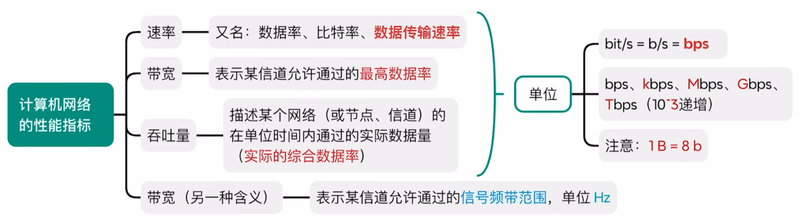

# 绪论

## 1 知识点

### 1.1 概述

* 概念

  

  * 家用路由器通过交换机将手机、电脑、电视等连接到同一个计算机网络中，再通过路由器连接到外部的互连网

  

  

* 分类

  

  

  

  * 以太网集线器：物理上是星形拓扑，逻辑上是总线形结构
  * 以太网交换机：物理上是星形拓扑，逻辑上也是星形拓扑

* 指标

  

  

  

  * 计算机网络中`K`、`M`、`G`等单位为 $10^k$，区别计组操作系统的 $2^k$

  

  

  

  * **分组传输的总时间是流水线模型，切记不是简单的总时延乘分组个数**

  

  

  

* 电路交换、报文交换、分组交换

  

  

  

  

  

  

### 1.2 计算机网络体系结构

* 计算机网络分层结构

  

  

  

  

  

* $\text{OSI}$ 模型

  

  * 功能
    * 数据链路层
      * **差错控制**：检错并纠错，或检错并丢弃要求重传
      * **流量控制**：协调相邻两个结点的传输速率
    * 网络层
      * 路由选择：构造并维护路由表，决定分组到达目的节点的最佳路径
      * 分组转发：将分组从合适的端口转发出去
      * 拥塞控制：发现网络拥塞，并采取措施缓解拥塞
      * 网际互联：实现异构网络互联
      * 其他功能：**差错控制、流量控制(整个网络的流量控制)**、连接建立与释放(确定分组不重复有序到达)、可靠传输管理(接收方需返回确 认信息)
    * 传输层(实现进程间端到端的通信，端指端口)
      * 复用和分用：发送端几个高层实体复用一条低层的连接，在接收端再进行分用
      * 其他功能：**差错控制、流量控制(端到端的流量控制)**、连接建立与释放、可靠传输管理
    * 会话层
      * 会话管理：采用检查点机制，当通信失效时从检查点继续恢复通信
    * 表示层
      * 数据格式转换：编码转换(如`GBK`与`UTF-8`)、压缩解压、加密解密
  * 因为局部正确不能确保整体正确，因此数据链路层、网络层、传输层都要实现差错控制和流量控制
  * 集线器：物理层；交换机：数据链路层；路由器：网络层
  * 服务访问点 $\text{SAP}$

    在同一系统中相邻两层的实体交换信息的逻辑接口称为服务访问点 $\text{SAP}$，$N$ 层的 $\text{SAP}$ 是 $N+1$ 层访问 $N$ 层服务的地方。$\text{SAP}$ 用于区分不同的服务类型。在 $5$ 层体系结构中有
    * 数据链路层的服务访问点为帧的“类型”字段
    * 网络层的服务访问点为 $\text{IP}$ 数据报的“协议”字段
    * 传输层的服务访问点为“端口号”字段
    * 应用层的服务访问点为“用户接口”

  

  * 从上到下要分段，从下到上要重装

* $\text{TCP/IP}$ 模型

  

  

  

  * $\text{OSI}$ 采用所有局部正确以保证整体正确的方式，所以数据链路层、网络层、传输层都要实现差错控制和流量控制；但 $\text{TCP/IP}$ 采用整体正确则局部就正确的方式，只在传输层实现差错控制、流量控制，底层只管分段通信，最后重装到传输层再检错

## 2 题目

* 1.1习题
  * ***14(链路数量与流水线画图)***
* 1.2习题
  * 01(网络模型只定义不实现)
  * ***16(物理层不会对数据封装)***
  * 17(传输层)
  * 26(服务访问点)
  * 31(应用层邻层)
