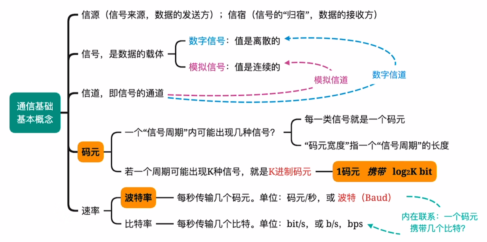
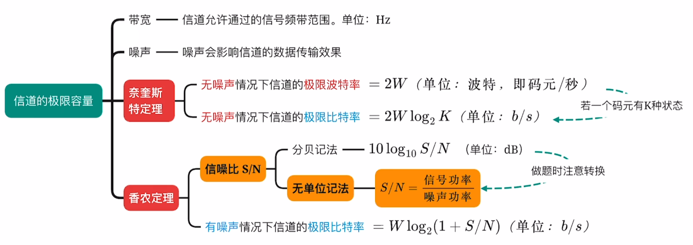
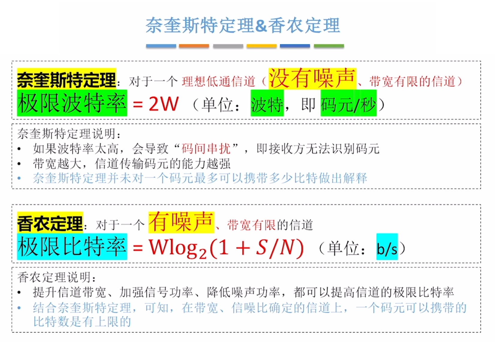
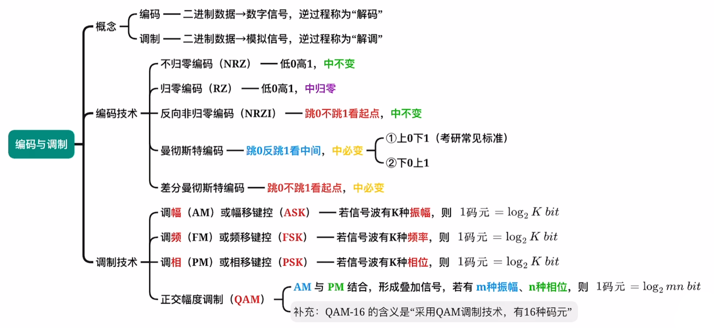
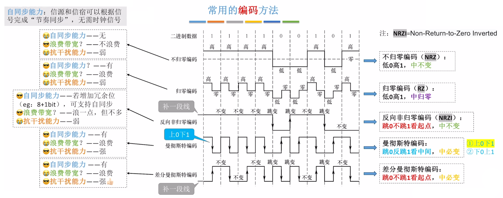
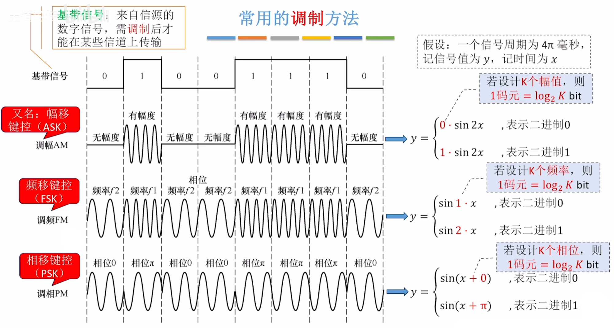
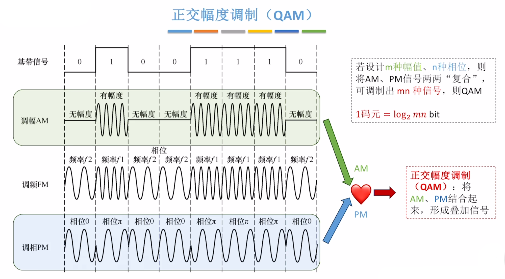
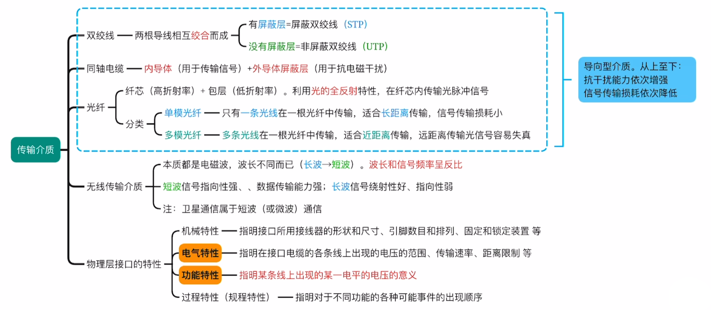
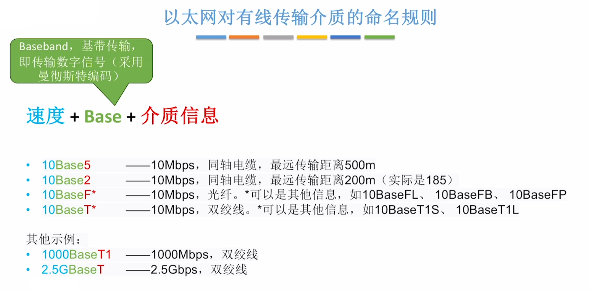
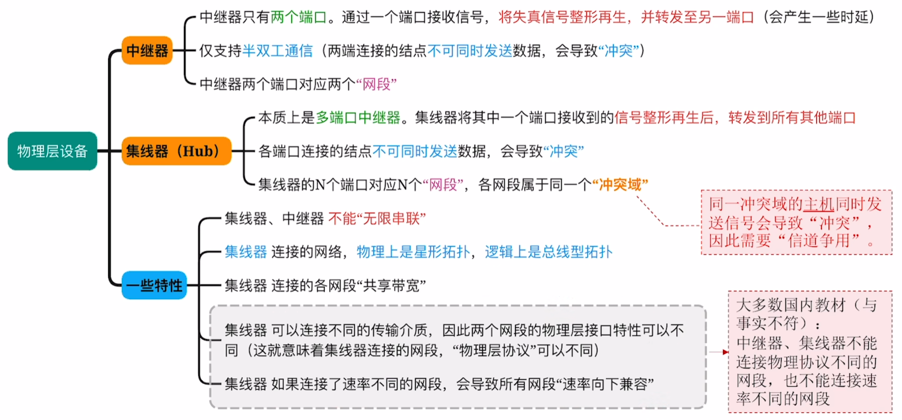

# 物理层

## 1 知识点

### 1.1 通信基础

* 概念

  

  * 信源通过信道给信宿发送信号
  * 一条物理线路通常包含发送信道和接收信道共两个信道
  * 以四进制码元为例，一个周期内可能出现`00`、`01`、`10`、`11`这四种信号，即一个码元携带 $2\text{bit}$ 信息；以二进制码元为例，一个周期内可能出现`0`、`1`这两种信号，即一个码元携带 $1\text{bit}$ 信息
  * 波特率又称码元传输速率，比特率又称信息传输速率
  * 传输方式分类
    * 按信道传输方式
      * 基带传输：在信道中直接使用信源发出的未经调制的原始电信号
      * 频带传输：在信道上传输经过调制的模拟信号
      * 宽带传输：在信道上传输经过调制的频分复用模拟信号
    * 按数据传输方式
      * 串行传输：适合远距离传输，如计算机网络
      * 并行传输：适合近距离传输，如计算机内部
    * 按交互方式
      * 单向通信：只有一个方向的通信，没有反方向的交互，只需要一个信道。如广播
      * 半双工通信：通信双方都可以发送和接收信息，但任何一方不能同时收发信息，需要两个信道
      * 全双工通信：通信双方可以同时收发信息，需要两个信道

* 信道极限容量

  

  * $W$ 为信道带宽，$S/N$ 为信噪比
  * **奈奎斯特采样定理：采样频率必须至少是原始信号最高频率的 $2$ 倍**
  
    > 如一个信道每 $\dfrac{1}{8}$ 秒采样一次，则采样频率为 $8\text{Hz}$，则原始信号最高频率为 $4\text{Hz}$，又因为自然界频率不能为负，因此原始信号频率范围为 $[0,4]\text{Hz}$，即带宽为 $4-0=4\text{Hz}$。该带宽值可用于后续的奈氏准则和香农定理

  * 香农定理中的信噪比使用的是无单位记法，因为无单位记法的比值可能很大，因此使用分贝记法简化书写

  

  * **理想低通信道**指没有噪声且带宽有限的信道，适用奈氏准则
  * **若给出了码元与比特数的关系，即使在有噪声信道中，也要同时考虑奈氏准则和香农公式**

* 编码与调制

  
  
  

  * 归零编码中间归零是为了同步时钟，方便接收方识别单个信号的边界。不归零编码为了实现该功能需要在收发双方间额外接一根时钟线
  * **曼彻斯特编码是以太网物理层的默认编码方式**。$\text{IEEE}$ 规定曼彻斯特编码上 $0$ 下 $1$。实际依照题目确定

  

  

  * $\text{QAM}$ 本质上就是复合函数

### 1.2 物理层介质与设备

* 传输介质

  

  * 同轴电缆比双绞线传输速率快是因为同轴电缆具有更高的屏蔽性和更好的抗噪性
  * 单模光纤中，若纤芯只有光的一个波长大小，则光沿直线传播
  * 长波更适合长距离、非直线通信；短波更适合短距离、高速通信。若用短波进行长距离通信需建立中继站，短波信号指向性强，要求信号接收器“对准”信号源
  * 卫星通信有成本高、传播时延长、受气候影响大、保密性差、误码率较高的特点

  

  * 以太网设备默认使用曼彻斯特编码方式
  * 传统以太网采用广播的方式发送信息，同一时间只允许一台主机发送信息，否则各主机之间就形成冲突，因此主机间的通信方式是半双工

* 物理层设备

  

  * 中继器是将衰减的信号再生，即放大 $+$ 整型
  * 集线器物理上是星形结构，逻辑上是总线形结构
  * 冲突域也称碰撞域，其中的计算机采用广播通信，同一时刻只能有一台计算机发送信息
  * 集线器、中继器需遵循 $5-4-3$ 原则，即最多只能串联 $5$ 个网段，使用 $4$ 台集线器(或中继器)，只有 $3$ 个网段可以挂载计算机

## 2 题目

### 2.1 选择

* 2.1习题
  * 03(计算机内部传输方式)
  * 05(曼彻斯特主要优点是同步)
  * ***12(奈氏准则限制香农公式)***
  * 14(带宽的赫兹定义)
  * ***16(奈奎斯特采样定理)***
  * 17(奈氏准则限制香农公式)
* 2.2习题
  * ***03(以太网采用广播，是半双工通信)***
  * 04(同轴电缆比双绞线快)
  * 09(电气特性)
* 2.3习题
  * 01(中继器是将信号放大+整型)
  * 06(中继器连接网络类型)

### 2.2 大题

* 2.1习题
  * ⭐***02(多段链路总时延分析)***
