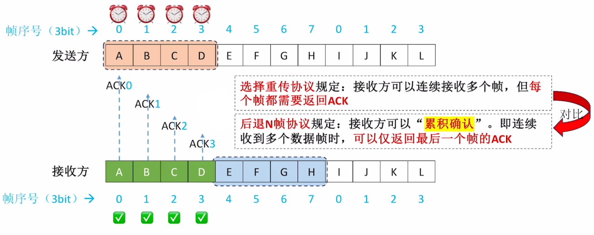

# 数据链路层

## 1 知识点

### 1.1 数据链路层功能

#### 1.1.1 组帧 (封装成帧)

* 帧首、尾主要是一些控制信息，如帧定界信息、校验码、倾类型(数据帧、确认帧等)、帧序号等

#### 1.1.2 差错控制

* 奇偶校验码

  

* 循环冗余校验码 $\text{CRC}$

  
  
  

  * 模 $2$ 除：最高位是 $1$ 则商 $1$，最高位是 $0$ 则商 $0$
  * 模 $2$ 减：商完后被除数与部分积进行异或操作，异或结果要固定剩 $R$ 位
  
  

  * 因为 $R$ 个校验位会有 $R$ 个余数位，且最多表示 $2^R$ 种状态，全 $0$ 固定表示正确，因此剩下 $2^R-1$ 种状态表示某位出错，数据总共 $K+R$ 位。因此 $\text{CRC}$ 只能在 $2^R-1\leq K+R$ 的情况下纠正 $1$ 位错，若数据长度大于 $K+R$，则余数错误码会从头开始，出现一个余数对应多种错误的情况

* 海明码

  

  

  

  * 如果有 $2$ 位错了，则校验方程 $S$ 指出的出错位置是不正确的，因此添加全校验位区分是"错一位在多个方程里体现"还是"错多位"。全校验码就是对整体偶校验，能识别一位错误。如果全校验码错了说明是"错一位在多个方程里体现"，修改即可；反正是"错多位"，只能重传

#### 1.1.3 流量控制与可靠传输

* 停止-等待协议 $\text{S-W}$

  

  

  * 正常工作
  
    发送方发送一个数据帧，接收方收到数据帧并确认无误后向发送方发送确认帧，随后接收窗口后移一个。发送方收到确认帧后将发送窗口后移一个，准备发送下一个帧。**因此发送方的窗口是由接收方控制的，实现了流量控制功能**

  * 数据帧丢失
  
    发送方发出一个数据帧后，发送方需要启动计时器，若计时器超时前未收到接收方的确认帧，则自动重传，并重置计时器
  
  * 确认帧丢失
  
    发送方发送一个数据帧，接收方收到数据帧并确认无误后向发送方发送确认帧，随后接收窗口后移一个。但确认帧丢失了。一段时间后发送方计时器超时并自动重传该帧。接收方收到后丢弃该重复帧，并发送针对该帧的确认帧。发送方收到确认帧后将发送窗口后移一个。**因此，必须给帧编号，否则无法识别重复帧**

    停止-等待协议中 $W_t+W_r=1+1\leq 2^n$，即 $n\geq 1$，最少采用 $1\text{bit}$ 对帧进行编号
  
  * 数据帧错误
  
    发送方发送一个数据帧，接收方收到数据帧后发现数据帧错误，则丢弃该帧，且不返回确认帧。等待发送方计时器超时后自动重传

  * 数据帧失序

    停止-等待协议不存在失序问题，因为发送窗口和接受窗口大小都为 $1$

  

* 后退 $N$ 帧协议 $\text{GBN}$

  

  

  * 正常工作
  
    发送方按序连续发送多个数据帧，接收方逐个接收数据帧并确认无误，接收完最后一个帧时向发送方发送确认帧，确认帧帧号为发送窗口中最后一个帧的帧号，意为累计确认该帧及其之前的帧均已正常接受，随后接收窗口后移一个。发送方收到确认帧后将发送窗口开始帧后移到接收窗口当前想要接收的帧处。如图中发送窗口应移动到`3 0 1`处

  * 数据帧丢失 / 错误
  
    发送方每发出一个数据帧后，都启动对应帧的计时器。接收方会丢弃错误帧和超出当前接收窗口的帧，并发送当前已接收的最后一个帧的 $\text{ACK}_i$。当计时器超时或收到 $\text{ACK}_i$ 时，发送方将发送窗口的开始帧移动到第 $i+1$ 帧，并重发从 $i+1$ 帧开始到发送窗口结束的所有帧
  
  * 确认帧丢失
  
    发送方每发出一个数据帧后，都启动对应帧的计时器。但接收方接收后发出的确认帧丢失。当计时器超时后，发送方会重传发送窗口内的所有帧，接收方收到后会丢弃重复帧，并发送当前已接收的最后一个帧的 $\text{ACK}_i$，发送方收到后移动发送窗口

    若帧编号不遵循 $W_t+W_r\leq 2^n$ 的要求，当发生数据帧重传时，接收窗口要求的帧号可能正好对应已经接受的重复帧的编号，导致错误的对应

  * 数据帧失序

    后退N帧协议不存在失序问题，因为接受窗口大小只有 $1$

* 选择重传协议 $\text{SR}$

  

  

  * 需要逐帧 $\text{ACK}$
  * 超时会导致重传，若数据帧错误则接收方会发送否认帧 $\text{NAK}$，要求发送方立刻重传该帧
  * 若帧编号不遵循 $W_t+W_r\leq 2^n$，会导致无法分辨重复帧；若不遵循 $W_t\geq W_r$，则接收窗口始终有空闲窗口，浪费资源

  

#### 1.1.4 介质访问控制

### 1.2 局域网

### 1.3 广域网

### 1.4 数据链路层设备

## 2 题目

* 3.1习题
  * ***06(流量控制是限制发送方的发送速率，以免超出接收方的承受能力)***
* 3.2习题
* 3.3习题
* 3.4习题
  * ⭐***26(滑动窗口协议帧序号比特数)***
* 3.5习题
* 3.6习题
* 3.7习题
* 3.8习题
