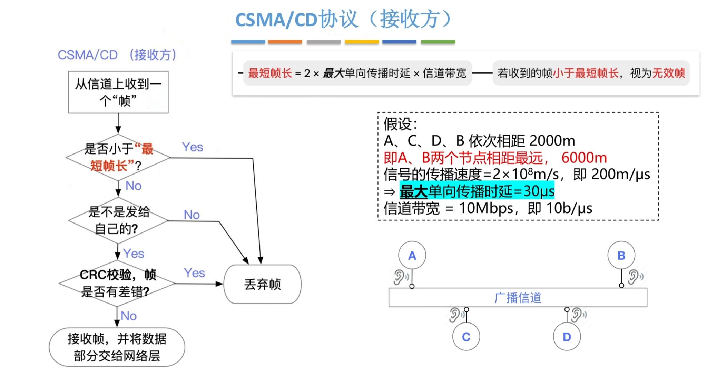

# 数据链路层

## 1 知识点

### 1.1 数据链路层概念

* $802.3$ 是以太网的代名词，$802.11$ 是无线网络技术 $\text{WiFi}$ 的代名词
* $\text{LLC}$ 子层名存实亡，数据链路层本质上几乎就是 $\text{MAC}$ 层了

### 1.2 数据链路层功能

#### 1.2.1 组帧 (封装成帧)

* 帧首、尾主要是一些控制信息，如帧定界信息、校验码、倾类型(数据帧、确认帧等)、帧序号等

#### 1.2.2 差错控制

* 奇偶校验码

  

* 循环冗余校验码 $\text{CRC}$

  
  
  

  * 模 $2$ 除：最高位是 $1$ 则商 $1$，最高位是 $0$ 则商 $0$
  * 模 $2$ 减：商完后被除数与部分积进行异或操作，异或结果要固定剩 $R$ 位
  
  

  * 因为 $R$ 个校验位会有 $R$ 个余数位，且最多表示 $2^R$ 种状态，全 $0$ 固定表示正确，因此剩下 $2^R-1$ 种状态表示某位出错，数据总共 $K+R$ 位。因此 $\text{CRC}$ 只能在 $2^R-1\geq K+R$ 的情况下纠正 $1$ 位错，若数据长度大于 $K+R$，则余数错误码会从头开始，出现一个余数对应多种错误的情况

* 海明码

  
  
  

  

  

  * 如果有 $2$ 位错了，则校验方程 $S$ 指出的出错位置是不正确的，因此添加全校验位区分是"错一位在多个方程里体现"还是"错多位"。全校验码就是对整体偶校验，能识别一位错误。如果全校验码错了说明是"错一位在多个方程里体现"，修改即可；反之是"错多位"，只能重传

#### 1.2.3 流量控制与可靠传输

* 停止-等待协议 $\text{S-W}$

  

  

  * 正常工作
  
    发送方发送一个数据帧，接收方收到数据帧并确认无误后向发送方发送确认帧，随后接收窗口后移一个。发送方收到确认帧后将发送窗口后移一个，准备发送下一个帧。**因此发送方的窗口是由接收方控制的，实现了流量控制功能**

  * 数据帧丢失
  
    发送方发出一个数据帧后，发送方需要启动计时器，若计时器超时前未收到接收方的确认帧，则自动重传，并重置计时器
  
  * 确认帧丢失
  
    发送方发送一个数据帧，接收方收到数据帧并确认无误后向发送方发送确认帧，随后接收窗口后移一个。但确认帧丢失了。一段时间后发送方计时器超时并自动重传该帧。接收方收到后丢弃该重复帧，并发送针对该帧的确认帧。发送方收到确认帧后将发送窗口后移一个。**因此，必须给帧编号，否则无法识别重复帧**

    停止-等待协议中 $W_t+W_r=1+1\leq 2^n$，即 $n\geq 1$，最少采用 $1\text{bit}$ 对帧进行编号
  
  * 数据帧错误
  
    发送方发送一个数据帧，接收方收到数据帧后发现数据帧错误，则丢弃该帧，且不返回确认帧。等待发送方计时器超时后自动重传

  * 数据帧失序

    停止-等待协议不存在失序问题，因为发送窗口和接受窗口大小都为 $1$

  

* 后退 $N$ 帧协议 $\text{GBN}$

  

  

  * 正常工作
  
    发送方按序连续发送多个数据帧，接收方逐个接收数据帧并确认无误，接收完最后一个帧时向发送方发送确认帧，确认帧帧号为发送窗口中最后一个帧的帧号，意为累计确认该帧及其之前的帧均已正常接受，随后接收窗口后移一个。发送方收到确认帧后将发送窗口开始帧后移到接收窗口当前想要接收的帧处。如图中发送窗口应移动到`3 0 1`处

  * 数据帧丢失 / 错误
  
    发送方每发出一个数据帧后，都启动对应帧的计时器。接收方会丢弃错误帧和超出当前接收窗口的帧，并发送当前已接收的最后一个帧的 $\text{ACK}_i$。当计时器超时或收到 $\text{ACK}_i$ 时，发送方将发送窗口的开始帧移动到第 $i+1$ 帧，**并重发从 $i+1$ 帧开始到发送窗口结束范围中已经发送的所有帧，发送窗口中之前未发送的帧不会重传**
  
  * 确认帧丢失
  
    发送方每发出一个数据帧后，都启动对应帧的计时器。但接收方接收后发出的确认帧丢失。当计时器超时后，发送方会重传发送窗口内的已发送的所有帧，接收方收到后会丢弃重复帧，并发送当前已接收的最后一个帧的 $\text{ACK}_i$，发送方收到后移动发送窗口

    若帧编号不遵循 $W_t+W_r\leq 2^n$ 的要求，当发生数据帧重传时，接收窗口要求的帧号可能正好对应已经接受的重复帧的编号，导致错误的对应

  * 数据帧失序

    后退N帧协议不存在失序问题，因为接受窗口大小只有 $1$

* 选择重传协议 $\text{SR}$

  

  

  * 需要逐帧 $\text{ACK}$
  * 超时会导致重传，若数据帧错误则接收方会发送否认帧 $\text{NAK}$，要求发送方立刻重传该帧
  * 若帧编号不遵循 $W_t+W_r\leq 2^n$，会导致无法分辨重复帧；若不遵循 $W_t\geq W_r$，则接收窗口始终有空闲窗口，浪费资源

  

#### 1.2.4 介质访问控制 (MAC)

##### 1.2.4.1 信道划分

* 时分复用 $\text{TDM}$

  

  * $\text{TDM}$ 必须满足如下条件
    * 介质的位速率(每秒传输的二进制位数)大于单个信号的位速率
    * 介质的带宽(所能传输信号的最高频率与最低频率之差)大于结合信号的带宽(所有信号经过调制后形成的复合信号的带宽)
  * $\text{TDM}$ 适合传输数字信号。所以在计算机网络中更常用

* 统计时分复用 $\text{STDM}$

  

* 频分复用 $\text{FDM}$

  

  * $\text{FDM}$ 适合传输模拟信号

* 波分复用 $\text{WDM}$

  

  * 本质上也是频分复用，因为波长与频率是倒数关系，但光信号的带宽更大，能拆出更多子信道

* 码分复用 $\text{CDM}$

  

  * 各站点码片序列相互正交，且各站点知道其他站点的码片序列
  * 码片序列为 $m$ 维向量，元素值为 $\set{1,-1}$
  * 从叠加信号中分辨是哪个站发的信号，使用下式计算。其中 $\eta_i$ 为 $i$ 站的码片序列，$\xi$ 为收到的混合码片序列，$m$ 为码片序列长度
  
    $$
    \dfrac{1}{m}\eta_i\cdot\xi=
    \begin{cases}
      1,&i站发送的1 \\
      -1,&i站发送的0 \\
      0,&i站没有发送
    \end{cases}
    $$

##### 1.2.4.2 随机访问

* $\text{ALOHA}$ 协议

  

  

  

* $\text{CSMA}$ 协议

  

  * 因为坚持监听，所以信道刚空闲时可能有多个节点同时发数据造成冲突

  

  * 非坚持通过等待监听改进了 1 坚持可能冲突的特点，但导致信道利用率低

  

* $\text{CSMA/CD}$ 协议

  

  * **以太网最短帧长 $64\text{B}=512\text{bit}$，则默认争用期为按此最短帧长计算的争用期**

  

  

  

  * 单倍最大单向传播时延能使一个节点发出的比特流占满整个信道，其他节点监听到信道忙时就不会再发帧
  * 两倍最大单向传播时延是最大可能的冲突时间。以图中数据为例，假设 $A$ 给 $B$ 发送一个帧，在第 $29\mu\text{s}$ 时，$B$ 还认为信道是空的，遂发送一个帧，但马上与 $A$ 发送的帧冲突了。再经过 $30\mu\text{s}$ 冲突信息才能被 $A$ 接收到，从 $A$ 发出信息到收到碰撞信息，总共过去两倍的单向最大传播时延。
  * 如果能度过争用期，则后续都是安全不会被打扰的

  

  * 如果帧太短，在极限情况，也就是争用期马上要满的情况下发生冲突，但此前因为帧太短导致已经发送完毕，且发送完毕前都未冲突，发送方因此认为发送成功，但实际出现冲突发送失败了。因此最短帧长不能低于关于争用期的时延带宽积。**以太网规定最小帧长为 $64\text{B}$**
  * 最大帧长也应该被限制，否则发送方会持续霸占信道导致其他节点无法收发信息，但最大帧长的限制由不同技术有不同的方案。**以太网规定最大帧长为 $1518\text{B}$**

* $\text{CSMA/CA}$ 协议

  

  

  * 因为信号是广播发送的，且随着距离增加信号强度降低，因此距离过远的两个站点可能检测不到对方，但二者发出的信号会在接入点处冲突，这就是隐蔽站问题

  

  * $\text{DIFS}>\text{SFIS}+\text{传播时延}$，只有这样才能确保一个完整的发送确认流程不会被打断。如果不满足该要求，则接收方在 $\text{SFIS}$ 后准备发 $\text{ACK}$ 时，信道会被认为是空闲的，新的信号与 $\text{ACK}$ 冲突导致之前的帧发送失败
  * 随机退避倒计时只在信道空闲时才继续，信道忙时冻结。这样能保证倒计时归零的时刻信道是空闲的

  

  * $\text{NAV}$ 值
  
    当 $A$ 站广播一个 $\text{RTS}$ 帧时,将占用信道的持续时间

    $$
    \text{SIFS+CTS+ SIFS+DATA+ SIFS+ACK}
    $$

    写入 $\text{RTS}$ 帧的首部；当 $\text{AP}$ 收到 $\text{RTS}$ 帧后,广播一个 $\text{CTS}$ 帧,将占用信道的持续时间

    $$
    \text{SIFS+DATA+SIFS+ACK}
    $$

    写入 $\text{CTS}$ 帧的首部。之后传送的数据帧的首部也携带本次通信所需的持续时间。其他站收到 $\text{CTS}$ 帧后，根据帧中的持续时间设置自己的 $\text{NAV}$ 值，即 $\text{CTS}$ 帧中批准的时间即为其他站的 $\text{NAV}$ 值

  * 返回的 $\text{CTS}$ 对预约者而言是同意预约，对其他站点而言是等待要求
  * 预约失败时，会随机退避一段时间，再尝试预约
  * 预约是选用的，长帧使用较多，因为短帧退避重发的代价相对较低，但长帧冲突的代价较高

##### 1.2.4.3 轮询访问

* 令牌传递协议在 $\text{IEEE 802.5}$ 网络中使用
* 令牌循环流动，持有令牌的节点每次只能发一个数据帧，发完就要释放转交令牌；不需要发数据帧的节点拿到令牌后会立即释放转交
* 转交令牌时是重新产生一个新令牌，将新令牌传给下个节点

### 1.3 局域网

* 概念

  
  
  

  
  
  * $\text{MAC}$ 地址写死在以 $\text{ROM}$ 中，不同适配器各自拥有全球唯一的 $\text{MAC}$ 地址

* $\text{IEEE 802.3}$ 以太网

  

  * 传输速度 $\geq 2.5\text{Gbps}$ 的双绞线只支持全双工；低于该速率的双绞线由通信双方协商采用半双工还是全双工。如集线器采用半双工，交换机采用全双工
  * **以太网提供的是无确认、无连接的服务！！！**

  

  * 地址字段占 $6\text{B}$，对应 $48$ 位的全球唯一 $\text{MAC}$ 地址
  * $\text{IEEE 802.3}$ 标准与 $\text{V2}$ 标准的以太网帧仅在占 $2\text{B}$ 的字段不同。$\text{IEEE 802.3}$ 标准下该字段表示数据部分的长度，因为标准 $\text{IEEE 802.3}$ 标准中与网络层直接连接的是 $\text{LLC}$ 层
  * 因为整帧长度为 $[64,1518]\text{B}$，因此数据部分长度为 $[46,1500]\text{B}$
  * $\text{FCS}$ 检验目的地址、源地址、协议、数据这四部分，即首部与数据都检验

  

  * 设备
    * 集线器工作在物理层，自然没有 $\text{MAC}$ 地址
    * 交换机工作在物理层、数据链路层，有 $\text{MAC}$ 地址。可能是多个接口共用一个 $\text{MAC}$ 地址，也可能各自独立拥有一个 $\text{MAC}$ 地址
    * 路由器工作在物理层、数据链路层、网络层，有 $\text{MAC}$ 地址
  * 冲突域、广播域
    * 集线器不隔离冲突域，也不隔离广播域

      > $E,F,G$ 主机只能半双工通信，因为同处一个冲突域

    * 交换机隔离冲突域，但不隔离广播域

      > $D,E$ 可以同时与其他主机通信，因为交换机将两个冲突域隔离了
      >
      > 当 $D$ 发送广播帧时，$A,B,C,E,F,G$ 都会收到，因为交换机不隔离广播域

    * 路由器既隔离冲突域，也隔离广播域

      > 当 $D$ 发送广播帧时，交换机也会将广播帧转发给路由器，但会被路由器拒绝，因为路由器隔离广播域

* $\text{IEEE 802.1Q}$ 虚拟局域网 $\text{VLAN}$

  

  $\text{VLAN}$ 既隔离冲突域，也隔离广播域

  * 划分方式

    

    * 需要管理员手动配置，且主机换接口就需要重新配置映射关系

    

    * 可以自动识别主机所属的 $\text{VLAN}$。交换机转发后接收的交换机通过查看 $\text{802.1Q}$ 帧内的 $\text{VID}$ 即可确定转发对象

    

    * 在网络层功能的支持下，$\text{VLAN}$ 可以跨局域网，让多个局域网的主机组成一个 $\text{VLAN}$

  * $\text{802.1Q}$ 帧

    

    * 在标准以太网帧的基础上增设 $\text{VLAN}$ 标签，用于区别所属虚拟局域网
    * $\text{802.1Q}$ 帧整帧实际长度范围为 $[68,1522]\text{B}$
    * 增设 $\text{VLAN}$ 标签后，$\text{FCS}$ 字段需要更新，对前面 $6\,6\,4\,2\,\text{N}$ 的数据重新进行 $\text{CRC}$ 校验

    

    * 主机与交换机之间使用普通帧，跨交换机时使用 $\text{802.1Q}$ 帧
    * 交换机转发后接收的交换机通过查看 $\text{802.1Q}$ 帧内的 $\text{VID}$ 即可确定转发对象

* $\text{IEEE 802.11}$ 无线局域网 $\text{WLAN}$

  

  

  

  * 地址 $1$ 是本次发送的目的地址，地址 $2$ 是本次发送的源地址，地址 $3$ 是剩下的地址，地址 $4$ 没用。**地址是 $\text{MAC}$ 地址**

### 1.4 广域网

* 广域网概念

  

  * 局域网使用广播通信，广域网使用点对点通信

* $\text{PPP}$ 协议

  

  > **MAC（如以太网）和PPP都是数据链路层的协议，它们服务于不同的网络环境和通信需求：**
  >
  > * **以太网MAC协议** 主要用于**局域网（LAN）**，解决**共享介质上多个设备**之间的通信问题。
  > * **PPP协议** 主要用于**广域网（WAN）** 的**点对点（Point-to-Point）链路**，连接两个且仅有两个通信端点。

  * $\text{PPP}$ 协议是点对点通信的，而不是像以太网、无线网一样使用广播信道，因此没有最短帧要求。帧数据部分长度范围为 $[0,1500]\text{B}$
  * $\text{PPP}$ 协议虽然提供差错检测，但不提供纠错
  * $\text{PPP}$ 协议只支持全双工通信
  * $\text{PPP}$ 协议提供的是有连接但不可靠的服务

  

  

  

### 1.5 数据链路层设备

* 集线器的用户共享带宽，交换机的用户独占带宽。例如 $10\text{kbps}$ 的带宽，$10$ 个用户，用集线器连接则每个用户有 $1\text{kbps}$ 带宽，用交换机连接每个用户有 $10\text{kbps}$ 带宽
* 交换机的多个接口之间可以并行传输
* 交换机工作在数据链路层和物理层，因此不能实现不同网络层协议的网络互连

* 同冲突域的主机第一次发送消息时，尽管集线器会直接送达消息，但交换机仍然会广播，因为目的主机的 $\text{MAC}$ 地址并不在交换机的转发表中

  > $E$ 给 $F$ 发信息，集线器会直接传输，但交换机仍然会广播
  >
  > $F$ 给 $E$ 发信息，因为上次 $E$ 的 $\text{MAC}$ 地址已被记录，因此交换机不再广播，也不会从接口中再次发送一遍，因为 $E$ 和 $F$ 是同一接口

* 直通交换只传输 $6\text{B}$ 的目的地址，非常快。但在 $\text{VLAN}$ 中交换机之间必须使用 $\text{802.1Q}$ 帧通信，直通交换相当于电路交换，传进来什么传出去什么，因此不能转换协议

## 2 题目

### 2.1 选择

* 3.1习题
  * ***06(流量控制是限制发送方的发送速率，以免超出接收方的承受能力)***
* 3.2习题
* 3.3习题
* 3.4习题
  * ***24(帧动态大小要求信道利用率恒100%，应以短帧计算，这样短的满足长的也满足，反正不成立)***
  * ⭐***26(滑动窗口协议帧序号比特数)***
* 3.5习题
  * 04(TDM适合数字信号)
  * ***13(争用期时延带宽积)***
  * 15(二进制退避考虑了网络负载对冲突的影响)
  * 24(CSMA/CA预约不是必须的)
  * ⭐***33(争用期是两倍的最长传播时间)***
* 3.6习题
  * ？***10(802.1Q帧数据段长度)***
  * ***23(VLAN优点)***
* 3.7习题
* 3.8习题
  * 02(VLAN既隔离冲突域，也隔离广播域)
  * ⭐***03(交换表构建)***
  * ***17(交换机转发看目的物理地址，交换表记录的是源物理地址)***

### 2.2 大题

* 3.2习题
  * 01(组帧方法)
* 3.3习题
  * 01(CRC)
* 3.4习题
  * ⭐***07(GBN流程、最大信道利用率)***
* 3.5习题
  * ***05(CSMA/CD下的有效数据传输效率)***

    > $\text{有效数据传输效率}=\dfrac{\text{帧数据部分长度}}{\text{帧总体传输时间+RTT+确认帧总体传输时间}}$

* 3.6习题
* 3.7习题
* 3.8习题
