# 网络层

## 1 知识点

### 1.1 网络层功能

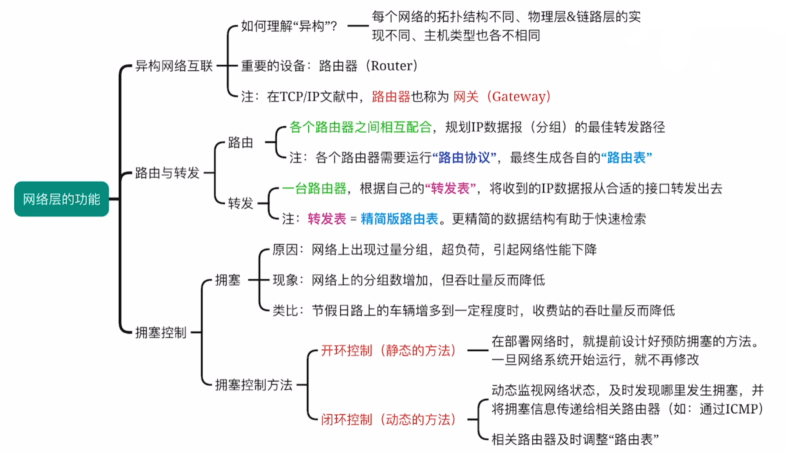

* 使用路由器互连的多个局域网中，每个局域网的物理层、数据链路层、网络层协议都可以不同，但再往上协议必须相同
* 主机与路由器都不知道完整的分组转发地址
* **网络层提供无连接不可靠的数据报服务**

### 1.2 IPv4

* $\text{IPv4}$ 分组

  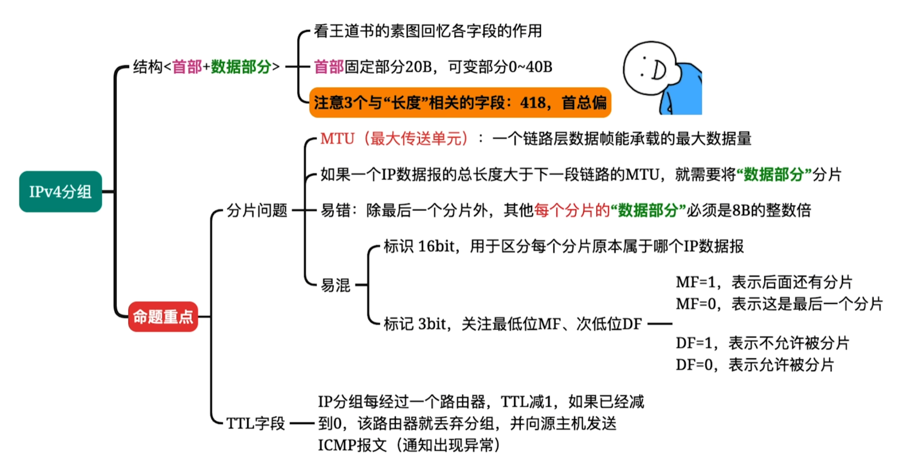

  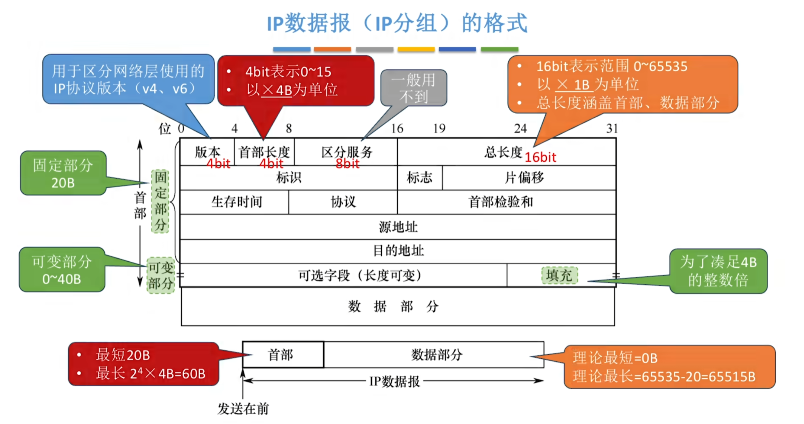

  * 总长度只是理论上的，实际上受不同链路 $\text{MTU}$ 的限制。如果一个 $\text{IP}$ 数据报的总长度超出了下一段链路的 $\text{MTU}$ 就需要分片。一个链路层数据帧能承载的最大数据量称为最大传送单元 $\text{MTU}$。如以太网的 $\text{MTU}=1500\text{B}$

  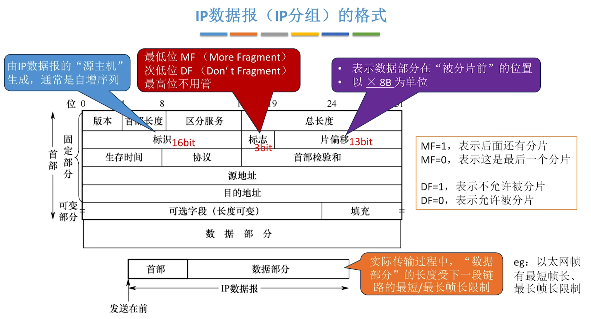

  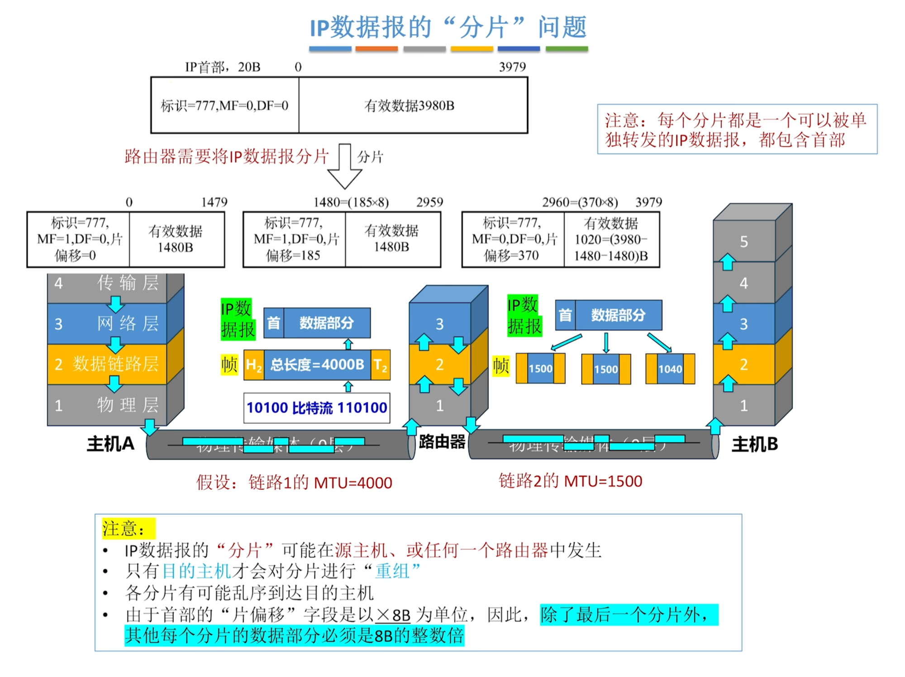

  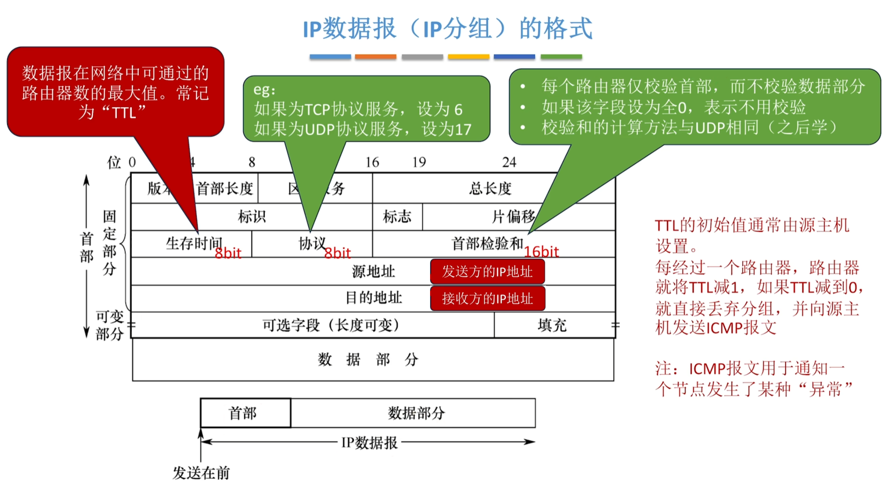

* $\text{IP}$ 地址

  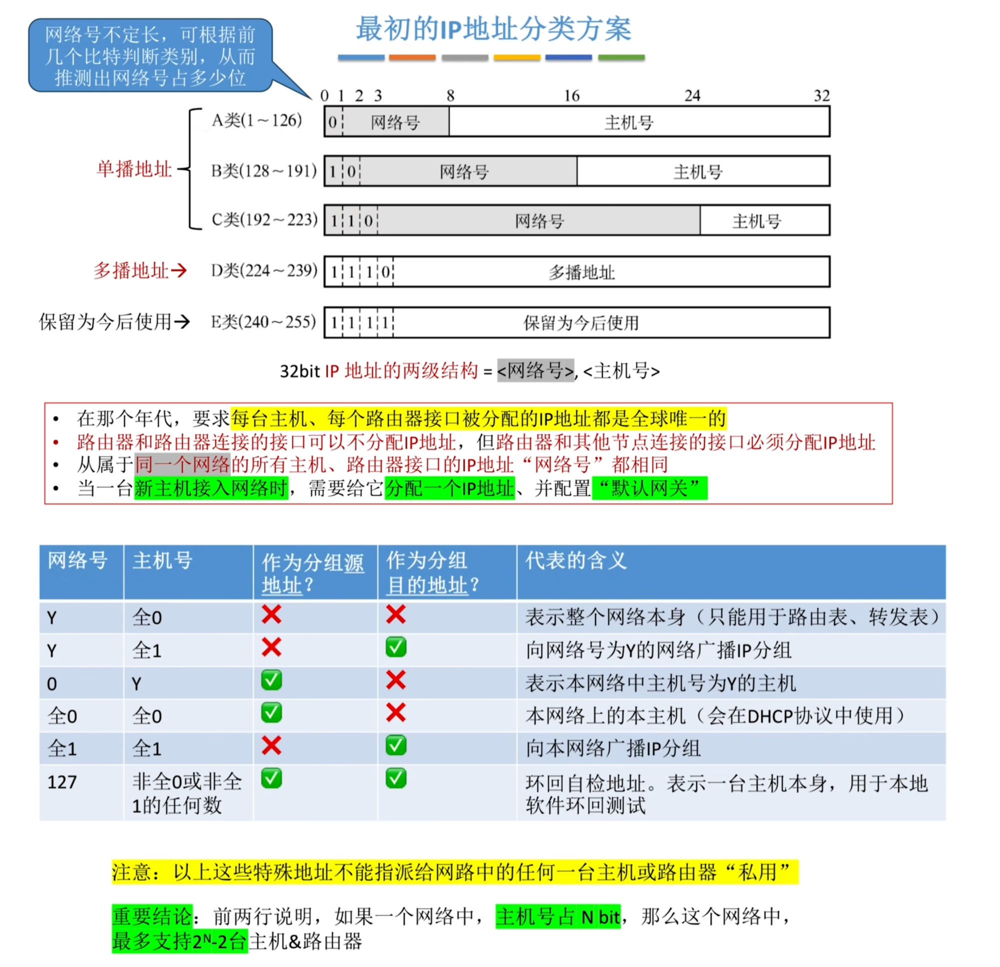

  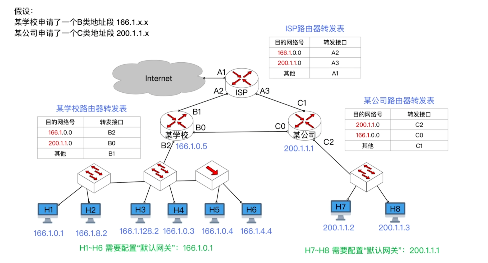

  > ***例 1：$\text{H1}$ 给 $\text{H7}$ 发送 $\text{IP}$ 数据报***
  >
  > 源目的地址为 $\text{H1}$ 的 $\text{IP}$ 地址，目的地址为 $\text{H7}$ 的 $\text{IP}$ 地址。$\text{H1}$ 要先将数据报发给默认网关 $\text{B2}$ 接口。数据链路层组帧时通过 $\text{ARP}$ 协议获得 $\text{B2}$ 的 $\text{MAC}$ 地址，发往交换机。交换机通过转发最终给到路由器的 $\text{B2}$ 接口。路由器通过查询网络号，应该转发到 $\text{C0}$ 接口，路由器组帧时将目的 $\text{MAC}$ 地址改为路由器 $C$ 的 $\text{MAC}$ 地址。路由器 $C$ 查询后应当转发到 $\text{C2}$ 接口，根据目的 $\text{IP}$ 地址，利用 $\text{ARP}$ 协议获得 $\text{H7}$ 的 $\text{MAC}$ 地址，并将目的 $\text{MAC}$ 地址改为 $\text{H7}$ 的 $\text{MAC}$ 地址，通过最后一个交换机完成发送
  >
  > **因此，$\text{IP}$ 数据报发送时，源和目的 $\text{IP}$ 地址不变，目的 $\text{MAC}$ 地址随着路由而变**

   

  > ***例 2：$\text{H1}$ 给 $\text{H6}$ 发送 $\text{IP}$ 数据报***
  >
  > 源目的地址为 $\text{H1}$ 的 $\text{IP}$ 地址，目的地址为 $\text{H7}$ 的 $\text{IP}$ 地址。$\text{H1}$ 通过比对网络号发现收发双方在同一网络内，因此 $\text{H1}$ 不需要将数据报发给默认网关 $\text{B2}$ 接口，而是直接通过 $\text{ARP}$ 协议获得 $\text{H7}$ 的 $\text{MAC}$ 地址进行组帧，通过交换机送达

   

  > ***例 3：$\text{H1}$ 给互联网发送 $\text{IP}$ 数据报***
  >
  > 源目的地址为 $\text{H1}$ 的 $\text{IP}$ 地址，目的地址为互联网中某台主机的 $\text{IP}$ 地址。所有路由器的转发表都无法匹配目的 $\text{IP}$ 地址，因此通过其他接口进行转发

  * 默认网关及默认使用发送 $\text{IP}$ 数据报的路由器，路由器接口应该具有和对着的网络相同的 $\text{IP}$ 地址

* 划分子网

  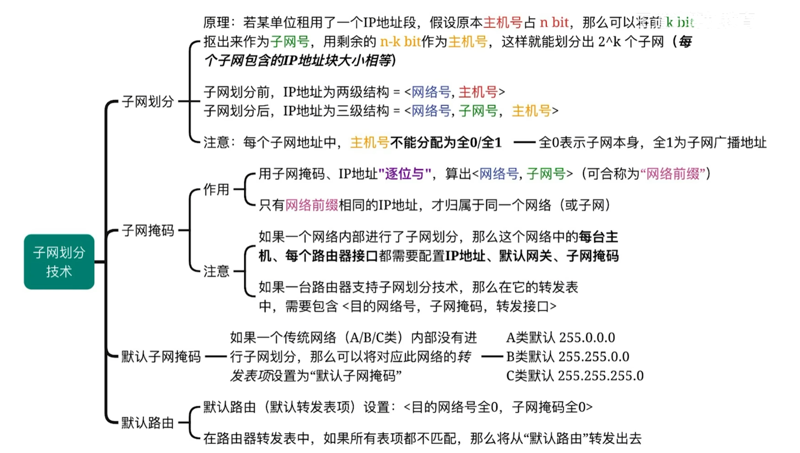

  * 默认路由 $\text{IP}$ 为`0.0.0.0`，子网掩码为`0.0.0.0`。当其他网络号无法匹配时，则通过默认路由转发出去

  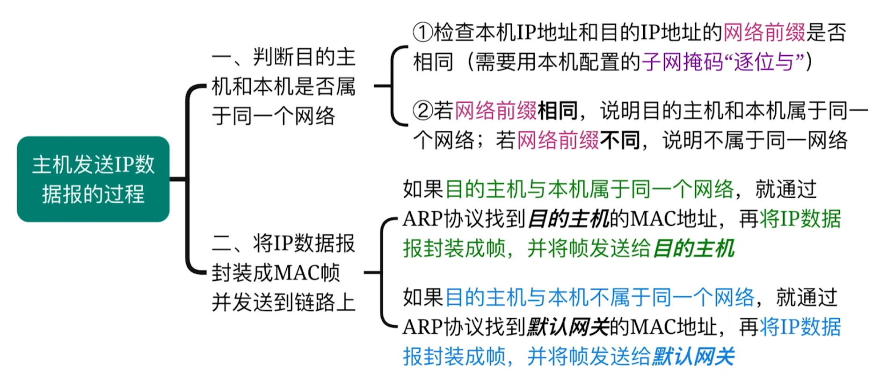

  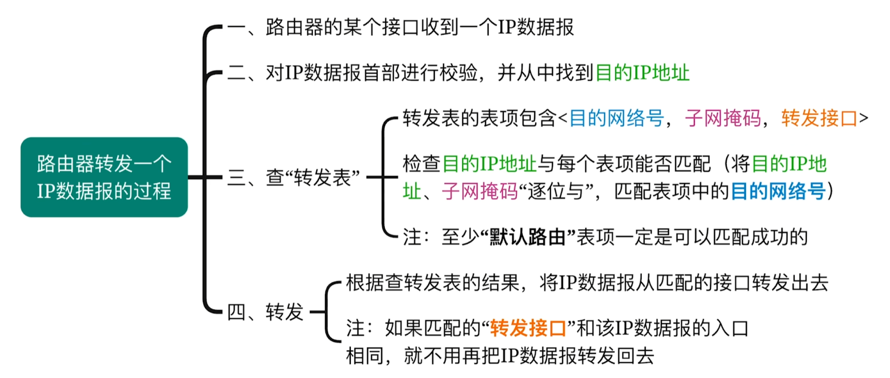

  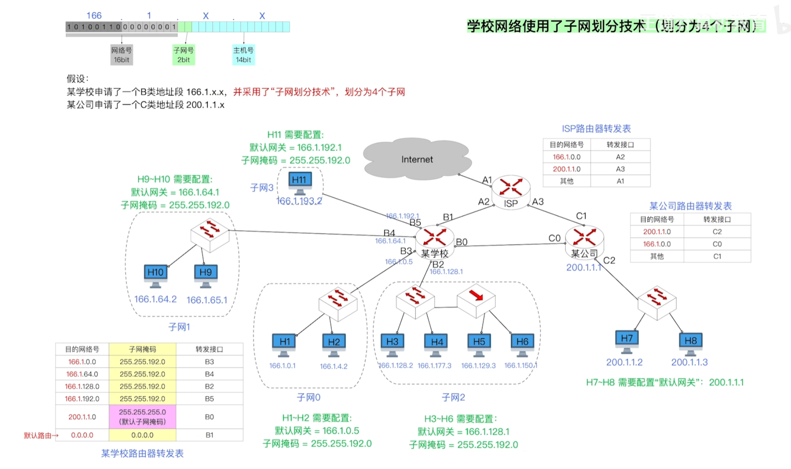

* 无分类编址 $\text{CIDR}$

* 路由聚合

* 网络地址转换 $\text{NAT}$

* 动态主机配置协议 $\text{DHCP}$

* 网际控制报文协议 $\text{ICMP}$

### 1.3 IPv6

### 1.4 路由算法与协议

* 路由算法

* 路由协议

### 1.5 IP多播

### 1.6 移动IP

### 1.7 网络层设备

## 2 题目

* 4.1习题
  * 03(局域网协议)
  * 07(主机和路由器都不知道完整路由地址)
  * 09(虚电路不适合故障率高的网络，因为一旦出现故障就要重新建立连接，而数据报可以动态选择转发结点)
* 4.2习题
  * 15(多播地址、广播地址)
* 4.3习题
* 4.4习题
* 4.5习题
* 4.6习题
* 4.7习题
