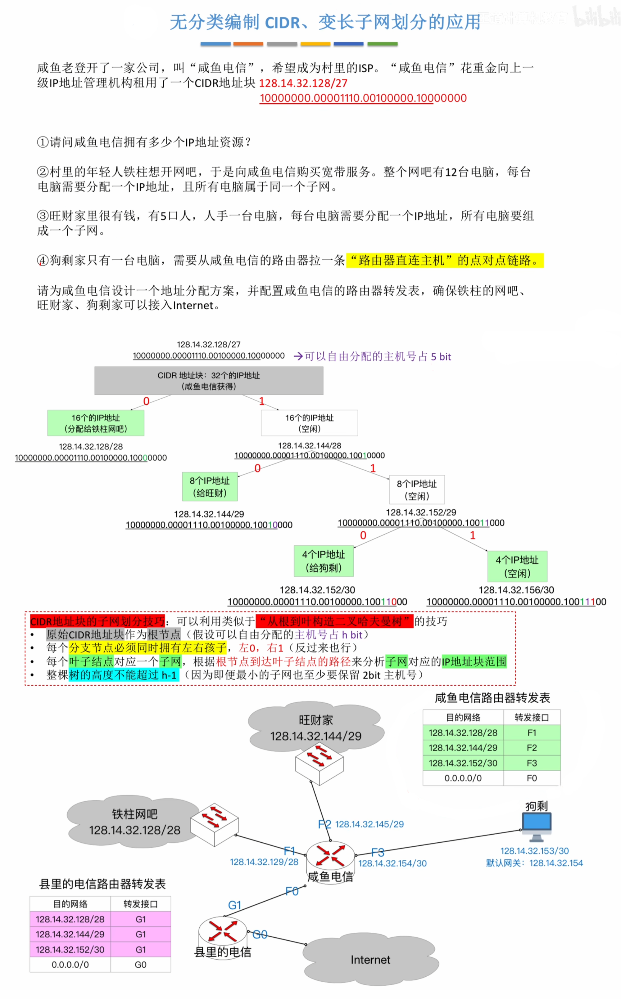

# 网络层

## 1 知识点

### 1.1 网络层功能

* 使用路由器互连的多个局域网中，每个局域网的物理层、数据链路层、网络层协议都可以不同，但再往上协议必须相同
* 主机与路由器都不知道完整的分组转发地址
* **网络层提供无连接不可靠的数据报服务**

### 1.2 IPv4

* $\text{IPv4}$ 分组

  

  

  * 总长度只是理论上的，实际上受不同链路 $\text{MTU}$ 的限制。如果一个 $\text{IP}$ 数据报的总长度超出了下一段链路的 $\text{MTU}$ 就需要分片。数据链路层一个数据帧能承载的最大数据量称为最大传送单元 $\text{MTU}$，即 $\text{MTU}$ 是数据链路层的 $\text{SDU}$ 最大长度的专属称呼，即网络层的 $\text{PDU}$ 长度。如以太网的 $\text{MTU}=1500\text{B}$

  

  

  * 每个分片的数据部分必须是 $8\text{B}$ 的整数倍
  * 当 $\text{IP}$ 分组的长度大于 $\text{MTU}$ 且 $\text{DF}=1$ 时，则丢弃该分组，并使用 $\text{ICMP}$ 的终点不可达差错报告报文向源主机报告

  

* $\text{IP}$ 地址

  

  

  > ***例 1：$\text{H1}$ 给 $\text{H7}$ 发送 $\text{IP}$ 数据报***
  >
  > 源目的地址为 $\text{H1}$ 的 $\text{IP}$ 地址，目的地址为 $\text{H7}$ 的 $\text{IP}$ 地址。$\text{H1}$ 要先将数据报发给默认网关 $\text{B2}$ 接口。数据链路层组帧时通过 $\text{ARP}$ 协议获得 $\text{B2}$ 的 $\text{MAC}$ 地址，发往交换机。交换机通过转发最终给到路由器的 $\text{B2}$ 接口。路由器通过查询网络号，应该转发到 $\text{C0}$ 接口，路由器组帧时将目的 $\text{MAC}$ 地址改为路由器 $C$ 的 $\text{MAC}$ 地址。路由器 $C$ 查询后应当转发到 $\text{C2}$ 接口，根据目的 $\text{IP}$ 地址，利用 $\text{ARP}$ 协议获得 $\text{H7}$ 的 $\text{MAC}$ 地址，并将目的 $\text{MAC}$ 地址改为 $\text{H7}$ 的 $\text{MAC}$ 地址，通过最后一个交换机完成发送
  >
  > **因此，$\text{IP}$ 数据报发送时，源和目的 $\text{IP}$ 地址不变，目的 $\text{MAC}$ 地址随着路由而变**

   

  > ***例 2：$\text{H1}$ 给 $\text{H6}$ 发送 $\text{IP}$ 数据报***
  >
  > 源目的地址为 $\text{H1}$ 的 $\text{IP}$ 地址，目的地址为 $\text{H7}$ 的 $\text{IP}$ 地址。$\text{H1}$ 通过比对网络号发现收发双方在同一网络内，因此 $\text{H1}$ 不需要将数据报发给默认网关 $\text{B2}$ 接口，而是直接通过 $\text{ARP}$ 协议获得 $\text{H7}$ 的 $\text{MAC}$ 地址进行组帧，通过交换机送达

   

  > ***例 3：$\text{H1}$ 给互联网发送 $\text{IP}$ 数据报***
  >
  > 源目的地址为 $\text{H1}$ 的 $\text{IP}$ 地址，目的地址为互联网中某台主机的 $\text{IP}$ 地址。所有路由器的转发表都无法匹配目的 $\text{IP}$ 地址，因此通过其他接口进行转发

  * 默认网关及默认使用发送 $\text{IP}$ 数据报的路由器，路由器接口应该具有和对着的网络相同的 $\text{IP}$ 地址

* 子网划分技术

  

  * 默认路由 $\text{IP}$ 为`0.0.0.0`，子网掩码为`0.0.0.0`。当其他网络号无法匹配时，则通过默认路由转发出去

  

  

  

* 无分类编址 $\text{CIDR}$

  

  

  * 给狗剩分配时，路由器接口和主机各占一个 $\text{IP}$ 地址，全 $0$、全 $1$ 地址保留，因此一个最小的网络需要 $4$ 个 $\text{IP}$ 地址，即 $2\text{bit}$ 主机号。再往下就不能划分了，因为只有 $1\text{bit}$ 主机号，只剩全 $0$、全 $1$ 地址

    > 在最新标准中，点对点链路可以使用`/31`网络前缀，因为点对点链路不存在广播，网络号可以直接使用网络前缀表示，因此可以使用`/31`网络前缀，即主机号只用 $1\text{bit}$

* 路由聚合

  
  
  

  

  * 转发时匹配最长的网络前缀，默认路由的网络前缀的长度为 $0$

* 网络地址转换 $\text{NAT}$

  

  * 普通路由器工作在物理层、数据链路层、网络层；$\text{NAT}$ 路由器工作在物理层、数据链路层、网络层、应用层
  * 私有 $\text{IP}$ 地址

    |网络号|范围|说明|
    |:-:|:-:|:-:|
    |`10.0.0.0/8`|`10.0.0.0/8`~`10.255.255.255/8`|相当于 $1$ 个 $A$ 类网络|
    |`172.16.0.0/12`|`172.16.0.0/12`~`172.31.255.255/12`|相当于 $16$ 个连续的 $B$ 类网络|
    |`192.168.0.0/16`|`192.168.0.0/16`~`192.168.255.255/16`|相当于 $256$ 个连续的 $C$ 类网络|

    私有网络的 $\text{IP}$ 地址不允许出现在公网上，包括分配、转发

  

  > ***例 1：手机 1给手机 2发微信***
  >
  > 手机 $1$ 构造报文，并包装成 $\text{IP}$ 数据报。源端口为手机 $1$ 的内网端口`9855`，目的端口为手机 $2$ 的外网端口`4096`；源 $\text{IP}$ 地址为手机 $1$ 的内网 $\text{IP}$ 地址`192.168.3.48`，目的 $\text{IP}$ 地址为手机 $2$ 的外网 $\text{IP}$ 地址`66.211.88.55`。当手机 $1$ 的数据报经过自己网络的路由器时，根据 $\text{NAT}$ 表将源端口和源 $\text{IP}$ 地址换成对应的外网端口和 $\text{IP}$ 地址，即将源端口`9855`换成`7788`，源 $\text{IP}$ 地址`192.168.3.48`换成`59.175.49.153`。随后经过传输到达手机 $2$ 网络的路由器。该路由器根据 $\text{NAT}$ 表将目的端口和目的 $\text{IP}$ 地址换成内网中手机 $2$ 的端口和 $\text{IP}$ 地址完成传输

   

  > ***例 2：手机 1给 DiliDili服务器发信息***
  >
  > 手机 $1$ 构造报文，并包装成 $\text{IP}$ 数据报。源端口为手机 $1$ 的内网端口`9855`，目的端口为服务器的端口`80`；源 $\text{IP}$ 地址为手机 $1$ 的内网 $\text{IP}$ 地址`192.168.3.48`，目的 $\text{IP}$ 地址为服务器的外网 $\text{IP}$ 地址`200.1.1.4`。当手机 $1$ 的数据报经过自己网络的路由器时，根据 $\text{NAT}$ 表将源端口和源 $\text{IP}$ 地址换成对应的外网端口和 $\text{IP}$ 地址，即将源端口`9855`换成`7788`，源 $\text{IP}$ 地址`192.168.3.48`换成`59.175.49.153`。随后经过传输到达服务器

* 地址解析协议 $\text{ARP}$

  

  

  * $\text{ARP}$ 组帧时必定要填充，因为以太网帧数据部分长度应为 $[46,1500]\text{B}$

  

  * 每台主机、路由器都有自己的 $\text{ARP}$ 表，并且需要定期更新表项
  * 当被查询方收到请求分组或查询方收到响应分组时，会将 $\text{IP}$ 地址与 $\text{MAC}$ 地址对应关系记录在自己的 $\text{ARP}$ 表中
  * 流程
    * 发送方拿自己的掩码于源 $\text{IP}$ 地址和目的 $\text{IP}$ 地址，判断双方是否在同一个局域网内
    * 若在同一个局域网内，则发送 $\text{ARP}$ 请求报文获得接收方的 $\text{MAC}$ 地址，等待 $\text{ARP}$ 响应报文
    * 若不在一个局域网内，那么根据目的 $\text{IP}$ 和源 $\text{IP}$ 在路由器转发过程中，每段网络链路上都使用 $\text{ARP}$ 获得下一跳的 $\text{MAC}$ 地址，直到 $\text{IP}$ 数据报进入目的网络，使用 $\text{ARP}$ 获得目的主机的 $\text{MAC}$ 地址

* 动态主机配置协议 $\text{DHCP}$

  

  

  * 因为一个网络中可能存在多个 $\text{DHCP}$ 服务器，因此主机请求 $\text{IP}$ 地址时的 $\text{DISCOVER}$ 帧和 $\text{REQUEST}$ 帧会被多个 $\text{DHCP}$ 服务器收到，每个服务器都认为是要求自己分配一个 $\text{IP}$ 地址。因此 $\text{DISCOVER}$ 帧和 $\text{REQUEST}$ 帧在数据链路层和网络层都必须是广播的，而不能是单播的，否则可能出现主机请求 $\text{IP}$ 地址，服务器 $1$ 和服务器 $2$ 都分配了地址，但主机只跟服务器 $2$ 单播接受了服务器 $2$ 的 $\text{IP}$ 地址，导致服务器 $1$ 分配的地址看似分配出去实则未被使用的情况

* 网际控制报文协议 $\text{ICMP}$

  

  * $\text{IP}$ 数据报首部检验和出错时，则该数据报被认为是不完整、不可信的，因此不会发丝 $\text{ICMP}$ 差错控制报文

### 1.3 IPv6

* 每段只省略前导 $0$，中间和末尾 $0$ 不能省略
* 地址中最多只能出现一次`::`

* 任播：访问`www.bilibili.com`这个域名时，域名背后是一组服务器，自动选择一台离用户最近的服务器为其提供服务

* 与 $\text{IPv4}$ 相比，$\text{IPv6}$ 对首部中的某些字段进行了如下更改
  * 取消了首部长度字段，**因为 $\text{IPv6}$ 的首部长度是固定 $40\text{B}$**
  * 取消了服务类型字段，因为优先级和流标号字段实现了服务类型字段的功能
  * 取消了总长度字段，改用有效载荷长度字段
  * 取消了标识、标志和片偏移字段，因为这些功能已包含在分片扩展首部中
  * **把 $\text{TTL}$ 字段改称为跳数限制字段**，但作用是一样的(名称与作用更加一致)
  * 取消了协议字段，改用下一个首部字段
  * **取消了检验和字段**，毕竟在传输层有差错检验功能，这样就加快了路由器的处理速度
  * 取消了选项字段，而用扩展首部来实现选项功能

* $\text{IPv6}$ 基本首部中各字段的含义
  * 版本。占 $4$ 位，指明协议的版本，对于 $\text{IPv6}$ 该字段的值是 $6$
  * 通信量类。占 $8$ 位，用来区分不同的 $\text{IPv6}$ 数据报的类别或优先级
  * 流标号。占 $20$ 位，$\text{IPv6}$ 提出流的抽象概念。流是指互联网上从特定源点到特定终点(单播或多播)的一系列数据报(如实时音/视频传输)，而在这个“流”所经过的路径上的路由器都保证指明的服务质量。所有属于同一个流的数据报都具有相同的流标号
  * 有效载荷长度。占 $16$ 位，指明 $\text{IPv6}$ 数据报除基本首部以外的字节数(所有扩展首部都算在有效载荷之内)。这个字段的最大值是 $65535\text{B}$
  * 下一个首部。占 $8$ 位，该字段相当于 $\text{IPv4}$ 首部中的协议字段或可选字段。当 $\text{IPv6}$ 没有扩展首部时，其作用与 $\text{IPv4}$ 的协议字段一样,它指明 $\text{IPv6}$ 数据报所运载的数据是何种协议数据单元;当 $\text{IPv6}$ 带有扩展首部时，它就标识后面第一个扩展首部的类型
  * 跳数限制。占 $8$ 位，类似于 $\text{IPv4}$ 首部的 $\text{TTL}$ 字段。源点在每个数据报发出时即设定某个限制值(最大为255)。路由器每次转发时将其值减1，减为0时就将该数据报丢弃
  * 源地址和目的地址。占 $128$ 位，是数据报的发送端/接收端的 地址

### 1.4 路由算法与协议

#### 1.4.1 路由算法

* 路由器 $X$ 到网络 $n$ 的最短距离= $\text{min}_{v=1..k}$ (路由器 $X$ 到邻居路由器 $v$ 的距离+路由器 $v$ 到网络 $n$ 的距离)

#### 1.4.2 路由协议

* 分层次的路由协议

  

  

* 路由信息协议 $\text{RIP}$

  

* 开放最短路径优先协议 $\text{OSPF}$

* 边界网关协议 $\text{BGP}$

### 1.5 IP多播

### 1.6 移动IP

### 1.7 网络层设备

## 2 题目

* 4.1习题
  * 03(局域网协议)
  * 07(主机和路由器都不知道完整路由地址)
  * 09(虚电路不适合故障率高的网络，因为一旦出现故障就要重新建立连接，而数据报可以动态选择转发结点)
* 4.2习题
  * 04(ICMP差错控制报文)
  * 15(多播地址、广播地址)
  * ***33(同子网的子网掩码)***
  * ***34(划分子网多余位数可当子网号)***
  * ⭐***40(子网划分二叉树、子网个数)***
  * ⛔***45(ARP局域网与跨局域网)***
  * ***53(/30子网能收到广播的最大主机数)***
  * ⭐ ***54(子网聚合、路由表下一跳)***
  * ⛔***67(IP数据报分片必须是8B的整数倍)***
* 4.3习题
  * ⛔***25(RIP坏消息传的慢)***
* 4.4习题
* 4.5习题
* 4.6习题
* 4.7习题
