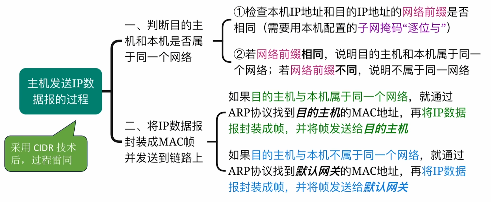
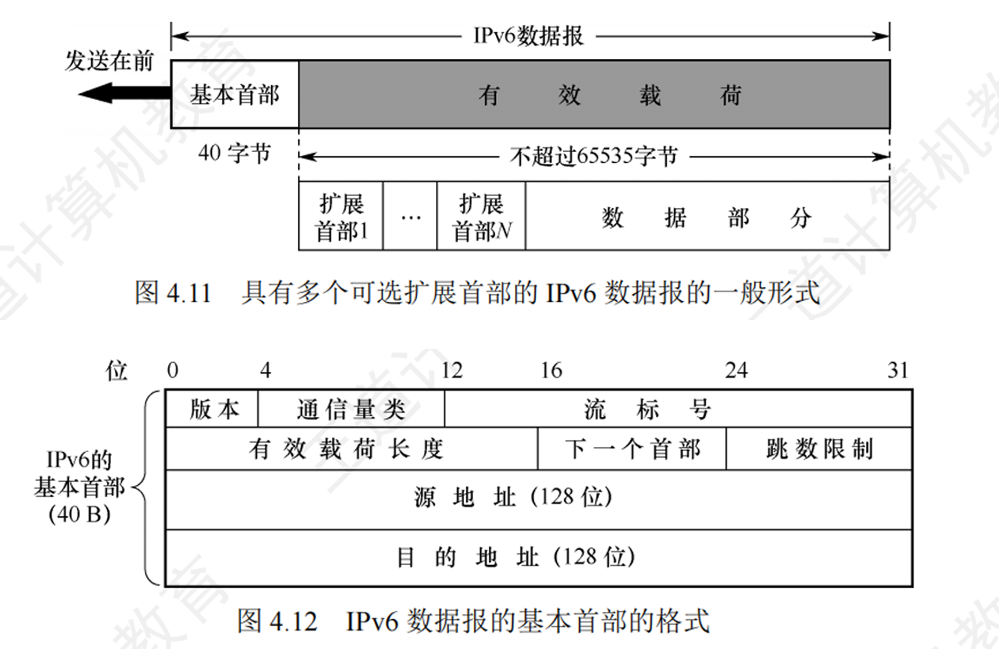
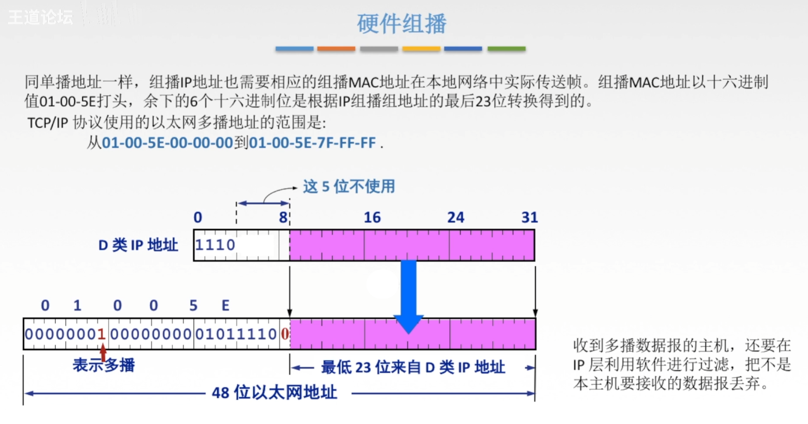

# 网络层

## 1 知识点

### 1.1 网络层功能

* 网络层提供虚电路或数据报的服务
* 网络层抽象结构：软件定义网络 $\text{SDN}$
* 使用路由器互连的多个局域网中，每个局域网的物理层、数据链路层、网络层协议都可以不同，但再往上协议必须相同
* 主机与路由器都不知道完整的分组转发地址
* **网络层提供无连接不可靠的数据报服务**

### 1.2 IPv4

* $\text{IPv4}$ 分组

  

  

  * 总长度只是理论上的，实际上受不同链路 $\text{MTU}$ 的限制。如果一个 $\text{IP}$ 数据报的总长度超出了下一段链路的 $\text{MTU}$ 就需要分片。数据链路层一个数据帧能承载的最大数据量称为最大传送单元 $\text{MTU}$，即 $\text{MTU}$ 是数据链路层的 $\text{SDU}$ 最大长度的专属称呼，即网络层的 $\text{PDU}$ 长度。如以太网的 $\text{MTU}=1500\text{B}$

  

  

  * 每个分片的数据部分必须是 $8\text{B}$ 的整数倍
  * 当 $\text{IP}$ 分组的长度大于 $\text{MTU}$ 且 $\text{DF}=1$ 时，则丢弃该分组，并使用 $\text{ICMP}$ 的终点不可达差错报告报文向源主机报告

  

  * 首部检验和的计算同 $\text{UDP}$，详见[首部检验和](./chapter4_transport_layer.md#12-udp)。但与 $\text{UDP}$ 相比，$\text{IP}$ 首部检验和不需要加伪首部再运算，且 $\text{IP}$ 首部检验和只检验首部，而不是像 $\text{UDP}$ 一样检验首部和数据
  * 跨网络传输时，$\text{IP}$ 数据报的 $\text{TTL}$ 会改变，因此首部检验和也会改变

* $\text{IP}$ 地址

  

  

  > ***例 1：$\text{H1}$ 给 $\text{H7}$ 发送 $\text{IP}$ 数据报***
  >
  > 源目的地址为 $\text{H1}$ 的 $\text{IP}$ 地址，目的地址为 $\text{H7}$ 的 $\text{IP}$ 地址。$\text{H1}$ 要先将数据报发给默认网关 $\text{B2}$ 接口。数据链路层组帧时通过 $\text{ARP}$ 协议获得 $\text{B2}$ 的 $\text{MAC}$ 地址，发往交换机。交换机通过转发最终给到路由器的 $\text{B2}$ 接口。路由器通过查询网络号，应该转发到 $\text{C0}$ 接口，路由器组帧时将目的 $\text{MAC}$ 地址改为路由器 $C$ 的 $\text{MAC}$ 地址。路由器 $C$ 查询后应当转发到 $\text{C2}$ 接口，根据目的 $\text{IP}$ 地址，利用 $\text{ARP}$ 协议获得 $\text{H7}$ 的 $\text{MAC}$ 地址，并将目的 $\text{MAC}$ 地址改为 $\text{H7}$ 的 $\text{MAC}$ 地址，通过最后一个交换机完成发送
  >
  > **因此，$\text{IP}$ 数据报发送时，源和目的 $\text{IP}$ 地址不变，目的 $\text{MAC}$ 地址随着路由而变**

   

  > ***例 2：$\text{H1}$ 给 $\text{H6}$ 发送 $\text{IP}$ 数据报***
  >
  > 源目的地址为 $\text{H1}$ 的 $\text{IP}$ 地址，目的地址为 $\text{H6}$ 的 $\text{IP}$ 地址。$\text{H1}$ 通过比对网络号发现收发双方在同一网络内，因此 $\text{H1}$ 不需要将数据报发给默认网关 $\text{B2}$ 接口，而是直接通过 $\text{ARP}$ 协议获得 $\text{H6}$ 的 $\text{MAC}$ 地址进行组帧，通过交换机送达

   

  > ***例 3：$\text{H1}$ 给互联网发送 $\text{IP}$ 数据报***
  >
  > 源目的地址为 $\text{H1}$ 的 $\text{IP}$ 地址，目的地址为互联网中某台主机的 $\text{IP}$ 地址。所有路由器的转发表都无法匹配目的 $\text{IP}$ 地址，因此通过其他接口进行转发

  * 默认网关即默认使用发送 $\text{IP}$ 数据报的路由器，路由器接口的 $\text{IP}$ 地址应与接口所连接的网络是同一个网络

* 子网划分技术

  

  * 默认路由 $\text{IP}$ 为`0.0.0.0`，子网掩码为`0.0.0.0`。当其他网络号无法匹配时，则通过默认路由转发出去

  

  

  

* 无分类编址 $\text{CIDR}$

  

  

  * 给狗剩分配时，路由器接口和主机各占一个 $\text{IP}$ 地址，全 $0$、全 $1$ 地址保留，因此一个最小的网络需要 $4$ 个 $\text{IP}$ 地址，即 $2\text{bit}$ 主机号。再往下就不能划分了，因为只有 $1\text{bit}$ 主机号，只剩全 $0$、全 $1$ 地址

    > 在最新标准中，点对点链路可以使用`/31`网络前缀，因为点对点链路不存在广播，网络号可以直接使用网络前缀表示，因此可以使用`/31`网络前缀，即主机号只用 $1\text{bit}$

* 路由聚合

  
  
  

  

  * 转发时匹配最长的网络前缀，默认路由的网络前缀的长度为 $0$

* 网络地址转换 $\text{NAT}$

  

  * 普通路由器工作在物理层、数据链路层、网络层；$\text{NAT}$ 路由器工作在物理层、数据链路层、网络层、应用层
  * 私有 $\text{IP}$ 地址

    |网络号|范围|说明|
    |:-:|:-:|:-:|
    |`10.0.0.0/8`|`10.0.0.0/8`~`10.255.255.255/8`|相当于 $1$ 个 $A$ 类网络|
    |`172.16.0.0/12`|`172.16.0.0/12`~`172.31.255.255/12`|相当于 $16$ 个连续的 $B$ 类网络|
    |`192.168.0.0/16`|`192.168.0.0/16`~`192.168.255.255/16`|相当于 $256$ 个连续的 $C$ 类网络|

    私有网络的 $\text{IP}$ 地址不允许出现在公网上，包括分配、转发

  

  > ***例 1：手机 1给手机 2发微信***
  >
  > 手机 $1$ 构造报文，并包装成 $\text{IP}$ 数据报。源端口为手机 $1$ 的内网端口`9855`，目的端口为手机 $2$ 的外网端口`4096`；源 $\text{IP}$ 地址为手机 $1$ 的内网 $\text{IP}$ 地址`192.168.3.48`，目的 $\text{IP}$ 地址为手机 $2$ 的外网 $\text{IP}$ 地址`66.211.88.55`。当手机 $1$ 的数据报经过自己网络的路由器时，根据 $\text{NAT}$ 表将源端口和源 $\text{IP}$ 地址换成对应的外网端口和 $\text{IP}$ 地址，即将源端口`9855`换成`7788`，源 $\text{IP}$ 地址`192.168.3.48`换成`59.175.49.153`。随后经过传输到达手机 $2$ 网络的路由器。该路由器根据 $\text{NAT}$ 表将目的端口和目的 $\text{IP}$ 地址换成内网中手机 $2$ 的端口和 $\text{IP}$ 地址完成传输

   

  > ***例 2：手机 1给 DiliDili服务器发信息***
  >
  > 手机 $1$ 构造报文，并包装成 $\text{IP}$ 数据报。源端口为手机 $1$ 的内网端口`9855`，目的端口为服务器的端口`80`；源 $\text{IP}$ 地址为手机 $1$ 的内网 $\text{IP}$ 地址`192.168.3.48`，目的 $\text{IP}$ 地址为服务器的外网 $\text{IP}$ 地址`200.1.1.4`。当手机 $1$ 的数据报经过自己网络的路由器时，根据 $\text{NAT}$ 表将源端口和源 $\text{IP}$ 地址换成对应的外网端口和 $\text{IP}$ 地址，即将源端口`9855`换成`7788`，源 $\text{IP}$ 地址`192.168.3.48`换成`59.175.49.153`。随后经过传输到达服务器

* 地址解析协议 $\text{ARP}$

  

  

  * $\text{ARP}$ 组帧时必定要填充，因为以太网帧数据部分长度应为 $[46,1500]\text{B}$

  

  * 每台主机、路由器都有自己的 $\text{ARP}$ 表，并且需要定期更新表项
  * 当被查询方收到请求分组或查询方收到响应分组时，会将 $\text{IP}$ 地址与 $\text{MAC}$ 地址对应关系记录在自己的 $\text{ARP}$ 表中
  * 流程
    * 发送方拿自己的掩码与运算源 $\text{IP}$ 地址和目的 $\text{IP}$ 地址，判断双方是否在同一个局域网内
    * 若在同一个局域网内，则发送 $\text{ARP}$ 请求报文获得接收方的 $\text{MAC}$ 地址，等待 $\text{ARP}$ 响应报文
    * 若不在一个局域网内，那么根据目的 $\text{IP}$ 和源 $\text{IP}$ 在路由器转发过程中，每段网络链路上都使用 $\text{ARP}$ 获得下一跳的 $\text{MAC}$ 地址，直到 $\text{IP}$ 数据报进入目的网络，使用 $\text{ARP}$ 获得目的主机的 $\text{MAC}$ 地址

* 动态主机配置协议 $\text{DHCP}$

  

  

  * 因为一个网络中可能存在多个 $\text{DHCP}$ 服务器，因此主机请求 $\text{IP}$ 地址时的 $\text{DISCOVER}$ 帧和 $\text{REQUEST}$ 帧会被多个 $\text{DHCP}$ 服务器收到，每个服务器都认为是要求自己分配一个 $\text{IP}$ 地址。因此 $\text{DISCOVER}$ 帧和 $\text{REQUEST}$ 帧在数据链路层和网络层都必须是广播的，而不能是单播的，否则可能出现主机请求 $\text{IP}$ 地址，服务器 $1$ 和服务器 $2$ 都分配了地址，但主机只跟服务器 $2$ 单播接受了服务器 $2$ 的 $\text{IP}$ 地址，导致服务器 $1$ 分配的地址看似分配出去实则未被使用的情况

* 网际控制报文协议 $\text{ICMP}$

  

  * $\text{IP}$ 数据报首部检验和出错时，则该数据报被认为是不完整、不可信的，因此不会发丝 $\text{ICMP}$ 差错控制报文

### 1.3 IPv6

* 每段只省略前导 $0$，中间和末尾 $0$ 不能省略
* 地址中最多只能出现一次`::`

* 任播：访问`www.bilibili.com`这个域名时，域名背后是一组服务器，自动选择一台离用户最近的服务器为其提供服务

* 与 $\text{IPv4}$ 相比，$\text{IPv6}$ 对首部中的某些字段进行了如下更改
  * 取消了首部长度字段，**因为 $\text{IPv6}$ 的首部长度是固定 $40\text{B}$**
  * 取消了服务类型字段，因为优先级和流标号字段实现了服务类型字段的功能
  * 取消了总长度字段，改用有效载荷长度字段
  * 取消了标识、标志和片偏移字段，因为这些功能已包含在分片扩展首部中
  * **把 $\text{TTL}$ 字段改称为跳数限制字段**，但作用是一样的(名称与作用更加一致)
  * 取消了协议字段，改用下一个首部字段
  * **取消了检验和字段**，毕竟在传输层有差错检验功能，这样就加快了路由器的处理速度
  * 取消了选项字段，而用扩展首部来实现选项功能

* $\text{IPv6}$ 基本首部中各字段的含义
  * 版本。占 $4$ 位，指明协议的版本，对于 $\text{IPv6}$ 该字段的值是 $6$
  * 通信量类。占 $8$ 位，用来区分不同的 $\text{IPv6}$ 数据报的类别或优先级
  * 流标号。占 $20$ 位，$\text{IPv6}$ 提出流的抽象概念。流是指互联网上从特定源点到特定终点(单播或多播)的一系列数据报(如实时音/视频传输)，而在这个“流”所经过的路径上的路由器都保证指明的服务质量。所有属于同一个流的数据报都具有相同的流标号
  * 有效载荷长度。占 $16$ 位，指明 $\text{IPv6}$ 数据报除基本首部以外的字节数(所有扩展首部都算在有效载荷之内)。这个字段的最大值是 $65535\text{B}$
  * 下一个首部。占 $8$ 位，该字段相当于 $\text{IPv4}$ 首部中的协议字段或可选字段。当 $\text{IPv6}$ 没有扩展首部时，其作用与 $\text{IPv4}$ 的协议字段一样,它指明 $\text{IPv6}$ 数据报所运载的数据是何种协议数据单元；当 $\text{IPv6}$ 带有扩展首部时，它就标识后面第一个扩展首部的类型
  * 跳数限制。占 $8$ 位，类似于 $\text{IPv4}$ 首部的 $\text{TTL}$ 字段。源点在每个数据报发出时即设定某个限制值(最大为255)。路由器每次转发时将其值减1，减为0时就将该数据报丢弃
  * 源地址和目的地址。占 $128$ 位，是数据报的发送端/接收端的地址

### 1.4 路由算法与协议

#### 1.4.1 路由算法

* $路由器X到网络n的最短距离=\text{min}_{v=1..k}(路由器X到邻居路由器v的距离+路由器v到网络n的距离)$

#### 1.4.2 路由协议

* 分层次的路由协议

  

  

  * 采用分层路由后，路由器被划分为区域，**每个路由器只知道如何将分组路由到自己所在区域内的目标地址，但对于其他区域内的结构毫不知情**。当不同的网络相互连接时，可将每个网络当作一个独立的区域，这样做的好处是一个网络中的路由器不必知道其他网络的拓扑结构

* 路由信息协议 $\text{RIP}$

  

  

  * 路由器 $B$ 收到了路由器 $A$ 发来的路由表，则把 $A$ 的路由表中的下一跳全改成 $A$，并且网络距离 $+1$，表示 $B$ 如果经过 $A$ 会出现的路由
  * 如果改造后的 $A$ 路由表中的网络
    * $B$ 没有，则添加到 $B$ 的路由表中
    * $B$ 有，且下一跳相同(都是 $A$ )，则更新距离
    * $B$ 有，且下一跳不同，则比较距离。距离更短则更新；距离相同则添加作为负载均衡；距离更长则不更新
  
  

  * $\text{RIP}$ 坏消息传得慢，因为存在距离向量环路，本来标记为不可达的网络经过其他滞后路由器更新后又可达了，形成环路直到所有路由器都发现不可到达才结束
  * $\text{RIP}$ 好消息传得快，有更短路由时很快能通过更新传遍网络

* 开放最短路径优先协议 $\text{OSPF}$

  

  * $\text{OSPF}$ 的 $\text{LSI}$ 中不写下一跳的 $\text{IP}$ 地址，而是写下一跳路由器的 $\text{Router ID}$

  

  

  

  * 通过选举 $\text{DR}$ 和 $\text{BDR}$ 减少路由器两两通信的数量，降低网络负载
  * 在更大的 $\text{AS}$ 中分割为多个小的区域，每个区域使用 $\text{OSPF}$，进一步降低路由器两两通信的数量，但会使 $\text{OSPF}$ 更加复杂
  * 不同 $\text{AS}$ 间的路由器只知道本 $\text{AS}$ 内的网络路由；不同 $\text{Area}$ 间的路由器只知道本 $\text{Area}$ 内的网络路由

* 边界网关协议 $\text{BGP}$

  

  

  * $\text{BGP}$ 会话类型：$\text{BGP}$ 外部会话 $\text{eBGP}$、$\text{BGP}$ 内部会话 $\text{iBGP}$

  

  * 先看本地偏好值，若说"没有任何约束策略"则说明没有本地偏好值，转而看 $\text{AS}$ 跳数最少的路由；若出现 $\text{AS}$ 跳数相同的路由，则使用热土豆算法，在本 $\text{AS}$ 内使用 $\text{RIP}$ 或 $\text{OSPF}$ 找到最短能离开本 $\text{AS}$ 的路由。如果还不行，就选 $\text{BGP}$ 标识符数值最小的路由

* 总结

  

  * $\text{RIP},\text{BGP}$ 是应用层协议，$\text{OSPF}$ 是网络层协议

### 1.5 IP多播

### 1.6 移动IP

> ***示例：用一个生动的“移动办公室”故事来串讲移动 IP中的这些关键术语***
>
> ---
>
> **故事主角：** 小明（一位经常出差的销售经理）
>
> **场景：**
>
> 1. **小明的“归属地”办公室 (Home Network)：**
>     * 这是小明公司总部的办公室，位于北京。
>     * 办公室里有一位专门负责小明的秘书，我们叫她**秘书小归 (归属代理 - Home Agent)**。
>     * 小明在总部办公室有一个固定的办公桌，桌上的电话号码是 **010-12345678**。这个号码就是小明的**归属地址 (Home Address)**。所有寄给小明的正式文件、客户寄来的合同、总部的内部通知，都会通过这个固定号码/地址送到他的桌上。
>
> 2. **小明出差到“外地”办公室 (Foreign Network)：**
>     * 今天，小明需要去上海分公司出差一周。
>     * 上海分公司的办公室就是**外地网络 (Foreign Network)**。
>     * 上海办公室也有一位热心的接待员，我们叫他**接待员小外 (外地代理 - Foreign Agent)**。
>
> 3. **小明到达上海并“注册” (Registration)：**
>     * 小明一到上海，就用笔记本电脑连接上了上海分公司的Wi-Fi。
>     * 他的电脑（**移动结点 - Mobile Node**）立刻被识别为“外来户”。
>     * 接待员小外（外地代理）走过来，热情地说：“欢迎光临！我知道您是北京总部的小明。为了方便联系，我给您安排了一个临时的办公桌和一个临时的本地电话分机号，比如 **021-88888888**。这个号码就是您的**转交地址 (Care-of Address)**。任何需要临时联系您的事，都可以打这个分机找您。”
>     * 小外（外地代理）还会立刻给北京的秘书小归（归属代理）发一份“报到通知”：“喂，小归啊，我是上海的小外。你们的小明现在到我这儿了，他的临时分机号是021-88888888，你记一下，有事找他打这个号！”
>
> 4. **客户如何联系小明 (数据包的转发)：**
>     * 假设北京总部的一位重要客户，需要给小明发一份紧急合同。客户只知道小明那个固定的电话号码 **010-12345678**（归属地址）。
>     * 客户拨通了010-12345678。电话打到了北京总部，接线员（相当于网络路由）发现这个号码对应的主人小明不在。
>     * 但接线员知道，秘书小归（归属代理）专门负责小明的事。于是，接线员把电话转给了小归。
>     * 秘书小归（归属代理）拿出她的“小明动态联系簿”（绑定缓存），一看：“哦，小明现在在上海，临时电话是021-88888888（转交地址）。”
>     * 小归（归属代理）做了一件关键的事：她**把自己变成了一个“邮差”**。她把客户发来的合同（数据包）**封装**在一个新的信封里，新信封的收件人地址写的是上海的021-88888888（转交地址）。这个过程叫做**隧道 (Tunneling)**。
>     * 小归（归属代理）把这个“套娃”信封（隧道后的数据包）寄往上海。
>
> 5. **小明收到文件 (接收数据)：**
>     * 上海的接待员小外（外地代理）收到了寄到021-88888888的信封。
>     * 他拆开外层信封（解封装），取出里面真正的合同（原始数据包）。
>     * 小外（外地代理）把合同交给了正在临时办公桌前工作的移动结点——小明。
>
> 6. **小明回复客户 (发送数据)：**
>     * 小明看完合同，需要立刻回复客户。他可以直接用笔记本电脑，**以自己的归属地址 010-12345678 作为源地址**，直接发邮件给客户。
>     * 这样，客户收到的邮件显示发件人还是那个熟悉的010-12345678，客户完全不知道小明已经出差到了上海。这保证了通信的**透明性**。
>
> ---
>
> ***总结与术语对应***
>
> * **移动结点 (Mobile Node)**：小明和他的笔记本电脑。一个可以在不同网络间移动的设备。
> * **归属网络 (Home Network)**：北京总部办公室。移动结点永久的“家”网络。
> * **归属地址 (Home Address)**：010-12345678。移动结点在归属网络上的永久、固定IP地址。通信对端（客户）只知道这个地址。
> * **归属代理 (Home Agent)**：秘书小归。位于归属网络，负责监控移动结点的位置。当数据包发往移动结点的归属地址时，它会拦截并**通过隧道转发**到移动结点当前的转交地址。
> * **外地网络 (Foreign Network)**：上海分公司办公室。移动结点当前临时接入的网络。
> * **外地代理 (Foreign Agent)**：接待员小外。位于外地网络，为到达的移动结点提供服务，如分配转交地址，并协助其向归属代理注册。
> * **转交地址 (Care-of Address)**：021-88888888。移动结点在外地网络上获得的临时IP地址。它标识了移动结点当前的实际位置。归属代理通过隧道将数据包发往此地址。
>
> 这个故事生动地展示了移动IP如何通过**归属代理**和**外地代理**的协作，利用**归属地址**和**转交地址**，以及**隧道技术**，让移动结点（小明）在移动过程中，对外仍然保持一个固定的标识（归属地址），确保通信不中断。

### 1.7 网络层设备

* 路由表的分组转发包括
  * 交换结构：根据转发表处理分组，将从某个输入端口进入的分组从一个合适的输出端口转发出去。路由表的路由信息由交换结构计算得到
  * 输入端口：包括物理层、数据链路层、网络层的处理模块
  * 输出端口：从交换结构接收分组，再将其转发到路由器外的线路上
* 路由器的路由选择部分包括
  * 路由选择处理机：根据所选定的路由选择协议构造路由表，同时和相邻路由器交换路由信息
  * 路由选择协议：用来更新路由表的算法
  * 路由表：它是根据路由算法得出的，一般包括从目的网络到下一跳的映射。

## 2 题目

### 2.1 选择

* 4.1习题
  * 03(局域网协议)
  * 07(主机和路由器都不知道完整路由地址)
  * 09(虚电路不适合故障率高的网络，因为一旦出现故障就要重新建立连接，而数据报可以动态选择转发结点)
* 4.2习题
  * 04(ICMP差错控制报文)
  * 15(多播地址、广播地址)
  * ***33(同子网的子网掩码)***
  * ***34(划分子网多余位数可当子网号)***
  * ⭐***40(子网划分二叉树、子网个数)***
  * ⛔***45(ARP局域网与跨局域网)***
  * ***53(/30子网能收到广播的最大主机数)***
  * ⭐ ***54(子网聚合、路由表下一跳)***
  * ⛔***67(IP数据报分片必须是8B的整数倍)***
* 4.3习题
  * ⛔***25(RIP坏消息传得慢)***
* 4.4习题
  * 14(RIP是应用层协议)
  * ***19(BGP交换的路由信息是到达网络的路径)***
* 4.5习题
* 4.6习题
  * 01(到达新网络通知本地代理)
* 4.7习题
  * 11(路由表分组转发结构)
  * ***18(路由器拥塞情况、全双工链路带宽指单向带宽，即带宽若为 $W$，则双向总带宽为 $2W$)***
  * ***19(网桥是单接口交换机，只隔离冲突域不隔离广播域)***

### 2.2 大题

* 4.2习题
  * ⭐***13(DHCP服务器路由直接用服务器IP，掩码全1、互联网路由就是默认路由`0/0`)***
  * ⭐***14(DHCP DISCOVER报文目的IP，目的MAC、错误配置默认网关后只可访问本网络不能访问互联网)***
  * ⛔***15(IP数据报分片必须是8的整数倍)***
  * ***16(NAT出会自动配置映射，入需要提前配置好，不然IP分组到了不知道转给谁)***
  * ⛔***17(根据争用期算最远相隔距离、DHCP报文、802.11帧)***
* 4.4习题
  * ***04(路由表中的"下一跳"应该写下一个路由器接口的IP地址，而不是路由器的名字(如R1)、BGP)***
  * ***05(OSPF要看边权决定路由路径)***
  * ⭐***06(RIP与OSPF的选择、路过 k个路由器的IP分组的TTL至少应该是 k+1、BGP路由算法)***
* 4.7习题
  * 03(路由器交换机网络综合、NAT)
