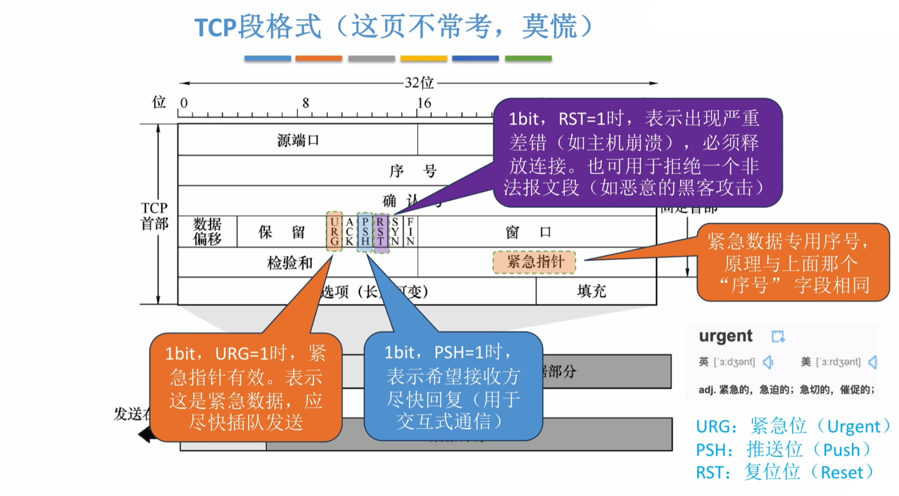

# 传输层

## 1 知识点

### 1.1 传输层功能

* $\text{TCP}$ 和 $\text{UDP}$ 的端口互相独立，即两个协议可以使用同一个端口号，以套接字中的协议作区分
* $\text{TCP}$ 的面向连接可以保证可靠与顺序交付
* 套接字可以唯一确定一个在互联网上通信的进程

### 1.2 UDP

* $\text{UDP}$ 只在 $\text{IP}$ 的基础上增加了端口(复用分用功能)
* $\text{UDP}$ 数据段的理论最大长度为 $65515\text{B}$，因为封装为 $\text{IP}$ 数据报后 $\text{IP}$ 首部至少 $20\text{B}$。实际长度依赖链路的 $\text{MTU}$

* 若检验和的计算结果正好为全 $0$，则设置检验和的内容为全 $1$，因为全 $0$ 表示不启用检验和

* 该算法适用于 $\text{IP}$ 数据报和 $\text{UDP}$ 数据段的首部检验和。 $\text{IP}$ 数据报只需要将首部按每 $16\text{bit}$ 计算取反即得到首部检验和。$\text{UDP}$ 数据段检验和则要额外增加伪首部再计算

### 1.3 TCP

* 概念

  

* $\text{TCP}$ 报文段

  

  * 确认号不包括当前序号，例如已发送 $0,1,2,3$ 报文段，收到确认号 $2$，表明 $0,1$ 已被正确接收。确认号既可以解读为对之前序号的累计确认，也可以解读为接下来想要接收的序号

  

  * $\text{TCP}$ 报文段数据部分长度 $=\text{IP}$ 数据报总长度 $-\text{IP}$ 首部长度 $-\text{TCP}$ 首部长度

  

  * 紧急指针本质上也是序号，但与序号拥有不同的号码

  

  

  

  

  * 双方各自设置的 $\text{MSS}$ 可以不相同。协商 $\text{MSS}$ 的目的是预留收发缓冲区，以便更好地通信

* 连接管理

  

  

  * 建立连接

    

    * **握手 $3$ 可以携带 $1\cdot\text{MSS}$ 的数据，之后的数据量由拥塞窗口和接收窗口决定。也就是说，如果握手 $3$ 要携带数据，则从连接建立到第一个 $\text{MSS}$ 被接收必定需要 $2\cdot\text{RTT}$，后续随着发送窗口的提高才能够叠发(即一个 $\text{RTT}$ 内完成发送窗口内所有 $\text{MSS}$ 的发送和确认)**

    

  * 释放连接

    

    

    * 断开连接可以是客户端先挥手，也可以是服务器先挥手。因此图左为先挥手的一方，图右为被动接受的一方
    * 先挥手的一方在收到挥手 $3$ 后要等待 $2\text{MSL}$，用以确认另一方先关闭连接。在 $\text{TIME-WAIT}$ 期间如果再次收到挥手 $3$ 需要重置计时器

    

* 可靠传输与流量控制

  

  * 推迟确认等待一段时间，如果到来了其他的数据段，则可以一起累计确认。但如果连续收到两个超过 $\text{MSS}$ 的报文段，因为长报文段超时重传代价更高，为了避免超时风险应该立即确认

  

  * 发送窗口不能大于接受窗口，以免发太快导致接收缓冲区溢出，由此实现流量控制
  * $\text{TCP}$ 为每个连接设有一个持续计时器，只要发送方收到对方的零窗口 $(\text{rwnd}=0)$ 通知，就启动**持续计时器**。若计时器超时，则发送一个零窗口探测报文段，而对方就在确认这个探测报文段时给出现在的窗口值。若窗口仍然为零，则发送方收到确认报文段后就重置持续计时器

  

  * **$\text{TCP}$ 的窗口收发单位是字节，区分于数据链路层的 $\text{ARQ}$ 协议，$\text{ARQ}$ 的收发单位是帧**

  

  * 一个端口可以创建多个套接字对象
  * 发送缓冲区和接收缓冲区大小可以不等

  

  

  

  * 数据必须是有序的，即若收到了 $1,2,4,5$，则只能上交 $1,2$，确保收到的数据序号是连续的

  

  

  

  * **收到一个 $\text{TCP}$ 数据段就立即确认。若发送方连续收到 $3$ 个冗余的对同一数据段的确认，即一共收到 $4$ 个对同一数据段的确认(第一个是正常确认，后三个是冗余确认)，则证明数据段丢失，立即在收到第 $3$ 个冗余确认时重传该数据段**

* 拥塞控制

  

  

  * 拥塞窗口是 **发送方** 根据网络拥塞情况确定的窗口值
  * 发送窗口的大小为接收窗口和拥塞窗口的最小值。如果说接收窗口无限大，则发送窗口即为拥塞窗口。但如果接收窗口有固定大小，注意是累计确认还是立即确认，累计确认会使接收窗口一直减小，因为接收窗口需要暂存已接收的数据段

  

  * 遇到超时重传会重新慢开始，同时 $\text{ssthresh}=\text{cwnd}/2$，$\text{cwnd}=1$。但 $\text{ssthresh}$ 不能低于 $2$
  * 遇到超时重传会重新慢开始，遇到 $3\text{ACK}$ 则会快恢复。但超时与 $3\text{ACK}$ 都是网络拥塞
  * 若慢开始经过一个 $\text{RTT}$ 窗口翻倍后大于拥塞控制阈值，则只能增长到阈值。即慢开始算法中 $\text{cwnd}=\min{(2\cdot\text{cwnd},\,\text{ssthresh})}$

  

## 2 题目

* 5.1习题
  * 03(面向连接的服务可以确保数据的顺序交付)
* 5.2习题
  * 08(全0检验和)
* 5.3习题
  * ***10(TCP的窗口是字节)***
  * 14(持续计时器)
  * 17(拥塞窗口是发送方确定的)
  * ***22(序号消耗总量)***
  * ⭐***44(发送窗口剩余发送量)***
  * ⛔***49(使用累计确认的拥塞控制发送窗口大小)***
  * ***53(拥塞窗口增加最长时间)***
  * ⛔***54(序号消耗总量)***
  * ⛔***60(TCP连接全过程最少时间)***
