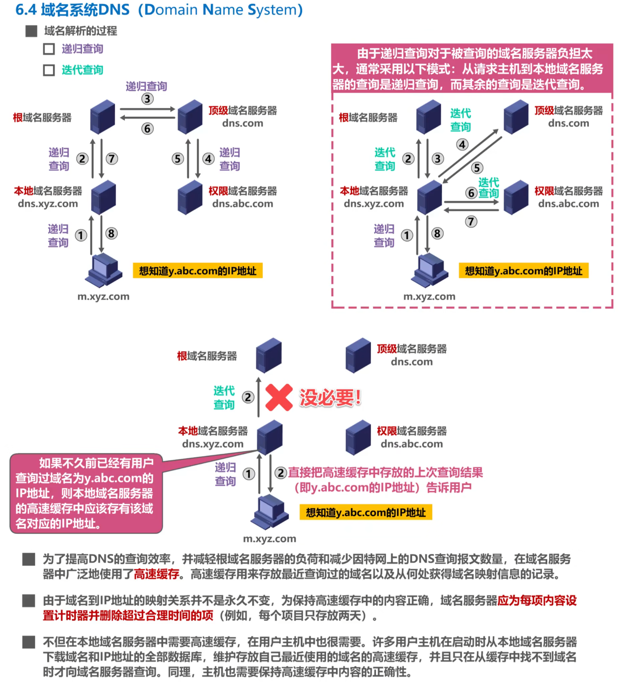
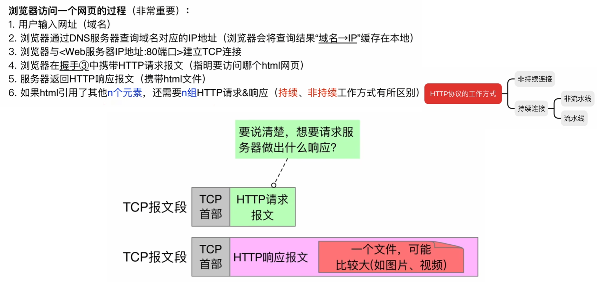
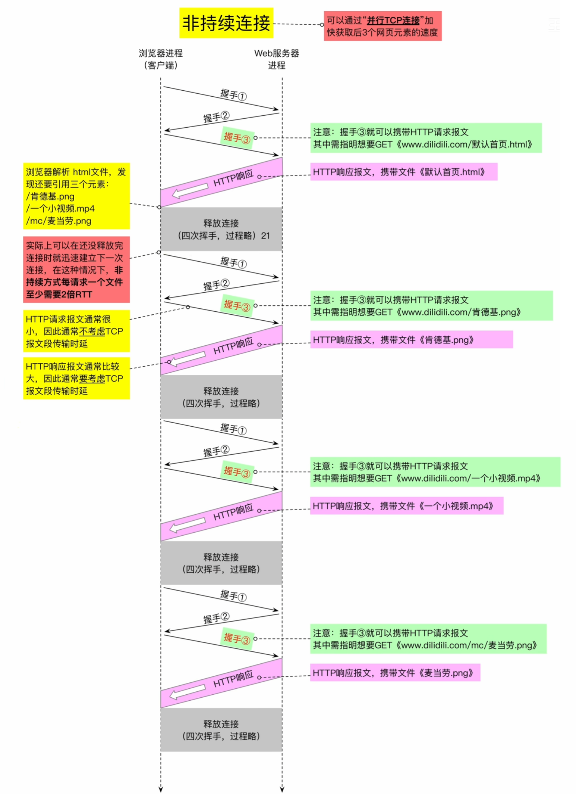
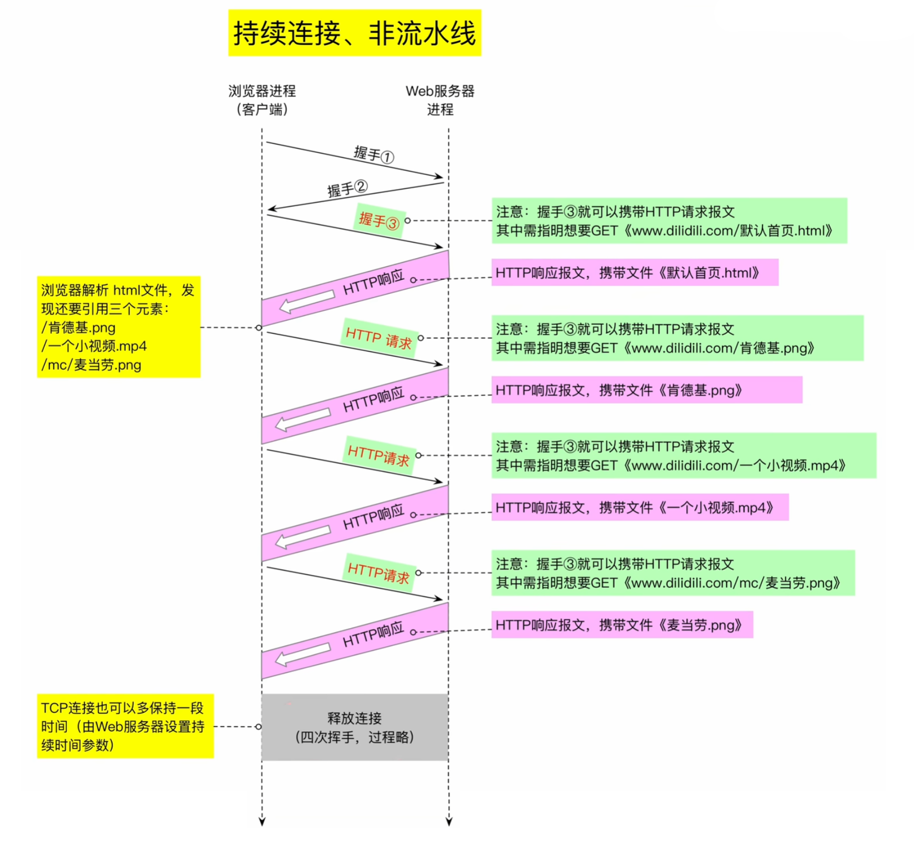
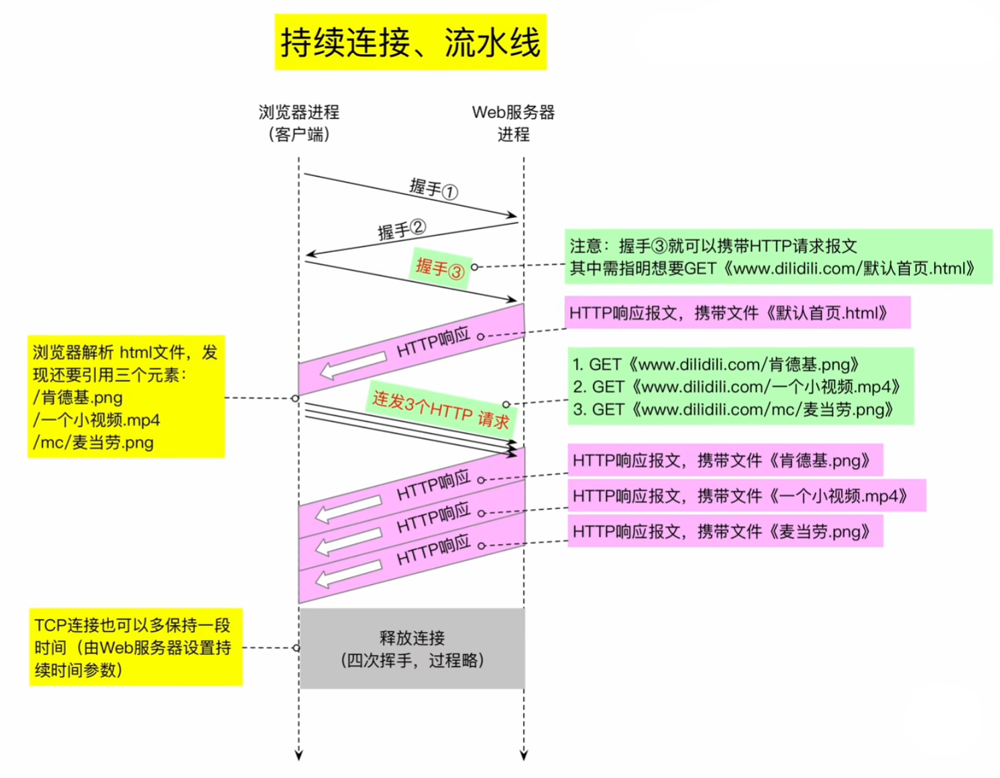
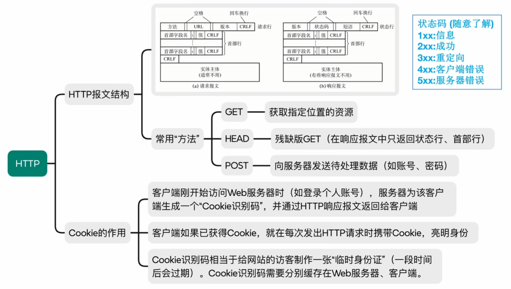

# 应用层

## 1 知识点

| 互联网应用 | $\text{TCP/IP}$ 应用层协议 | $\text{TCP/IP}$ 传输层协议 | 端口号 |
| :-: | :-: | :-: | :-: |
| 域名解析 | 域名系统 $(\text{DNS})$ | $\text{UDP}$ | $53$ |
| 文件传送 | 简单文件传送协议 $(\text{TFTP})$ | $\text{UDP}$ | $69$ |
| 路由选择 | 路由信息协议 $(\text{RIP})$ | $\text{UDP}$ | $520$ |
| 路由选择 | 边界网关协议 $(\text{BGP})$ | $\text{TCP}$ | $179$ |
| $\text{IP}$ 地址分配 | 动态主机配置协议 $(\text{DHCP})$ | $\text{UDP}$ | $68$ |
| 网络管理 | 简单网络管理协议 $(\text{SNMP})$ | $\text{UDP}$ | $161$ |
| 远程终端接入 | 远程终端协议 $(\text{TELNET})$ | $\text{TCP}$ | $23$ |
| 万维网(服务端) | 超文本传送协议 $(\text{HTTP})$ | $\text{TCP}$ | $80$ |
| 文件传送 | 文件传送协议 $(\text{FTP})$ | $\text{TCP}$ | 服务器控制通道 $21$   服务器数据通道 $20$   客户端使用临时端口 |
| 电子邮件发送 | 简单邮件传送协议 $(\text{SMTP})$ | $\text{TCP}$ | $25$ |
| 电子邮件接收 | 邮局协议 $(\text{POP3})$ | $\text{TCP}$ | $110$ |
| 电子邮件接收 | 因特网邮件访问协议 $(\text{IMAP4})$ | $\text{TCP}$ | $143$ |

### 1.1 网络应用模型

### 1.2 域名系统 DNS

* 根域名服务器，顶级域名服务器用来给出索引指向，具体的域名转 $\text{IP}$ 地址由权限域名服务器完成

> ***示例：用一个生动的“寻宝”故事，把域名解析过程中根域名服务器、顶级域名服务器、权限域名服务器、本地域名服务器和主机之间的关系和作用讲清楚***
>
> 想象一下，你要找到一个藏在世界某个角落的宝藏，这个宝藏的名字叫 `treasure.example.com`。
>
> * **你 (主机)**：就是发起寻宝请求的人。你只知道宝藏的名字 `treasure.example.com`，但不知道它具体在世界的哪个国家、哪个城市、哪条街的哪个门牌号。你手里只有一张空白的地图。
>
> * **你的私人向导 (本地域名服务器)**：你有个非常热心的私人向导（比如你的手机或电脑默认设置的 DNS 服务器，可能是你的 ISP 提供的，比如 `8.8.8.8` 或 `114.114.114.114`）。你把宝藏名字 `treasure.example.com` 告诉他，让他帮你找。他是你的第一联系人，负责帮你跑腿、查资料、问路。他脑子里可能记着一些常见宝藏的地址（缓存），但 `treasure.example.com` 他没听说过。
>
> ---
> ***寻宝开始(迭代查询)***
>
> 1. **向导求助“世界地图中心” (查询根域名服务器)**
>     * 你的向导（本地域名服务器）不知道 `treasure.example.com` 在哪，但他知道一个“世界地图中心”（**根域名服务器**）。
>     * 他跑去问“世界地图中心”：“您好！我想找 `treasure.example.com` 这个宝藏，您能告诉我它在哪个‘顶级国家/区域’（顶级域名）吗？比如 `.com`、`.org`、`.cn` 这类？”
>     * “世界地图中心”（根域名服务器）非常权威，但它不会直接告诉你宝藏在哪。它只会告诉你大的分区方向。它查了查它的超级地图，回答向导：“`com` 这个区域啊？负责管理 `.com` 区域的‘领事馆’（**顶级域名服务器**）的地址是 `ns.com-gTLD-servers.net`。你去找他吧！”
>
> 2. **向导求助“.com 领事馆” (查询顶级域名服务器)**
>     * 你的向导（本地域名服务器）谢过“世界地图中心”，立刻马不停蹄地跑到 `.com` 领事馆（**顶级域名服务器**）。
>     * 他问领事馆官员：“您好！我受人之托，要找 `example.com` 这个地方里的 `treasure` 宝藏。您知道管理 `example.com` 这个具体‘城市’（域名）的‘市政厅’（**权限域名服务器**）在哪吗？”
>     * `.com` 领事馆（顶级域名服务器）掌管着所有 `.com` 后缀的“城市”。它查了查它的登记簿，告诉向导：“管理 `example.com` 这个城市的‘市政厅’（权限域名服务器）有两个，地址是 `ns1.example.com` 和 `ns2.example.com`。你去找他们准没错！”
>
> 3. **向导求助“example.com 市政厅” (查询权限域名服务器)**
>     * 你的向导（本地域名服务器）再次道谢，然后直奔 `example.com` 市政厅（**权限域名服务器**）。这个市政厅是唯一真正知道 `example.com` 城市里所有宝藏（主机）具体位置的地方。
>     * 向导问市政厅的工作人员：“您好！我要找 `treasure.example.com` 这个具体的宝藏，它的精确坐标（IP 地址）是多少？”
>     * 市政厅（权限域名服务器）查了查它最详细的地籍档案（DNS 记录），找到了答案：“哦，`treasure.example.com` 啊，它的精确坐标是 `93.184.216.34`。”
>
> 4. **向导带回宝藏坐标 (返回结果)**
>     * 你的向导（本地域名服务器）终于拿到了宝藏的精确坐标 `93.184.216.34`！他立刻把这个信息记在自己的小本本上（缓存起来，下次别人问就不用再跑一趟了），然后火速跑回来告诉你（**主机**）：“找到了！`treasure.example.com` 的坐标是 `93.184.216.34`！”
>
> 5. **你直奔宝藏 (建立连接)**
>     * 你（**主机**）拿到 IP 地址 `93.184.216.34` 后，就可以直接拿着这个地址，通过网络找到对应的服务器，获取你想要的网页、文件或其他服务了，就像拿着精确坐标找到了宝藏。
>
> ---
>
> ***总结关系与作用***
>
> | 角色 | 比喻 | 作用 | 特点 |
> | :--- | :--- | :--- | :--- |
> | **主机 (你)** | 寻宝者 | 发起域名查询请求，最终使用获取到的 IP 地址 | 知道域名，需要 IP |
> | **本地域名服务器 (你的向导)** | 私人向导 | 代表主机进行递归查询；向更高层级的服务器询问；缓存结果以提高效率 | 主机的“代理”，负责“跑腿”和“记忆” |
> | **根域名服务器 (世界地图中心)** | 世界地图中心 | 提供顶级域名服务器的地址 | 知道所有顶级域（.com, .org, .net, .cn 等）的“领事馆”在哪，但不知道具体域名 |
> | **顶级域名服务器 (.com 领事馆)** | .com 领事馆 | 提供负责某个具体域名的权限域名服务器的地址 | 知道某个顶级域（如 .com）下各个域名（如 example.com）的“市政厅”在哪 |
> | **权限域名服务器 (example.com 市政厅)** | example.com 市政厅 | 存储并提供该域名下所有主机（如 treasure.example.com）的最终 IP 地址 | 是特定域名（如 example.com）记录的“权威”来源，知道最精确的信息 |
>
> **关键点：**
>
> * **递归 vs. 迭代**：主机对本地服务器的查询是**递归**的（“你必须给我一个答案”）。本地服务器对根、顶级、权限服务器的查询是**迭代**的（“你告诉我下一步找谁，我去问”）。
> * **层级结构**：这是一个树状的层级结构，从根开始，逐级向下查询，直到找到权威答案。
> * **缓存**：本地域名服务器会缓存查询结果，短时间内再次查询相同域名就不用走完整流程了，大大提高了效率。

* 域名与 $\text{IP}$ 地址(服务集群)、$\text{MAC}$ 地址(多网卡)、主机都不是唯一对应的
* 如果主机和本地域名服务器同处一个网络内，则主机递归查询本地域名服务器的时间是可以忽略的

### 1.3 文件传输协议 FTP

* 控制连接在会话期间一直打开，数据连接在需要传数据时建立，传完关闭
* **带外传送**：控制信息和数据信息通过不同的逻辑信道传送。$\text{FTP}$ 采用带外传输的方式
* 主动模式 $\text{PORT}$ 下服务器的数据连接端口为 $20$，被动模式 $\text{PSAV}$ 下服务器的数据连接端口由双方协商。两种模式下服务器的控制连接端口均为 $21$。**客户端的端口号全是临时端口号**
* `LIST`命令是数据传输命令，用于获取服务端的文件列表

### 1.4 电子邮件

* 概念、收发流程、邮件结构

  

  

  * $\text{SMTP}$ 用于用户代理向邮件服务器、邮件服务器间发送邮件   $\text{MIME}$ 用于扩展 $\text{SMTP}$ 的传输类型    $\text{POP3},\text{IMAP4}$ 用于从邮件服务器到用户代理发送邮件。$\text{POP3}$ 不能管理用户邮箱，$\text{IMAP4}$ 可以管理用户邮箱
  * 用户代理中的 $\text{SMTP}$ 地址错误会导致不能发邮件，收件人 $\text{E-mail}$ 地址错误会导致发错人或投递失败(如没有这个邮箱)   用户代理的 $\text{POP3}$ 地址错误会导致无法接收邮件

  

  * $\text{From}$、发送时间由系统自动生成；$\text{To}$、$\text{Subject}$ 需要发件人手动填入

* 简单邮件传输协议 $\text{SMTP}$

  

  * $\text{SMTP}$ 只支持传输 $7\text{bit}$ 的 $\text{ASCII}$ 码内容

* 多用途因特网邮件扩展 $\text{MIME}$

  

  * $\text{SMTP}$ 不能传非 $\text{ASCII}$ 码的内容，也不能传图像、视频、音频数据。因此采用 $\text{MIME}$ 扩展，将非 $\text{ASCII}$ 数据转换成 $\text{ASCII}$ 数据

* 邮局协议 $\text{POP3}$、因特网报文存取协议 $\text{IMAP4}$

  

  * $\text{POP3}$ 明文传递登录密码，不对密码进行加密。
  * $\text{POP3}$ 基于 $\text{ASCII}$ 码，如要传递非 $\text{ASCII}$ 码数据需要使用 $\text{MIME}$ 将数据转换成 $\text{ASCII}$ 码
  * $\text{POP3}$ 一个账号在服务器上只能有一个邮件接收目录

* 基于万维网的电子邮件

  

### 1.5 万维网

* 万维网 $\text{WWW}$

  

  

  * 请求报文内容较少，因此大部分情况下传输时延可以忽略，但 $\text{HTTP}$ 响应内容大，传输时延往往不能忽略

  

  * $\text{HTTP1.0}$ 默认采用非持续连接，$\text{HTTP1.1}$ 默认采用持续连接   $\text{HTTP}$ 请求报文中 $\text{Connection: Close}$ 是非持续连接，$\text{Connection: keep-alive}$ 是持续连接
  * 非持续连接(非并行)请求一个文档时，若文档内有 $n$ 个其他资源，则一共要建立 $n+1$ 次 $\text{TCP}$ 连接，$(n+2)\cdot\text{RTT}$，第一个 $\text{RTT}$ 用于建立连接，第二个则捎带请求信息
  * 并行方式可以在 $2\cdot\text{RTT}$ 内并行地建立连接，再请求资源
  * **挥手时间可以忽略，即刚开始挥手，就立即开始建立新的连接，则每请求一个资源只需要 $2\cdot\text{RTT}$，一个 $\text{RTT}$ 用来连接，一个 $\text{RTT}$ 用来请求资源**

  

  

* 超文本传输协议 $\text{HTTP}$

  

  * `GET`返回资源信息和资源；`HEAD`只返回资源信息，相当于询问资源存不存在
  * $\text{Cookie}$ 由服务端生成，在客户端和服务端存储

## 2 题目

### 2.1 选择

* 6.1习题
* 6.2习题
  * 09(权限域名服务器)
  * ⛔***14(HTTP、域名解析最短最长时间)***
* 6.3习题
  * 08(FTP`LIST`命令是数据传输命令)
  * ***11(ASCII方式与Binary方式)***
* 6.4习题
  * ***04(浏览器发邮件使用的是HTTP)***
  * 05(只能发不能收因为POP3地址错误)
  * 08(POP3冷门知识)
* 6.5习题
  * ***11(并行非持续连接所需RTT)***
  * ***13(访问网页最长RTT、获得解析IP比只查询DNS多一个RTT)***
  * ***14(TCP拥塞控制RTT综合)***
  * ***16(PPP用于接入网络)***
  * ⛔***18(带拥塞控制窗口的连续流水线连接)***
  * ⛔***19(忽略挥手的非持续连接)***

### 2.2 大题

* 6.3习题
  * ⛔***03(FTP、TCP连接建立与释放、拥塞控制窗口)***
  
    > 特别注意 $\text{TCP}$ 是以字节编号 $\text{seq}$ 的，拥塞控制中每次的 $\text{seq}$ 应增加一个 $\text{MSS}$ 的大小。即若 $\text{MSS}=1000B$，初始序号为 $\text{seq}=100$，则下一次的序号应为 $\text{seq}=1100$，而不是 $\text{seq}=101$
* 6.4习题
  * 03(封装SMTP的TCP报文段)
* 6.5习题
  * ⭐***03(IP，MAC十六进制综合、NAT、WWW持续连接非流水线)***
  * ⭐***04(ARP、DNS、MAC交换表)***
