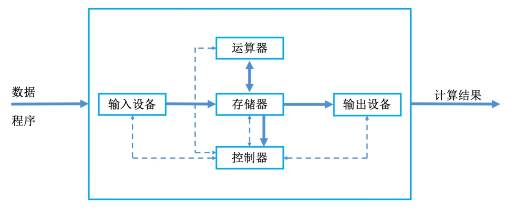
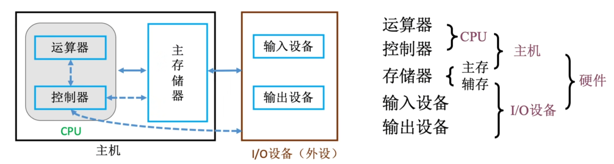
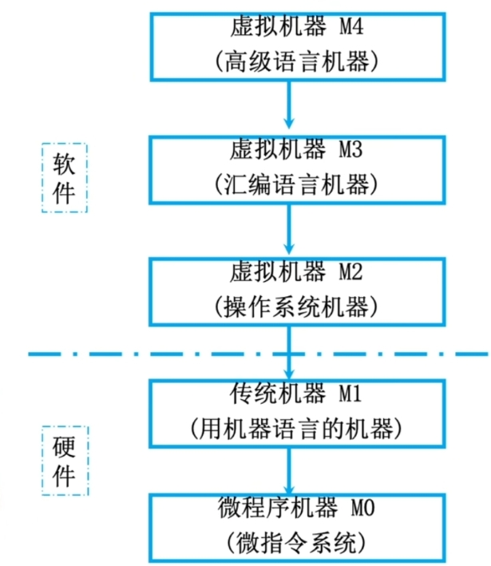

# 绪论

## 1 知识点

### 1.1 计算机系统层次结构

* 硬件
  * 硬件功能

    计算机硬件主要分为如下 $5$ 大部分：

    |硬件|作用|
    |:-:|:-:|
    |**输入设备**|将信息转换成机器能识别的形式|
    |**输出设备**|将结果转换成人类能识别的形式|
    |**存储器**|存放数据和程序|
    |**运算器**|进行算数运算、逻辑运算|
    |**控制器**|指挥各部件运行|

    * 主存
      * 存储体
        * 存储单元：每个存储单元存放一串 $2$ 进制码
        * 存储字：存储单元内 $2$ 进制码的长度，如一个`字`可能为`16 bit`
        * 存储字长：存储单元内 $2$ 进制码的位数
        * 存储元：存储 $2$ 进制码的电子元件，每个存储元可存储`1 bit`
      * 地址寄存器 $\text{MAR}$：指明要读写的存储单元的地址，**其位数反映存储单元数量**
      * 数据寄存器 $\text{MDR}$：用于暂存要读写的数据，**其位数等于存储字长**
      * 现代计算机结构常将 $\text{MAR}、\text{MDR}$ 集成在 $\text{CPU}$ 中
    * 运算器
      * 累加计数器 $\text{ACC}$：存放操作数和运算结果
      * 乘商寄存器 $\text{MU}$：进行乘除法时使用
      * 通用寄存器 $\text{X}$：存放操作数
      * **算术逻辑单元 $\text{ALU}$**：用电路实现各种算术运算和逻辑运算
    * 控制器
      * 程序计数器 $\text{PC}$：存放下一条指令的地址
      * 指令寄存器 $\text{IR}$：存放当前执行的指令
      * **控制单元 $\text{CU}$**：分析指令并给出控制信号

    ***工作过程：初始时，指令和数据存入主存，PC指向第一条指令。从主存中取指令放入IR，PC自动加 1，CU分析指令并指挥其他部件执行指令***

  * 硬件结构
    * 冯诺依曼结构

      以 **运算器** 为中心，首次提出了 **存储程序** 的概念
      

      * 计算机由五大部件组成
      * 指令和数据以同等地位存于存储器，可按地址寻访
      * 指令和数据用二进制表示
      * 指令由操作码和地址码组成
      * 存储程序
      * 以运算器为中心
    * 现代计算机结构

      以 **存储器** 为中心，提高了处理效率
      

      

      * $\text{CPU}=$ 运算器 $+$ 控制器，在现代计算机中运算器和控制器直接集成在 $\text{CPU}$ 中
      * 辅存即外存，**属于 $\text{IO}$ 设备**
* 软件
  * 分类
    * 系统软件：管理硬件资源，为上层软件提供服务。如操作系统、$\text{DBMS}$、网络软件等
    * 应用软件：为解决某个特定问题设计的软件。如 $\text{QQ}$、$\text{PyCharm}$ 等
  * 语言级别
    * 机器语言：二进制代码
    * 汇编语言：助记符。如`LOAD 5`、`ADD 1`
      * 使用汇编器将汇编语言翻译为机器语言
    * 高级语言：现代常用编程语言，如 $\text{C}、\text{Python}$
      * 使用解释器 **(执行一句翻译一句)** 翻译成机器语言，如 $\text{Python}、\text{JavaScript}、\text{Shell}$
      * 使用编译器 **(先翻译再执行)** 先翻译成汇编语言，再翻译成机器语言；或直接翻译成机器语言，如 $\text{C++}$。***执行流程：预处理 $\to$ 编译 $\to$ 汇编 $\to$ 连接***
  * 软件与硬件
    * 二者在逻辑上等价。如计算乘法，可以使用加法电路做程序累加，也可以直接使用乘法电路进行计算
    * 指令集体系结构 $\text{ISA}$：定义一台计算机可以支持哪些指令、每条指令的作用及用法。将会作为软硬件之间的界面
* 计算机系统层次

  

  * $\text{M0}$：硬件之间执行微指令
  * $\text{M1}$：用微程序解释机器指令
  * $\text{M2}$：用机器语言解释操作系统
  * $\text{M3}$：汇编语言程序 ${\xrightarrow{汇编程序}}$ 机器语言程序
  * $\text{M4}$：高级语言程序 ${\xrightarrow{编译程序}}$ 汇编语言程序

### 1.2 性能指标

* 存储器容量
  * $\text{MAR}$ 的位数反映存储单元数量
  * $\text{MDR}$ 反映每个存储单元大小
  * 存储器容量 $=\text{MAR的位数}\cdot2^\text{MDR的位数}$
* $\text{CPU}$
  * 时钟周期
    * $\text{CPU}$ 中 **最小的时间单位**，每个动作至少要 1 个时钟周期
  * 主频（时钟频率）
    * $=1/$ 时钟周期，单位：$\text{Hz}$
  * $\text{CPI}$
    * 执行一条指令所需的时钟周期数
  * $\text{CPU}$ 执行时间
    * 运行一个程序所花费的时间
    * $=$ (指令条数 $\times\text{CPI}$) $/$ 主频
  * $\text{IPS}$
    * 每秒执行多少条指令 $=$ 主频 $/$ 平均 $\text{CPI}$
  * $\text{FLOPS}$
    * 每秒执行多少次浮点运算
* 其他
  * 机器字长
    * 通常指的 $64$ 位机器即为机器字长，简称字长。指的是计算机进行 ***一次定点整数运算所能处理的二进制数据的位数***
    * 与 $\text{CPU}$ 寄存器位数、$\text{ALU}$ 有关
  * 数据通路宽度
    * 指数据总线一次所能并行传送信息的位数
  * 吞吐量
    * 指系统在单位时间内处理请求的数量
    * 取决于设备间的 $\text{IO}$ 速度
  * 响应时间
    * 指从用户向计算机发送一个请求，到系统对该请求作出响应并获得所需结果的等待时间
    * 通常包括 $\text{CPU}$ 时间、等待时间、存储器访问、$\text{IO}$ 操作、系统操作开销时间等
  * 基准程序
    * 用于专门进行性能评价的一组程序
* 常用数量单位
  * 描述存储容量、文件大小时：
    * $K=2^{10},M=2^{20},G=2^{30},T=2^{40},P=2^{50}$
  * 描述频率、速率时：
    * $K=10^3,M=10^6,G=10^9,T=10^{12},P=10^{15},E=10^{18},Z=10^{21}$

## 题目

* 1.2 习题
  * 01(完整的计算机系统)
  * 02(冯诺依曼结构工作方式)
  * 09(运算器组成)
  * 10(CPU存取速度)
  * 18(测试性能、系列机)
  * 20(相联存储器)
  * 21(计算机硬件可执行语言)
  * ***22(高级语言执行过程)***
* 1.3 习题
  * 06(机器字长)
  * 10(CPU透明寄存器)
  * 12(CPI影响因素)
  * 14(并行计算)
  * 18(性能指标)
  * 19(机器字长、性能指标)
  * ***20(IPS、运行时间)***
  * 30(数量单位)
