# 数据表示与运算

## 1 知识点

### 1.1 数制与编码

* 数制
  * 无符号数：所有比特位用于表示数值，***只能表示定点数***
  * 有符号数：最高位用于表示符号，`0`为正数，`1`为负数；其余位用于表示数值
  * 定点数：小数点确定位置
    * 定点整数：小数点在最低位后面
    * 定点小数：小数点在最符号位后面，整个二进制码表示小数，也称尾数
  * 浮点数：小数点位置不确定，使用科学计数法
* 编码

    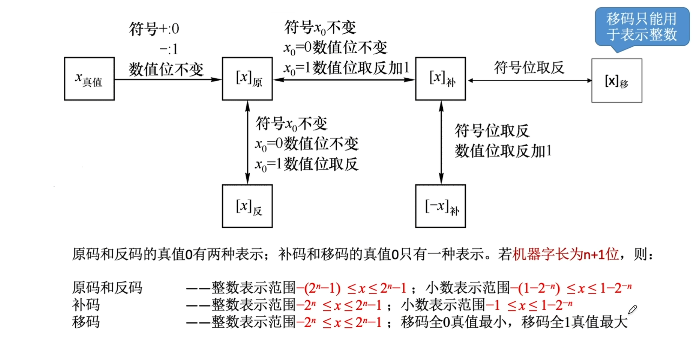

  * 快速求反码：从右往左找到第一个 $1$，这个 $1$ 及其右边不变；左边除符号位外全部取反
  * 快速求 $[-x]_补$：从右往左找到第一个 $1$，这个 $1$ 及其右边不变；左边包括符号位全部取反
  * 移码天然递增，方便硬件比较数值大小
  * 移码本质上是使用偏置机制，即 $[x]_移=[x+b]_原$，偏置值 $b$ 常用 $2^{n-1}$，$n$ 为 $x$ 的二进制位数
  * `1000 0000(8位)`人为规定为`-128`的补码，也是唯一一个不能由取反加一获得的，因为`+128`溢出了
  * ***！！！带符号数才有反码、补码、移码！！！***
* 类型转换

  所有带符号数均以 **补码** 的形式存储，无符号数以 **原码** 的形式存储
  * 带符号转无符号：符号位变数值位，全部位均表示数值，整串码由表示补码变成表示原码
  * 无符号转带符号：最高位用于表示符号，其余位用于表示数值，整串码由表示原码变成表示补码
  * 高字长转低字长：`int32`转`short16`时，只保留最后16位补码作为新值的补码
  * 低字长转高字长：无符号用`0`补充高位，有符号用与符号相同的数补充高位

### 1.2 定点数运算

* 逻辑电路基础

  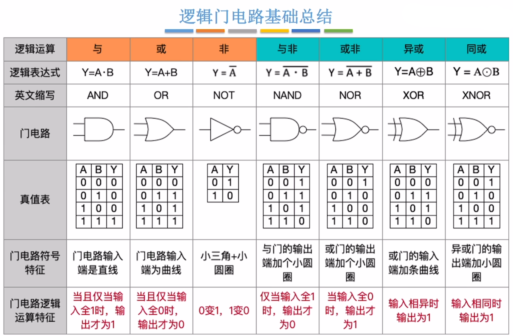

  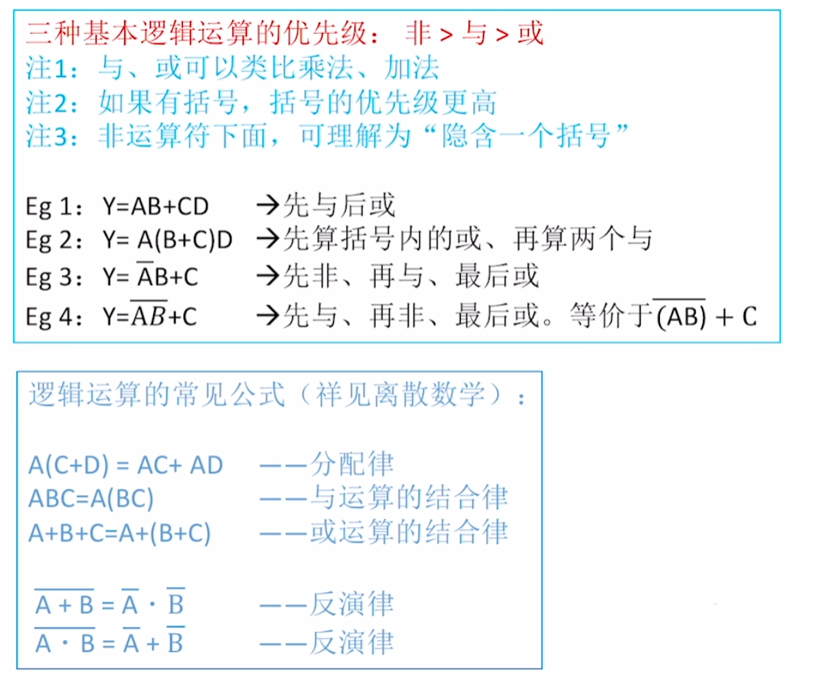

  * 多个`bit`异或时，有奇数个`1`结果必定为1，有偶数个`1`结果必定为0
* 加法器
  * 加法器电路图
  
    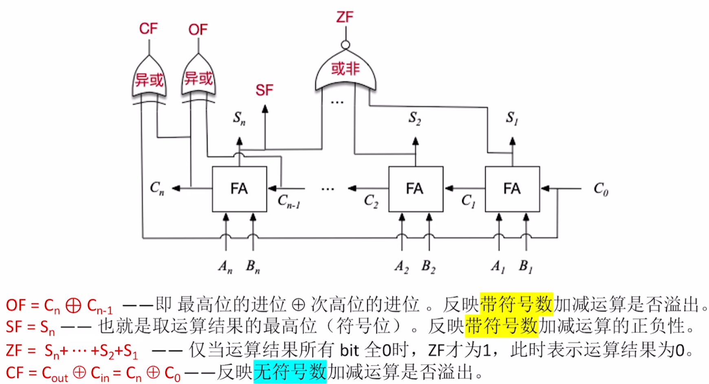

    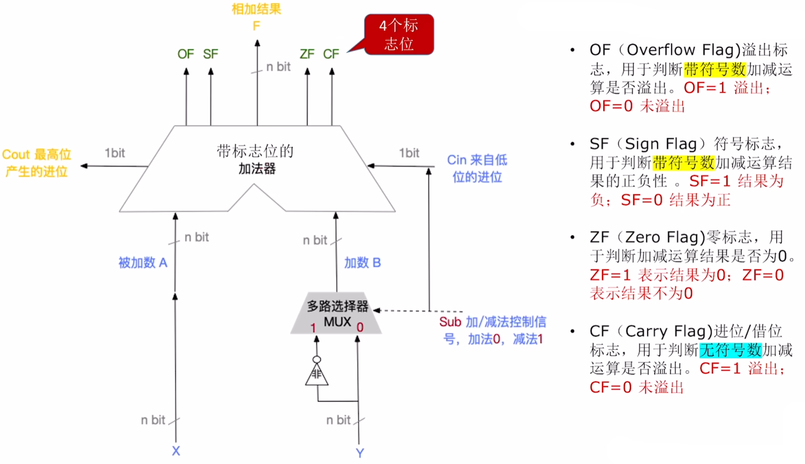

    * $\text{OF}=C_n\oplus C_{n-1}=\overline{C_n}C_{n-1}+C_n\overline{C_{n-1}}$。如果是正数相加，若最高次高均未进位，则符号位正常仍为0，没有溢出；如果是负数相加，最高次高均进位，但次高的进位 $1$ 补充到符号位上了，符号仍然是 $1$。没有溢出。反之若 $\text{XOR}$ 得到了 $1$，说明正数相加得到了负数或负数相加得到了正数，显然是溢出了

      | $C_{n-1}$ | $C_n$ | $\text{OF}$ | 是否溢出 | 典型场景 | 结果是否正确 |
      |:-:|:-:|:-:|:-:|:-:|:-:|
      | 0 | 0 | 0 | ❌ 否 | 小正 + 小正，或小负 + 小负 | ✅ 正确 |
      | 1 | 0 | 1 | ✅ 是 | **正 + 正 → 负**（和太大） | ❌ 错误 |
      | 0 | 1 | 1 | ✅ 是 | **负 + 负 → 正**（和太小） | ❌ 错误 |
      | 1 | 1 | 0 | ❌ 否 | **负 + 负 → 负**（大负数相加，进位“穿过”符号位） | ✅ 正确 |

    * $\text{OF}$ 可用于记录 **带符号数加减乘除**、**无符号数乘除** 是否溢出，$\text{CF}$ 只记录 **无符号数加减** 是否溢出
    * 加法时 $C_\text{in}=0$，若最高进位 $C_{\text{out}}=1$ (即产生进位)则加法溢出；减法时 $C_\text{in}=1$，若最高进位 $C_{\text{out}}=0$ (即产生借位)则减法溢出。因此 $\text{CF}=C_\text{in}\oplus C_\text{out}=C_n\oplus \text{sub}$
    * **$\text{sub}$ 信号为 1 当且仅当 $\text{ALU}$ 需要对第二个操作数取反并加 1（即计算 `A - B`转化成计算`A + (-B)`），无论该操作数是正数还是负数；为 $0$ 则直接相加（`A + B`）。**

  * ALU
    * ALU是CPU中运算器的核心部件，加法器是ALU的核心。ALU可以进行算术运算、逻辑运算或其他操作(如求补码、直送等)
    * 如果ALU支持 $k$ 种功能，则信号控制位数 $m\geq\lceil\log_2{k}\rceil$
    * ALU的运算数、运算结果数位数与计算机的 **机器字长** 相等
* 定点数移位运算
  
  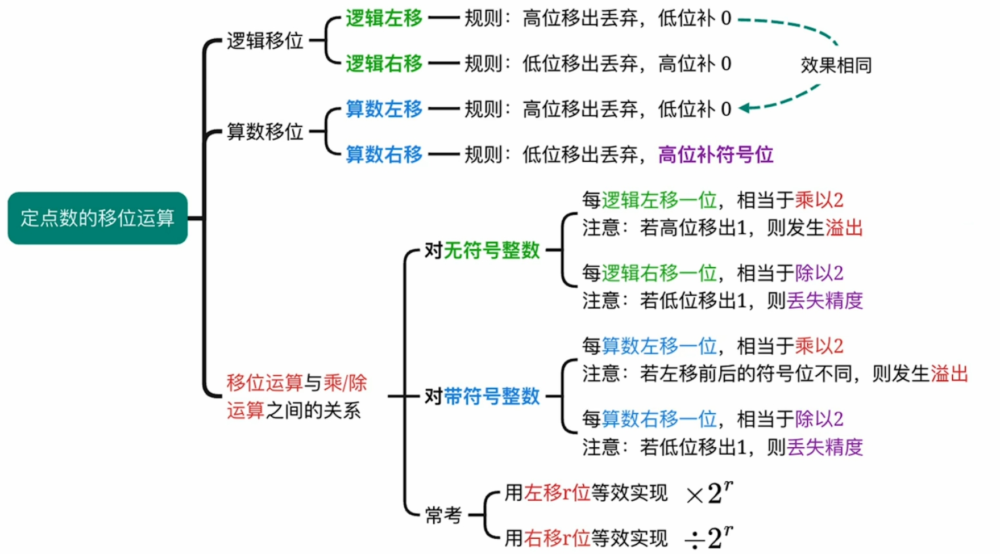

  * 带符号数左移时，若存在溢出的高位不与符号位相同，则说明溢出。如负数左移，溢出的高位出现 $0$，表明溢出，因为负数的扩展位应该都是 $1$

* 定点数加减运算
  * 带符号数加减运算

    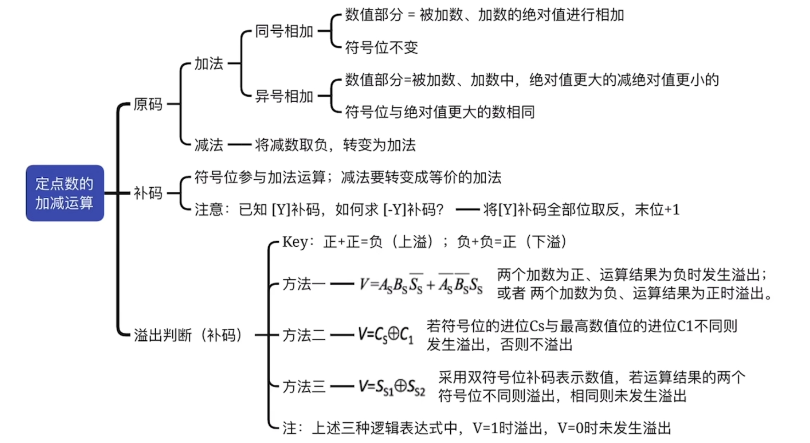

    * $A_S$ 为输入 $A$ 的符号位，$B_S$ 为输入 $B$ 的符号位，$S_S$ 为结果 $S$ 的符号位
    * $\begin{cases}
      [x+y]_补=[x]_补+[y]_补\\
      [x-y]_补=[x]_补+[-y]_补
    \end{cases}$
    * 双符号位也称 **模 $4$ 补码、变形补码**，存储时只存 $1$ 位符号，运算时使用两位符号。最高符号位表示本应得到的符号，次高符号位为实际得到的符号，若二者不同则表明溢出。单符号位也称 **模 $2$ 补码**

  * 无符号数加减运算
  
    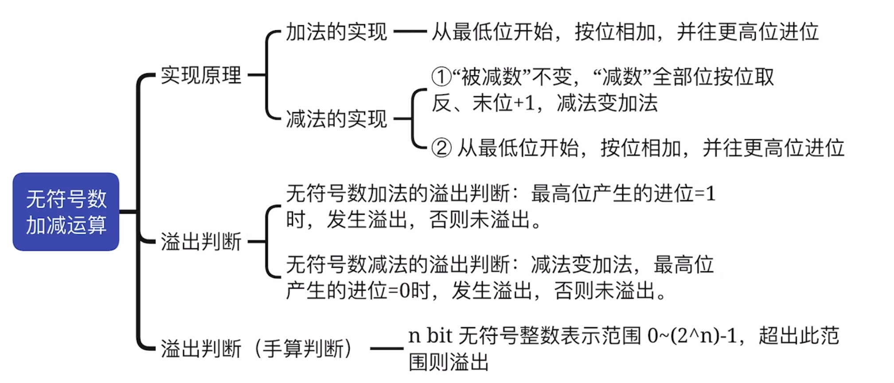

    * $x+x_\text{补数}=m=2^n$，$m$ 即为模，$n$ 为位数。如 $8$ 位二进制数的模 $m=256$
    * 无符号减法底层逻辑同带符号数的减法，取补数类似取反码。本质上是 $x-y=x+y_\text{补数}$，同钟表，减数取反后与被减数相加等于 $2^n-1$，减数取反后再加 $1$ 即为被减数在 $n$ 位二进制下的补数了
* 定点数乘除运算
  * 原码乘运算

    结果数值的计算同十进制乘法，逐位相乘，错位相加；结果符号由两个乘数的符号位 $\text{XOR}$ 取得，乘数的符号位不参加运算

  * 无符号数乘运算

    操作同十进制乘法，逐位相乘，错位相加
    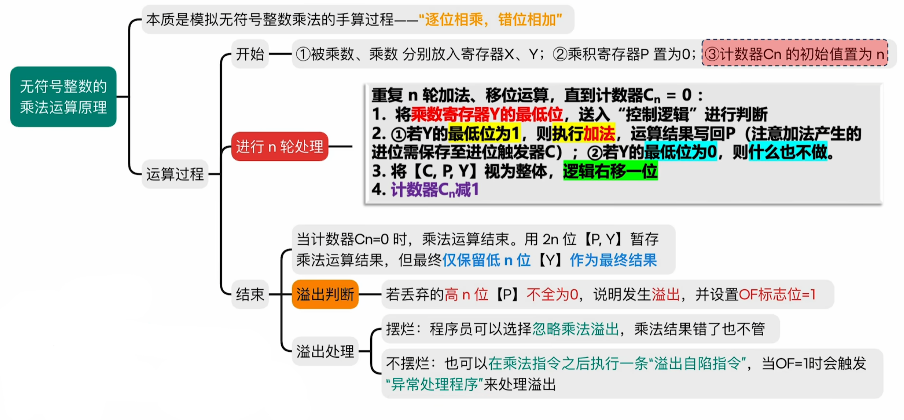

    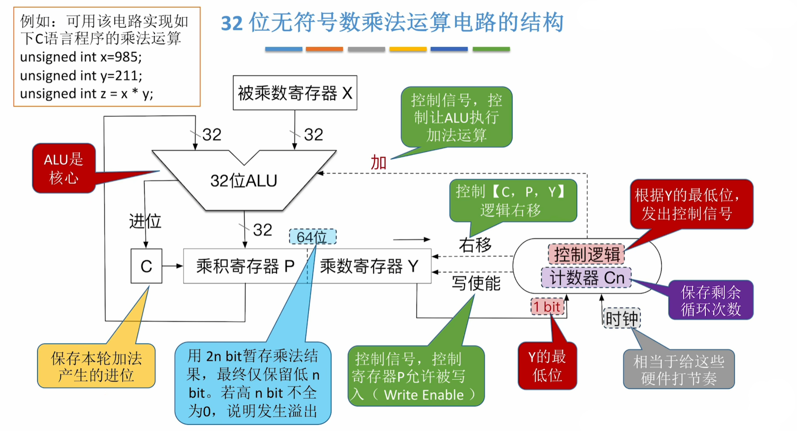

    > 以`unsigned 4bit`数相乘为例说明无符号数乘法
    > 开始阶段，$C_n=乘数位数$ ，最终结果的位数不超过 $2n$
    > 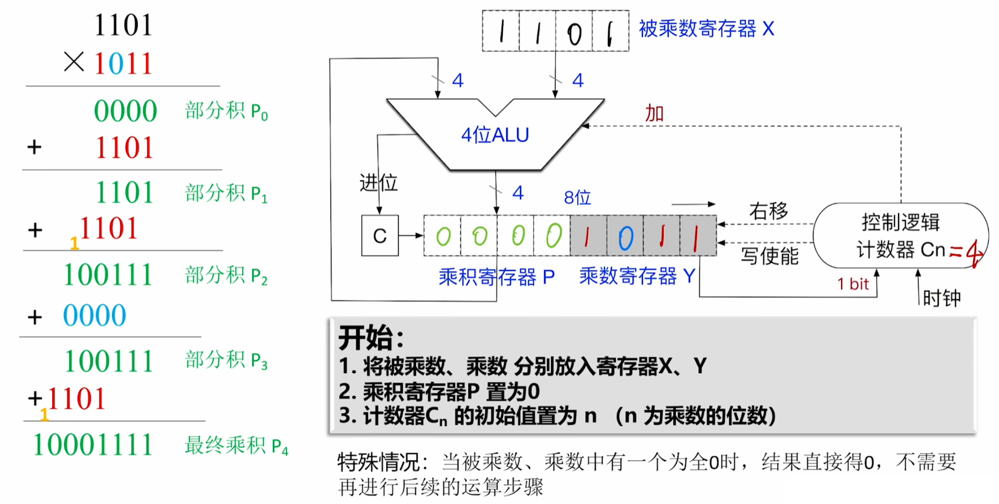
    > 最低位为 $1$，执行加操作，将 $P$ 内的数与乘数相加，结果写回 $P$ 中。最高位进位 $C=0$
    > 
    > 随后将进位 $C$、乘积寄存器 $P$、乘积寄存器 $Y$ 整体 **逻辑右移** 一位，以实现错位的效果。同时计数器 $C_n$ 减一，空出的进位 $C$ 补0
    > 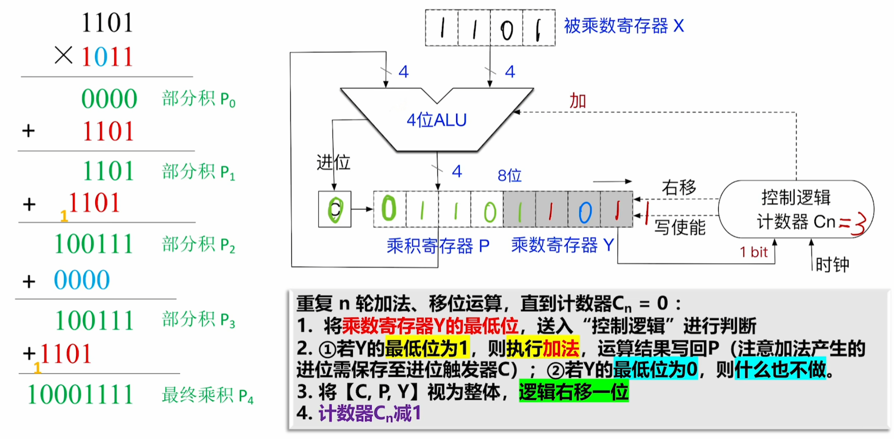
    > 后续操作同理，乘数遇到 $0$ 就什么也不用做，最终加完截取在 $Y$ 中的后 $n$ 位作为结果

  * 带符号数乘运算

    也称“补码移位乘法”，由Booth提出，也称“布斯(Booth)乘法”
    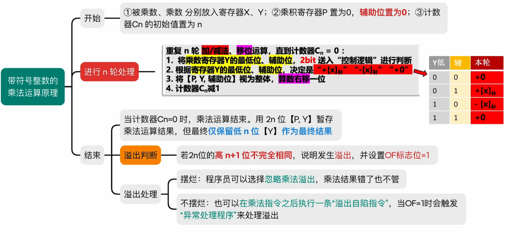

    * 溢出判断前 $n+1$ 位是为了保持符号扩展相同，即高 $n$ 位与低 $n$ 位中的最高位(符号位)保持相同。若前 $n+1$ 位都是 $0$，则结果是正数，没有溢出；若前 $n+1$ 位都是 $1$，则结果是负数，没有溢出。类比算术移位补符号位

    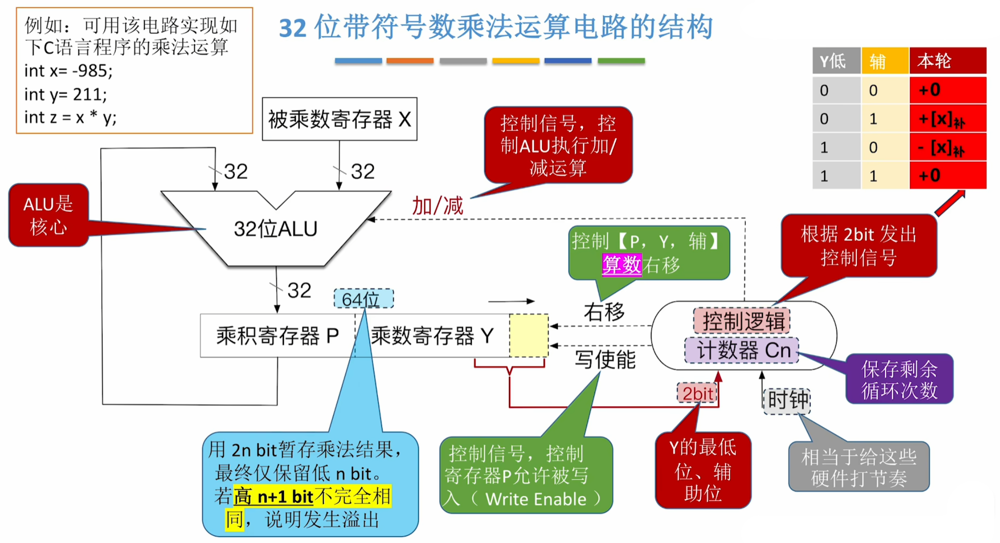

    > 以`unsigned 4bit`数相乘为例说明带符号数乘法
    > 开始阶段，$C_n=乘数位数$ ，最终结果的位数不超过 $2n$，辅助位置 $0$
    > 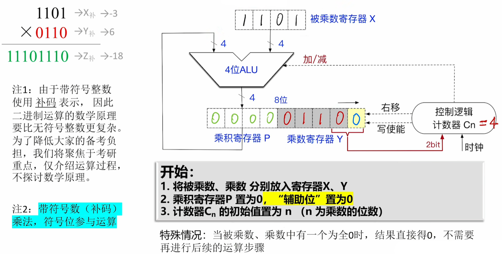
    > 最低位为 $00$，什么也不执行
    > 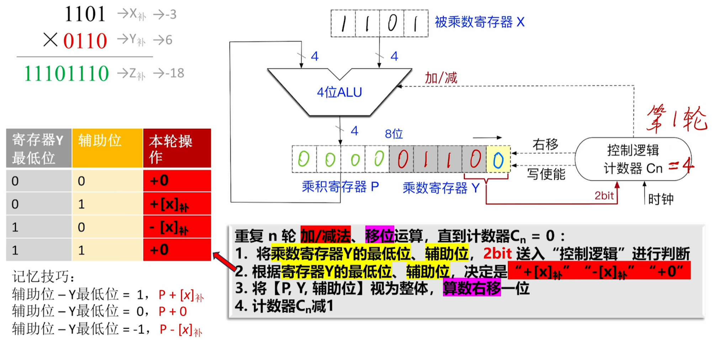
    > 随后将乘积寄存器 $P$、乘积寄存器 $Y$、辅助位整体 **算术右移** 一位，空出的高位补符号。同时计数器 $C_n$ 减一
    > 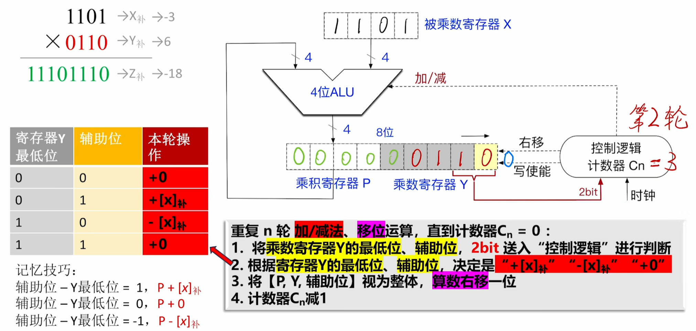
    > 第二步最低位与辅助位是 $10$，要减 $[x]_补$，计算出 $[-x]_补$ 后加回到 $P$ 中再算术右移
    > 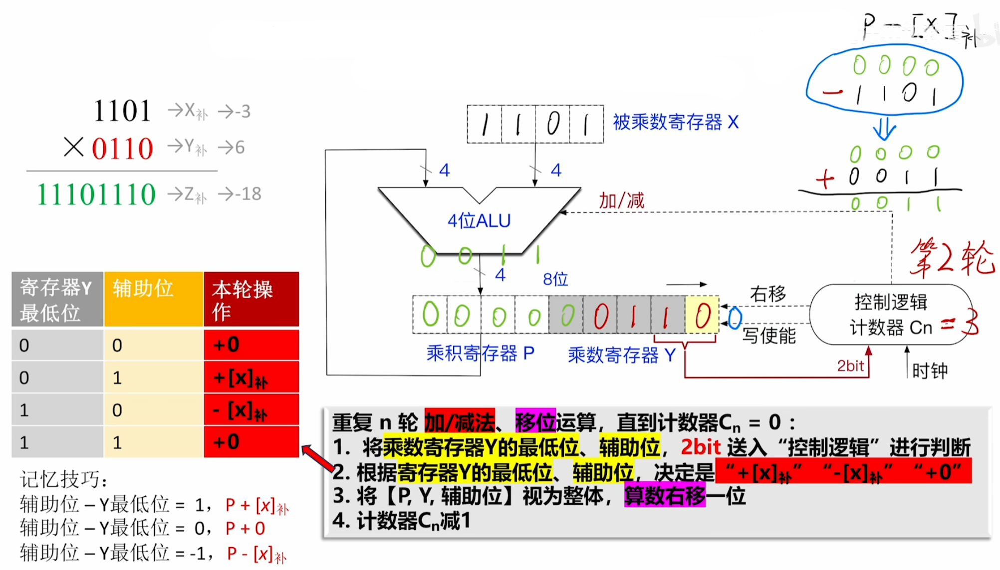
    > 后续操作同理，直至 $C_n=0$

  * $3$ 种定点数乘法实现方法

    包含无符号数和带符号数的乘法运算
    * 使用 **算术运算、移位运算** 这种纯软件方法实现乘法运算速度最慢
    * 使用 **$\text{ALU}$ 、移位器、寄存器、控制逻辑** 这种 $\text{CPU}$ 中带乘法指令的电路速度较快，通常需要多个时钟，可以通过增加每个时钟的处理位数减少时间
    * 使用 **阵列乘法电路** 这种 $\text{CPU}$ 中带乘法指令的电路速度最快，可在 $1$ 个时钟内完成运算

  * 无符号数除运算

    同十进制除法一样，上商取余，补位继续除法
    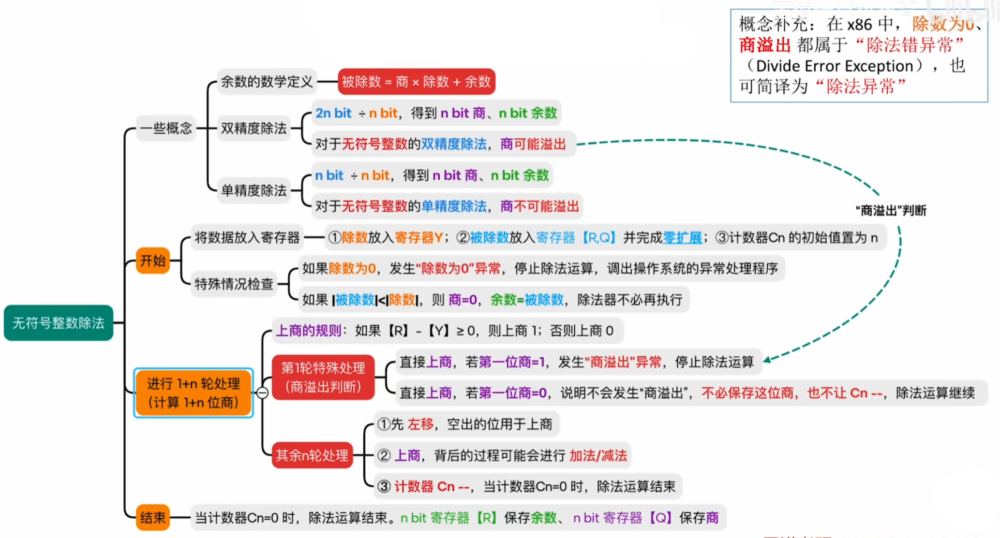

    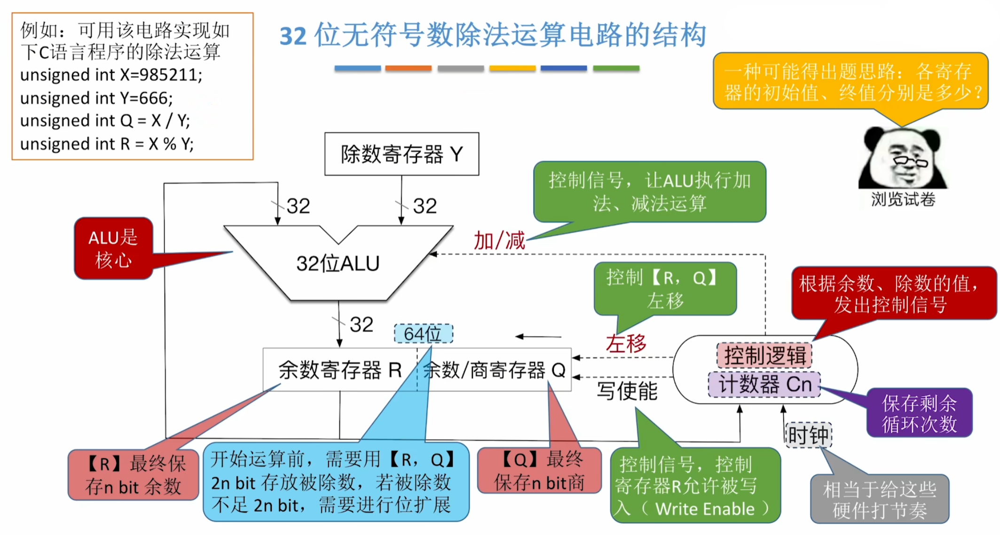

    > 以`unsigned 4bit`数除法为例说明无符号数除法
    > 开始阶段，$C_n=乘数位数$，被除数从`unsigned 4bit`扩展到`unsigned 8bit`，扩展 $2$ 倍
    > 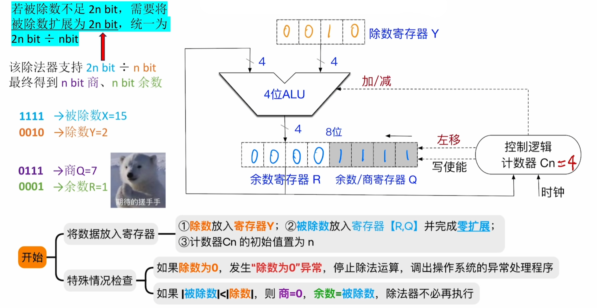
    > 第一步特判，$\text{R}=\text{R}-\text{Y}$，发现小于 $0$，说明本次计算不会溢出，因为最后需要阶段后 $\text{n}$ 位，所以这个 $0$没必要保留。恢复 $\text{R}$ 中变成负数的数值，再加上 $\text{Y}$ 变回原始的数值。进入下一步
    > 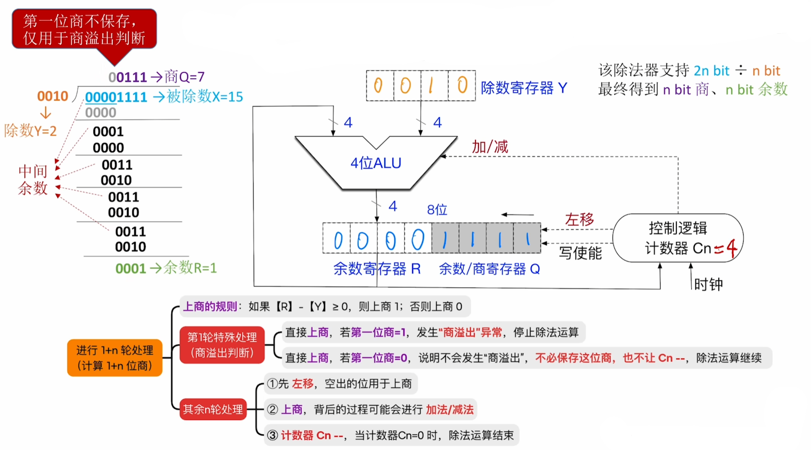
    > 第二步开始先左移一位，将最后位空出来用于保存商。更新 $\text{R}=\text{R}-\text{Y}$，再根据上商规则判断商是 $0$ 还是 $1$，如果是 $0$ 最后再加回 $\text{Y}$ 恢复到判断之前的数；如果是 $1$ 就不用加回去，减完就是这一步的余数了。最后计数器减一
    > 
    > 第三步先左移一位，本次商 $1$，不用对 $\text{R}$ 加回去 $\text{Y}$
    > 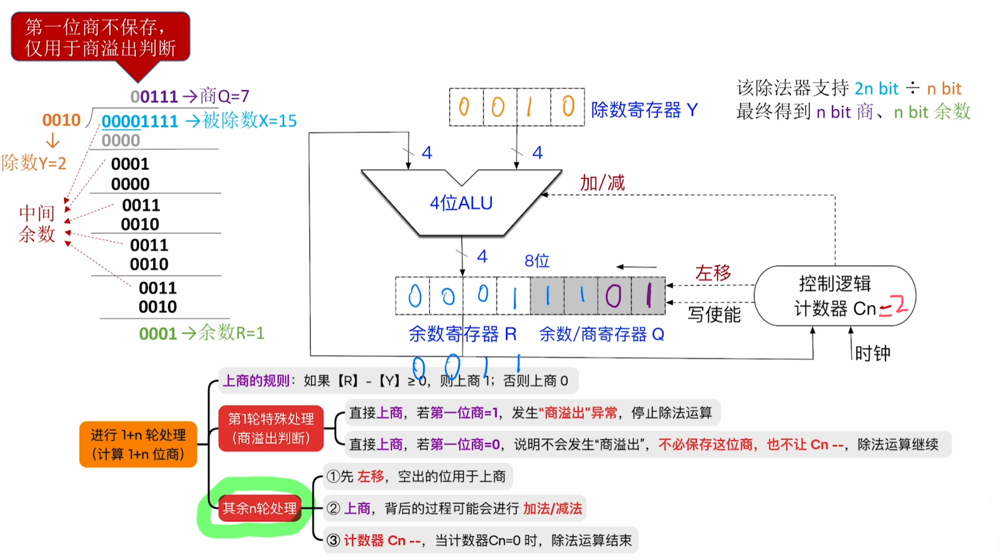
    > 重复上述操作，最终得到如下结果。结果取 $\text{G}$ 中的后 $n$ 位截断
    > 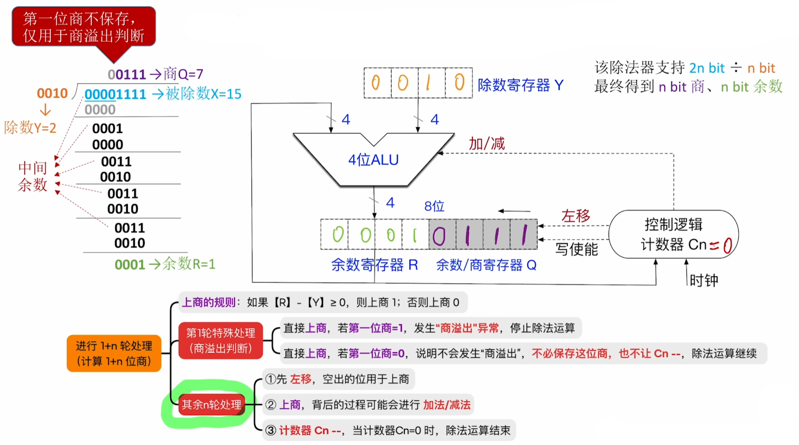

### 1.3 浮点数运算

* 浮点数定义
  * 单精度浮点数 $\text{float32}$

    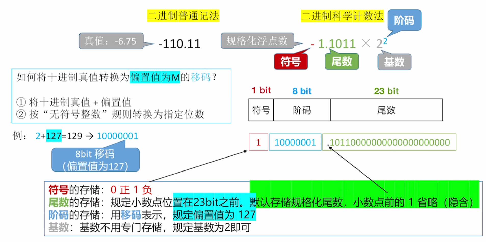

    * 阶码采用的移码偏置值为 $2^{n-1}-1=127$。其中，$n=8$ 为阶码的位数

      | 内容 | 描述 |
      |------|------|
      | 阶码取值范围（理论） | $[0,255]-127=[-127,128]$ |
      | 实际可用的正常阶码范围 | $[-126,127]$ |
      | 极端阶码用途 | `-127(0000 0000)` $\to$ 非规格化数或零   `+128(1111 1111)` $\to\pm\infty$ 或 NaN |

    * 尾数只保留小数点后的部分，因为采用科学计数法，则小数点前一定是一位 $1$，可以省略，实际上位数的精度为 $24$ 位
    * **可连续表达的整数范围为 $\left[-2^{-24},2^{24}\right]$**

  * 双精度浮点数 $\text{double64}$
  
    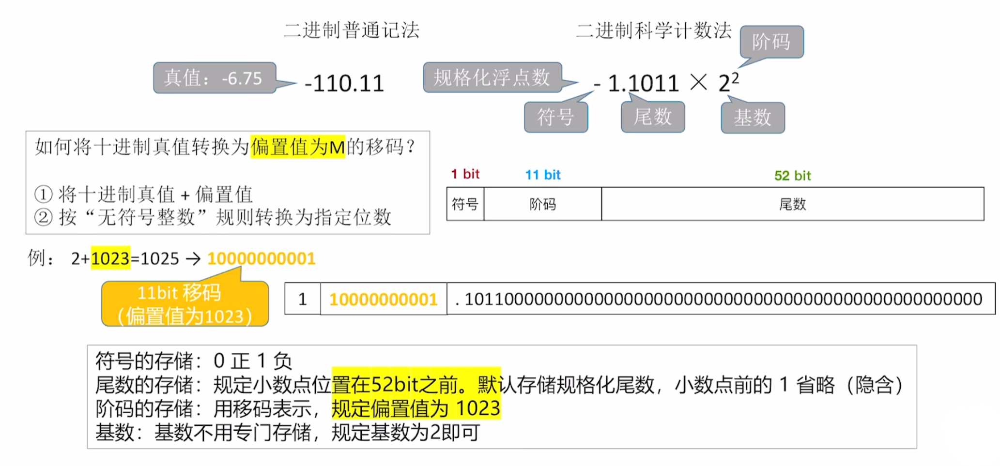

    * 阶码采用的移码偏置值为 $2^{n-1}-1=1023$。其中，$n=11$ 为阶码的位数

      | 内容 | 描述 |
      |------|------|
      | 阶码取值范围（理论） | $[0,2047]-1023=[-1023,1024]$ |
      | 实际可用的正常阶码范围 | $[-1022,1023]$ |
      | 极端阶码用途 | `-1023(000 0000 0000)` $\to$ 非规格化数或零   `+1024(111 1111 1111)` $\to\pm\infty$ 或 NaN |

    * 尾数只保留小数点后的部分，因为采用科学计数法，则小数点前一定是一位 $1$，可以省略，实际上位数的精度为 $53$ 位
    * **可连续表达的整数范围为 $\left[-2^{-53},2^{53}\right]$**

  * 保留数

    $\text{IEEE754}$ 浮点数存在部分保留情况 $\downarrow$

    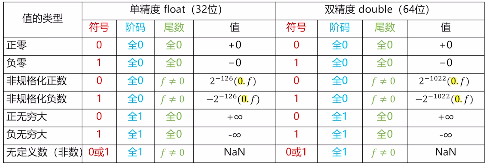

    $\text{float32}$ 边界值 $\downarrow$

      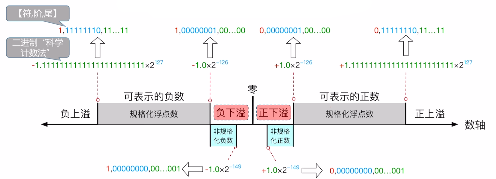

    $\text{double64}$ 边界值 $\downarrow$

      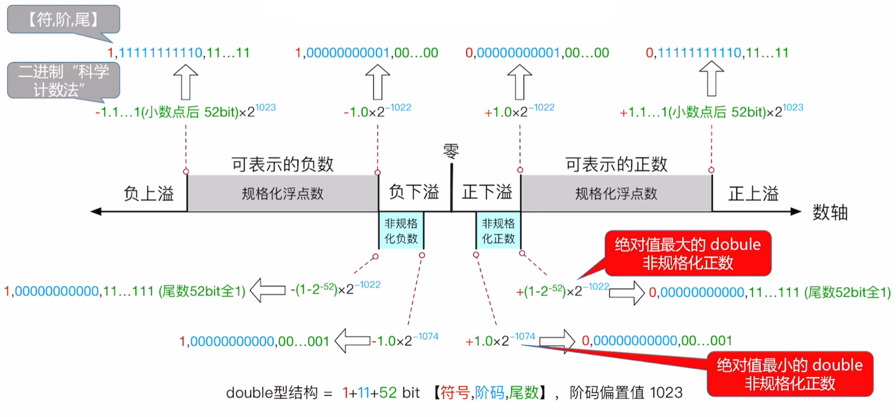

    * $n$ 位二进制整数的十进制为 $2^n-1$；$n$ 位二进制尾数的十进制为 $1-2^{-n}$
    * 正(负)上溢时记为 $+\infty\left(-\infty\right)$。同时上溢标志 $\text{OE}=1$
    * 正(负)下溢时如果在非规格化数区间内则用非规格化数表示，否则记为 $+0\left(-0\right)$。同时下溢标志 $\text{UE}=1$
    * 非规格化数小数点前是`0.f`，规格化数小数点前是`1.f`
    * `float32`绝对值最小的非规格化数为 $2^{-126}\cdot2^{-23}=2^{-149}$；`double64`绝对值最小的非规格化数为 $2^{-1022}\cdot2^{-52}=2^{-1074}$

* 浮点数加减运算
  1. 对阶，小阶看大阶。不用大阶看小阶是避免大阶对阶时溢出
  2. 尾数进行无符号数加减运算
  3. 运算后的尾数规格化，调整尾数及阶码

### 1.4 数据存储

* 大小端

  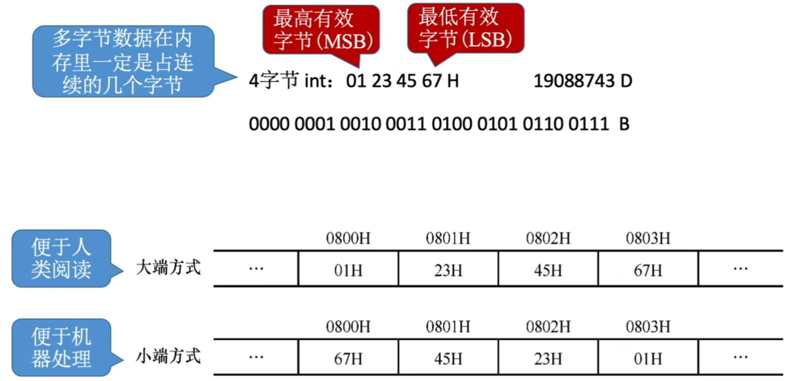

  * 大端：低址存高有效字，高址存低有效字。符合人类阅读习惯
  * 小端：高址存高有效字，低址存低有效字。符合机器计算

* 边界对齐

  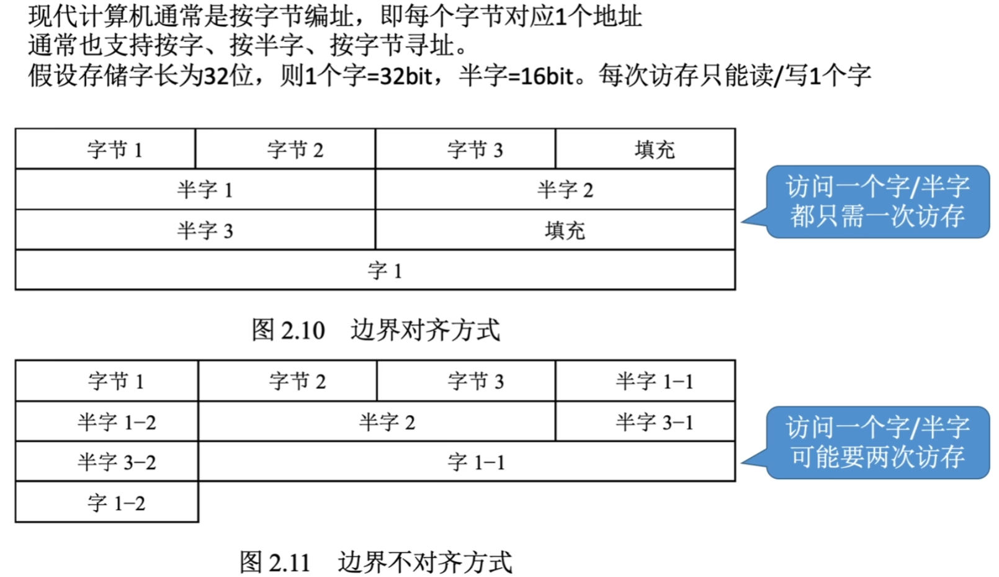

  * 此例中`字`=`4Byte`=`32bit`，`半字`=`2Byte`=`16bit`，每次 $\text{IO}$ 只能以`字(4Byte)`为单位。不同的计算机对`字长`的定义不一定相同，以题目为准
  * 边界对齐方法空间换时间，每次 $\text{IO}$ 都能获得完整数据；边界不对齐方法时间换空间，末尾可能出现数据分开存在两个`字`的情况，读取需要两次 $\text{IO}$

## 2 题目

### 2.1 选择

* 2.1习题
  * 01(小数进制转换)
  * 11(补码范围)
  * 12(0的补码)
  * 13(补码不等式)
  * 15(补码等式)
  * ***21(移码、-128)***
  * ***23(移码溢出)***
  * ***24(移码天然递增、移码计算、移码最大最小、补码最大最小)***
  * ***26(主存地址用无符号数)***
  * 27(带符号低字长转高字长)
  * 28(无符号低字长转高字长)
  * 34(补码范围)
* 2.2习题
  * 12(模4补码)
  * 18(原码乘法)
  * ***21(无符号数减法进位信息)***
  * 23(带符号数左移溢出判断)
  * 28(计算)
  * 32($\text{ALU}$ 只计算、$\text{CF}$)
* 2.3习题
  * ***01(char1、short16、int32、long32/64、float32、double64)***
  * 02(阶码越多范围越大，尾数越多精度越高)
  * ***14(对正的规格化浮点数 $N_1,N_2$ ，若 $m>n$，则恒有 $N_1=M_1\cdot2^m>N_2=M_2\cdot2^n$)***
  * ***16(浮点数运算溢出判断取决于阶码是否上溢)***
  * 21(非IEEE754浮点数)
  * 24(规格化尾数 $\geq\dfrac{1}{\beta}$，$\beta$ 为基数)
  * ***25(舍入、左规、右规)***
  * 26(信息单元的存储地址必须是其字节长度的整数倍)
  * ⚠️ ***强制类型转换***

    27(强制类型转换) 
    32(强制类型转换) 
    35(强制类型转换)
    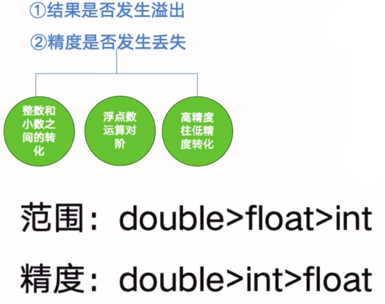
    * `double64`可以无损表示全部`int32`
  * 34(非IEEE754浮点数运算)
  * ***51(连续有效范围)***

### 2.2 大题

* 2.2习题
  * ⛔⭐***04(字长决定数据类型长度、无符号转带符号、无符号加减运算、补码加减运算、加法器电路、OF标志位原理)***
  
    > 数据类型的长度有时是根据机器字长确认的，并非一成不变
    >
    > **正是因为无符号和带符号加减法都是模 $2^n$ 运算，所有一个电路可以支持这四种运算**

  * ⭐***05(无符号数乘法、带符号数乘法、乘法电路、阵列乘法器、乘法溢出判断)***
* 2.3习题
  * ⭐***05(无符号数溢出、全1机器数转换、浮点数舍入阶码加1、`float32`的最大范围和最大精确范围)***
