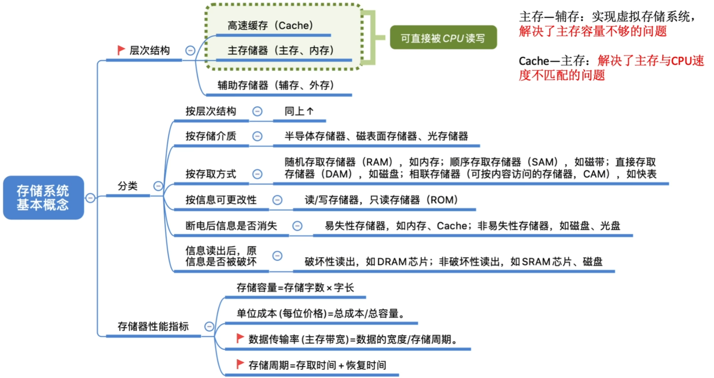
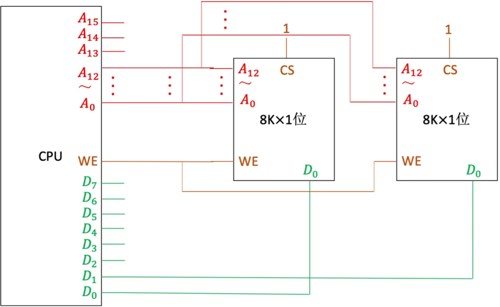
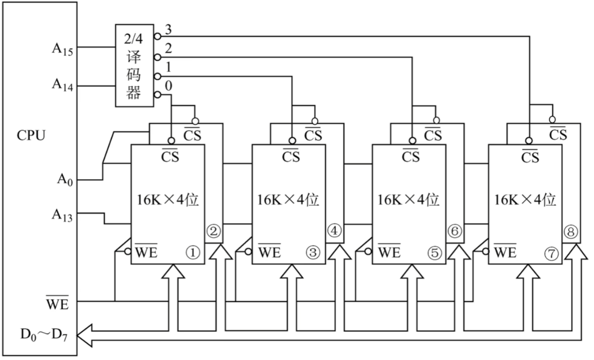

# 存储系统

## 1 知识点

### 1.1 存储系统概念

### 1.2 主存储器

* 组成

  

  

  * 电容充电写入数据，电容放电读出数据
  * 存储芯片对外暴漏的金属引脚数量=地址线数量+数据线数量+片选线(1根)+读写控制线(1或2根)
    * 地址线数量= $2^\text{MAR的位数}$
    * 数据线数量= $\text{MDR}$ 的位数
    * 片选项 $\overline{CS}$ 低电平时允许选择信号，用于使译码器和存储单元的电信号稳定时再被读取，以免不稳定时读取出错
    * 读写控制线 $\overline{WE}$ 是 $1$ 根线，高电平读，低电平写；$\overline{WE},\overline{OE}$ 是 $2$ 根线，$\overline{WE}$ 允许写，$\overline{OE}$ 允许读
    * **芯片规格可写作`存储单元数*数据位数`的样式。如`1024×8位`芯片有 $10$ 根地址线，$8$ 根数据线**

* $\text{SRAM}$、$\text{DRAM}$

  

  * $\text{DRAM}$
    * 存在一个由 $\text{SRAM}$ 制成的行缓冲区，用于缓冲读取的行数据。行缓冲区的大小 $=$ 列数 $\times$ 数据位数

  * 重写

    $\text{DRAM}$ 读出需要电容放电，放完电里面的信息就没了，需要再写进去；$\text{SRAM}$ 使用双稳态触发器，并不会出现这个问题

  * 刷新

    $\text{DRAM}$ 电容内的电荷只能坚持一定的时间，超出时间就会自然流失导致数据消失，因此需要定期刷新数据

    

    * 在一个刷新周期内所有数据都要刷新一次，**每次刷一行**
    * 采用行列地址减少地址线数量，地址线分别对接行地址译码器和列地址译码器。如地址有 $8$ 位的情况下，使用一维地址要 $2^8=256$ 根地址线；使用行列地址分两半只需要 $2^4+2^4=32$ 根地址线

    

    * 依照不同的情况选择刷新策略。分散刷新读写周期长，但没有死时间；集中刷新死时间大；异步刷新折中，存在少量死时间

    

    * 在使用行列地址的基础上，再去掉一半地址线，地址线对接缓冲器，先选行再选列进行索引。只有 $\text{DRAM}$ 采用地址复用技术，$\text{SRAM}$ 不使用地址复用技术
    * 有偶数根地址线时，行列地址线为其平方根；有奇数根地址线则采用相近的两个数，且为使行刷新效率更大，大的数为列地址线数量。如 $\text{4K}\times4$ 芯片行列各有 $6$ 根地址线，使用复用技术后总共有 $6$ 根地址线；$\text{8K}\times4$ 芯片行有 $6$ 根地址线，列有 $7$ 根地址线，使用复用技术后总共有 $7$ 根地址线

* $\text{ROM}$

  

  

  

  * 逻辑上主存由 $\text{DRAM(RAM)}$ 与 $\text{BIOS(ROM)}$ 组成。由于 $\text{DRAM}$ 断电即失，$\text{BIOS}$ 用于在开机时将启动操作系统的指令送入 $\text{CPU}$，执行开机

* 双端口 $\text{RAM}$、多模块存储器

  

  * 双端口 $\text{RAM}$
    * 需要两组完全独立的地址线、数据线、控制线，$\text{CPU}$、$\text{RAM}$ 中也要有更复杂的控制电路
    * 存在读写者问题。可以同时读相同或不同的地址单元，但不能出现写操作。需要写操作时要置`忙=0`，关闭其他的端口，等到写完再开启访问

  * 多模块存储器
    * 多体并行存储器

      

      * 高位交叉编址 **(连续编址)**：高位用于给不同的存储体编号，低位用于给存储体内的不同存储单元编号 
      低位交叉编址 **(交叉编址)**：低位用于给不同的存储体编号，高位用于给存储体内的不同存储单元编号
      * 高位交叉编址中的连续地址为先同存储体内的存储单元，再不同的存储体(左图中的二进制码) 
      低位交叉编址中的连续地址为先不同的存储体，再同存储体内的存储单元(右图中的二进制码)
      * 低位交叉编址效率更高，因为数据大多存储在一片连续的存储单元中，读取下一个存储单元的数据时可以避开上一个存储单元的存储体的恢复时间
      * 低位交叉编址最佳存储体数量

        

        * 确定最佳存储体数量的核心思想是保证一个 $T$ 中每个 $r$ 都能读到一个就绪的存储单元。$m$ 少了就要等待恢复时间，多了就会出现存储单元闲置
        * 确定属于第几个存储体：有二进制直接看体号；有十进制直接 $\bmod\,m$

    * 单体多字存储器

      

      * 不分存储体，扩大存储字数。一次读出一行的全部数据
      * 一个读取周期内的读取速度= $T/m$。若 $T=4r\,,m=4$ 时，读取速度 $=1\text{word/r}$，与多体并行存储器相同

* 主存储器与 $\text{CPU}$ 的连接
  * 位扩展

    

  * 字扩展

    

    * 线选法浪费地址

    

    * 译码器能完全利用所有地址，常用的有`1-2译码器`、`2-4译码器`、`3-8译码器`等。命名规则为`k-2^k译码器`
    * 片选信号由 $\text{CPU}$ 的**高位**发出

  * 字位扩展

    先字扩展为`组`，再对`组`进行位扩展

    

    * $\text{74ls138}$ 译码器

      

      * 高电平有效直接写字母，导线两端正常 
        低电平有效加上横线，导线两端加圆圈

      

      * 读数据时，$\text{CPU}$ 先发送地址信号，并将译码器的前两位置为合法表示。待地址电信号稳定后，发出合法信号 $\overline{MREQ}=0$ 接通译码器使之可以工作，接通之前译码器的所有输出都是非法位(此处的非法位为1)。芯片的片选线 $\overline{CS}$ 接通，依靠数据线 $\text{D}$ 向 $\text{CPU}$ 发送数据。数据读取稳定后 $\text{CPU}$ 撤销片选信号。$\text{CPU}$ 确定收到数据后，撤销地址信号，完成读操作

### 1.3 外部存储器

* 磁盘

  

  * 组成

    

    

  * 性能指标

    

    

    * 寻道时间通常由题目给出；旋转时间若题目没给，通常采用旋转时间期望，即转半圈的时间
    * 硬盘的主要操作是寻址、读盘、写盘。每个操作都对应一个控制字，硬盘工作时，第一步是取控制字，第二步是执行控制字。
    * 硬盘属于机械式部件，**其读写操作是串行的**，不可能在同一时刻既读又写，也不可能在同一时刻读两组数据或写两组数据。

    

    * 每转一圈能够读取一条磁道上的所有数据

  * 磁盘地址

    

  * 廉价冗余磁盘阵列 $\text{RAID}$

    廉价冗余磁盘阵列 $(\text{Redundant Array Inexpensive Disk})$ 是将多个独立的物理磁盘组成一个独立的逻辑盘，数据在多个物理盘上分割**交叉存储、并行访问**

    * $\text{RAID0、RAID1}$

      

      $\text{RAID0}$ 没有额外备份和校验，磁盘编码方式类似低位交叉编址，并行存取速度更快 
      $\text{RAID1}$ 保存一份完全镜像，磁盘容量减半

    * $\text{RAID2}$

      

    $\text{RAID}$ 等级越高，可靠性越高，冗余备份成本越低

* 固态硬盘 $\text{SSD}$

  

  

### 1.4 高速缓冲存储器Cache

* $\text{Cache}$ 概念

  

  **$\text{cache}$ 的功能完全由硬件实现**

  * 性能分析

    

    **注意区分两种访问方式** $\begin{cases}\text{同时访问 cache 和主存} \\ \text{先访问 cache，未命中再访问主存(408默认方式)}\end{cases}$
  
  * 分块

    

    为了方便 $\text{cache}$ 与主存的数据交换，二者采用数据分块的策略，按`块`为单位交换。主存可分块，每块使用块号索引，块内使用块内地址索引

* $\text{Cache}$ 与主存的映射方式

  

  
  * 全相联映射
  
    

    * 先将主存分块，只要 $\text{cache}$ 未满，就能装载主存块
    * 标记位只存储主存块号用于比对是否命中

  * 直接映射

    

    * 先将主存分块，$\text{cache}$ 块只能装载对应的取模映射主存块
    * 若 $\text{cache}$ 有 $2^k$ 个块，则标记位只存储最后 $k$ 位之前的地址。因为主存块唯一对应一个 $\text{cache}$ 块，且 $\text{cache}$ 块的数量可以用 $k$ 位二进制码唯一标识，所以主存地址的最后 $k$ 位可以用于表示对应的 $\text{cache}$ 块编号，$\text{cache}$ 标记可以不存这后 $k$ 位，节省存储空间

  * 组相联映射

    

    * 先将主存分块，$\text{cache}$ 组内只能装载对应的取模映射主存块
    * $\text{cache}$ 分组，每组有 $n$ 个块，也称 $n$ 路组相联映射
    * 若 $\text{cache}$ 有 $2^k$ 个组，则标记位只存储最后 $k$ 位之前的地址。原因同直接映射

* $\text{Cache}$ 替换算法

  

  **由于直接映射装载方式固定，因此不需要置换算法。置换算法仅在组相联的组内分配阶段和全相联使用**

  * 随机算法 $\text{RAND}$

    

  * 先进先出 $\text{FIFO}$

    

  * 最近最少使用 $\text{LRU}$

    

    **手写做题可以设置指针快速非严谨求解。当命中块时，将这个块的指针更新到最新访问处；未命中时，淘汰最早的指针指向的块并销毁其指针，再装载要访问的块并建立新指针**

  * 最不经常使用 $\text{LFU}$

    

* $\text{Cache}$ 一致性写策略

  

  

  * **Cache 层之间**通常使用 **全写 + 非写分配**，以保持数据一致性并减少不必要的块加载，适用于高速访问场景
  * **Cache 与主存之间**通常使用 **写回 + 写分配**，以提升性能、减少主存访问次数，适合低速存储且一致性要求相对宽松的场景

  * 写回法

    

    $\text{CPU}$ 先写 $\text{cache}$ 内的块，并使用脏位在 $\text{cache}$ 中标记该块被写，等到块被置换出 $\text{cache}$ 后再写回主存

  * 全写法

    

    $\text{CPU}$ 先写 $\text{cache}$ 内的块，并将写内容送入写缓存。由写缓冲将写内容写回主存

  * 写分配法

    

    $\text{CPU}$ 直接将块调入 $\text{cache}$，在 $\text{cache}$ 中写这个块。常与写回法搭配使用

  * 非写分配法

    

    $\text{CPU}$ 直接写主存中的块，并且不将块调入 $\text{cache}$。常与全写法搭配使用

* ⚠️ $\text{Cache}$ 容量

  | 项目 | 每行位数 | 备注 |
  |:---:|-------|------|
  | **$\text{Tag}$ 位** | 主存地址位数 $-$ 块内地址位数 $-\text{cache}$ 内索引位数 |  $\text{cache}$ 内索引仅直接映射(行号)和组相联映射(组号)有 |
  | **有效位** | $1$ | 必须存在 |
  | **脏位** | $1$ | 使用写回法时存在 |
  | **替换控制位** | $\lceil \log_2{k} \rceil$ 位 $/$ 组，其中 $k$ 是该组的路数 | 只有在使用 LRU 替换策略时才需要 |
  | **数据块** | 块大小 $(\text{bit})$ | 存储实际数据。例如块大小为 $\text{4B}$ 需要 $4\times8=32$ 位 |

  **$\text{cache}$ 总容量 $=$ 每行总位数 $\times\,\text{cache}$ 行数**

* ⚠️ $\text{Cache}$ 时钟周期

  $$
  \text{cache}损失时间计算
  \begin{cases}
    存储器访问过程
    \begin{cases}
      t_0:\text{CPU}发送地址到内存\\
      t_1:访问内存的初始化时间\\
      t_2:总线传输一个数据的时间\\
    \end{cases}\\\\

    \text{cache}与主存的组织形式
    \begin{cases}
      窄型结构\\
      宽型结构\\
      多模块结构
    \end{cases}
  \end{cases}
  $$

  * 窄型结构
  
    串行传输，总时间 $=n(t_0+t_1+t_2)$。$n$ 为数据量

    

  * 宽型结构
  
    加大了单次传输量的串行传输，总时间 $=\left\lceil\dfrac{n}{k}\right\rceil\cdot(t_0+t_1+t_2)$。$n$ 为数据量，$k$ 为单次可传输的数据量

    

  * 多模块结构
  
    流水线传送，总时间 $=(t_0+t_1+t_2)+(n-1)t_2$。$n$ 为数据量

    

### 1.5 虚拟存储器

详见[操作系统-虚拟存储器](../os/chapter2_memory_manage.md#12-虚拟内存管理)

## 2 题目

* 3.1习题
  * 12(Cache命中率期望)
  * 14(压缩光盘CDROM)
* 3.2习题
  * ***01(地址线、数据线)***
  * 04(刷新策略死时间)
  * 10(地址线、数据线)
  * ***12(U盘是ROM中的闪速存储器)***
  * 16(芯片扩容、异步刷新时间)
  * 17(刷新)
  * 18(SDRAM)
  * ***19(地址线复用)***
  * ***23(多轮流水线计算)***
  * 24(连续编址、交叉编址)
  * 25(*单体多字存储器)
  * ***33(交叉编址读取次数)***
  * 34(奇数根地址线)
* 3.3习题
  * 07(高位片选)
  * 11(译码器逻辑)
  * ***14(MAR决定地址位数，与实际空间大小无关)***
  * ***16(编址字长)***
* 3.4习题
  * ***03(存储系统层次)***
  * 08(磁盘最大数据传输率)
  * ***09(磁盘读取时间)***
  * 10(磁盘可靠性)
* 3.5习题
  * 02(CPU与主存信息交换单位)
  * ***08(cache功能完全由硬件实现)***
  * 09(指令cache、数据cache)
  * 10(LRU页面失效率)
  * ***14(cache地址映射表)***
  * ***15(tag位)***
  * ***21(cache单行位数)***
  * ***22(确定组号)***
  * ***23(cache时钟周期)***
  * ***31(cache缺页率)***
* 3.6习题
