# 指令系统

## 1 知识点

### 1.1 指令系统概念

* $\text{ISA}$
  
  指令系统是 **指令集体系结构 $\text{ISA}$** 最核心的部分，$\text{ISA}$ 完整定义了软硬件间的接口，是机器语言或汇编语言程序员所应熟悉的。$\text{ISA}$ 主要包括

  1. 指令格式；指令寻址方式；操作类型；不同操作的操作数规定
  2. 操作数类型；操作数寻址方式；大小端存储方式
  3. 程序可访问的寄存器编号、个数、位数；存储空间的大小、编址方式
  4. 指令执行过程的控制方式(程序计数器、条件码定义等)

* 指令的基本格式

  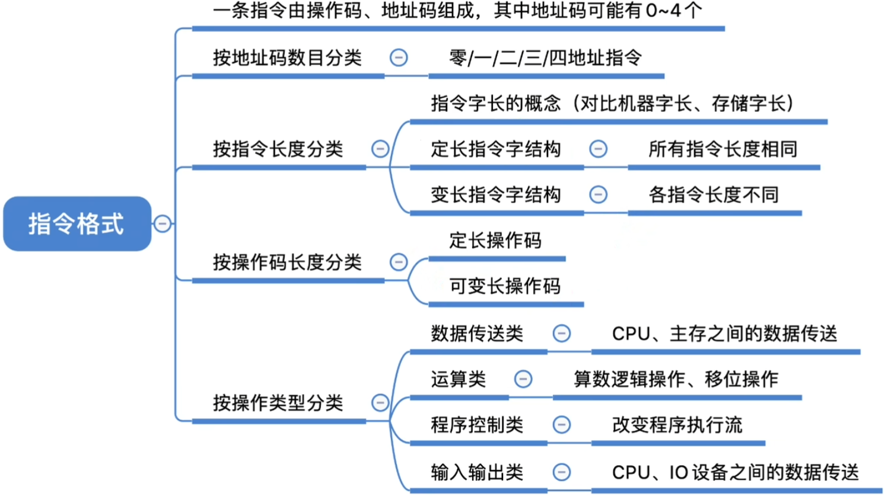

  * 按地址码数量分类

    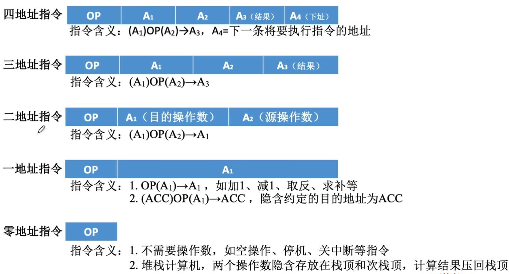

    在指令字长不变的情况下，地址码越多，寻址范围越差

  * 按指令长度分类

    指令字长：一条指令的总长度(可能会变)</br>
    定长指令字结构：系统中所有指令长度一样</br>
    变长指令字结构：系统中各种指令长度不相等

  * 按操作码长度分类
  
    定长操作码：系统中所有指令的操作码长度相同。$n$ 位操作码有 $2^n$ 个指令</br>
    可变长操作码：系统中各指令的操作码长度可变

  * 按操作类型分类

    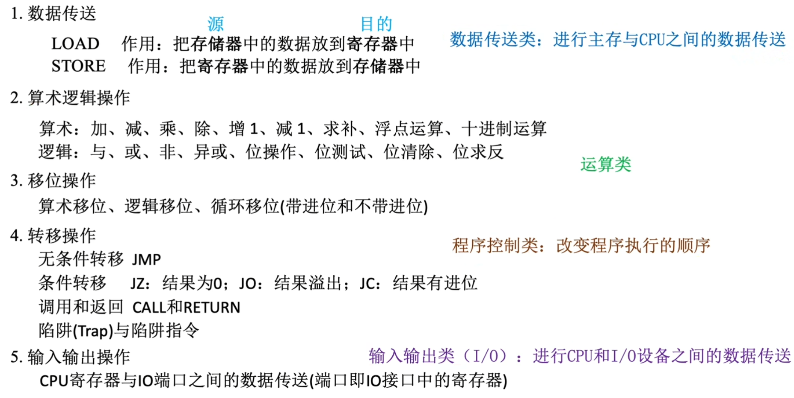

* 扩展操作码指令格式

  设指令字长固定为 $16$ 位，操作码长度为 $4$ 位，设计指令系统如下

  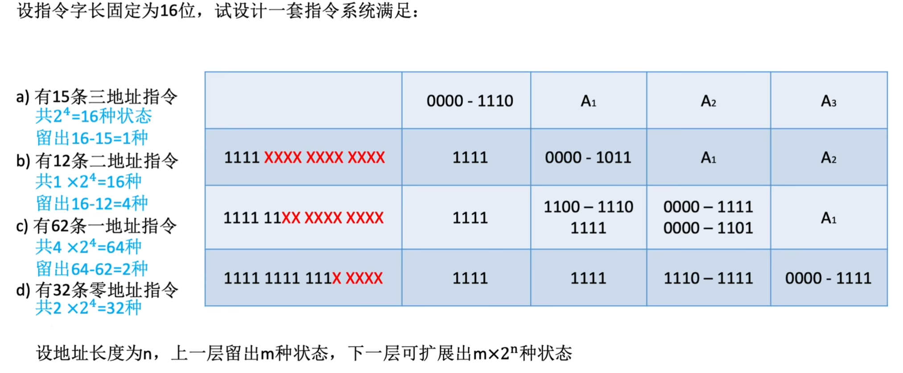

  * 定长操作码

    在指令字的最高位部分分配固定的若干位(定长)表示操作码。一般 $n$ 位操作码字段的指令系统最大能够表示 $2^n$ 条指令
    * 优点：定长操作码对于简化计算机硬件设计，提高指令译码和识别速度很有利
    * 缺点：指令数量增加时会占用更多固定位，留给表示操作数地址的位数受限

  * 扩展操作码(不定长操作码)
  
    全部指令的操作码字段的位数不固定，且分散地放在指令字的不同位置上。最常见的变长操作码方法是扩展操作码，使操作码的长度随地址码的减少而增加，不同地址数的指令可以具有不同长度的操作码，从而在满足需要的前提下，有效地缩短指令字长
    * 优点：在指令字长有限的前提下仍保持比较丰富的指令种类
    * 缺点：增加了指令译码和分析的难度，使控制器的设计复杂化

### 1.2 指令寻址方式

* 指令寻址

  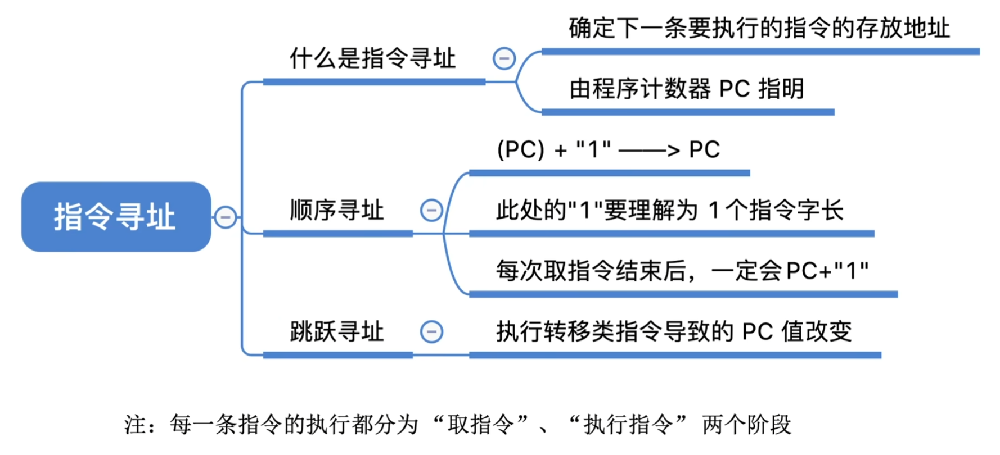

  * $\text{PC}+1$ 指增加一个指令字长，因为不同的指令长度可能不一样，计算机编址方式也可能不一样
  * 跳跃寻址分为 **绝对转移**(地址码直接给出目标地址)与 **相对转移**(地址码给出**相对于下一条指令**的偏移量)

* 数据寻址
  * 隐含寻址

    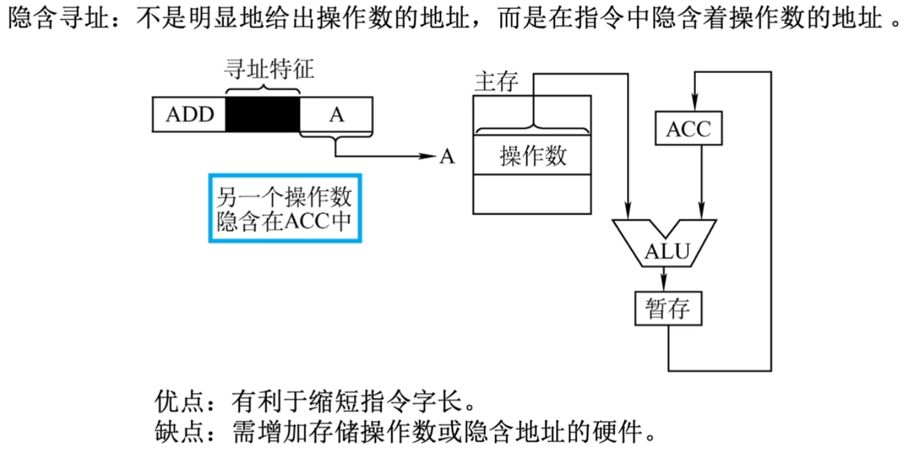

  * 立即寻址

    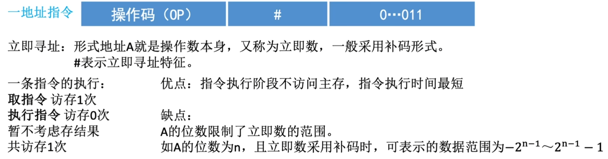

    寻址特征使用`#`表示

  * 直接寻址

    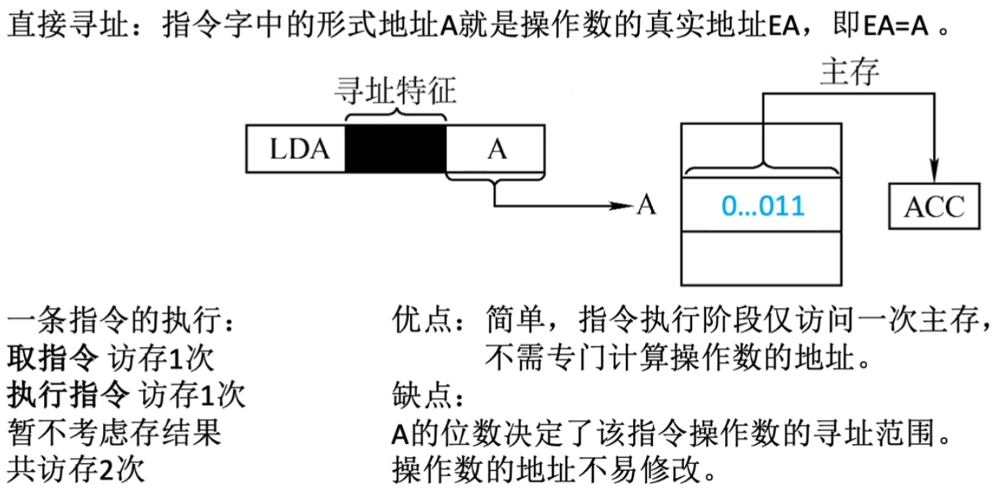

  * 间接寻址

    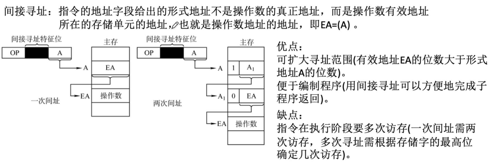

  * 寄存器寻址

    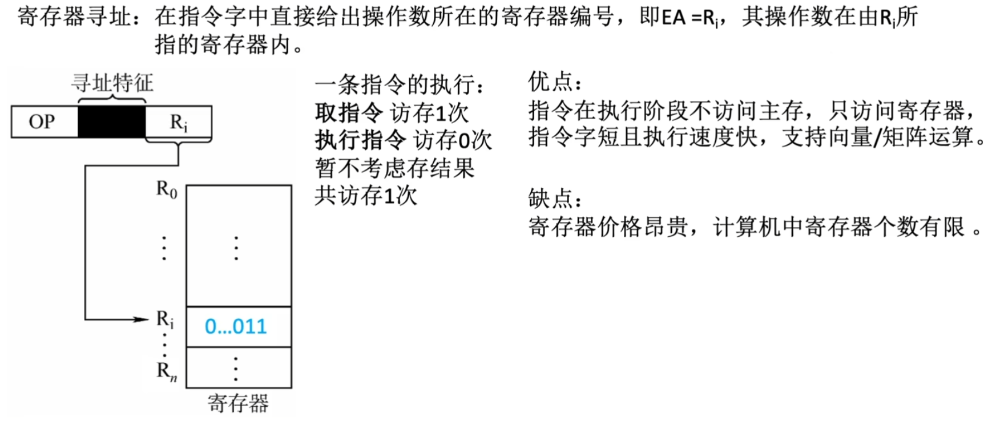

    **访问寄存器不算访存**

  * 寄存器间接寻址

    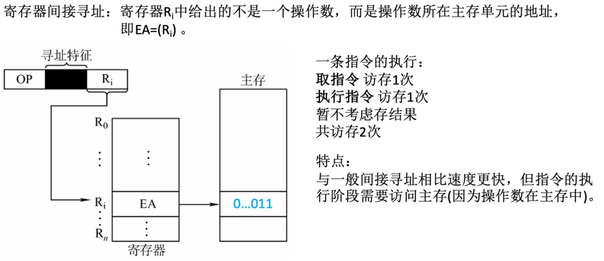

  * 基址寻址

    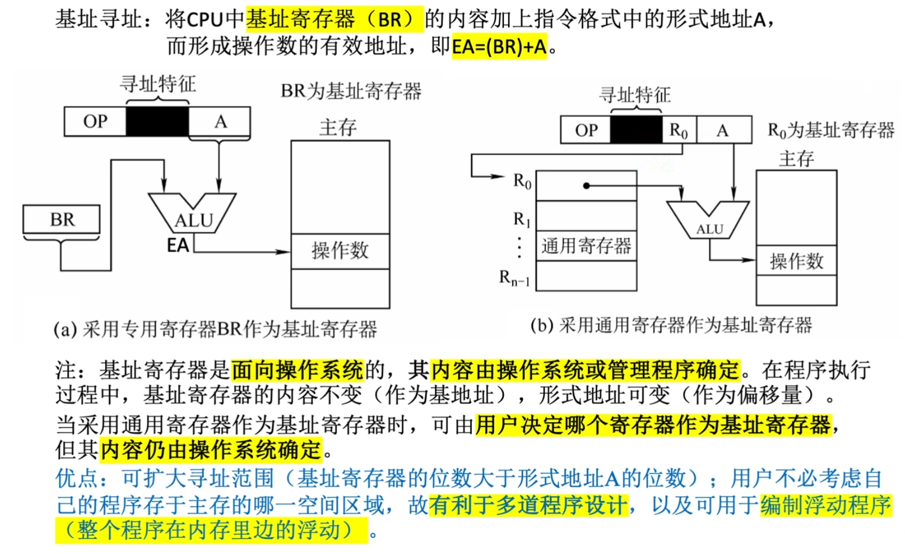

    可以采用专用的基址寄存器 $\text{BR}$ (也称重定位寄存器)来存储基址；也可以采用通用寄存器，并在指令中指明使用哪一个通用寄存器存放基址。**特别地，无论哪种方法，存放基址的寄存器的内容只能由操作系统进行管理，但基址寄存器对用户可见，因为用户可以指定一个寄存器作为基址寄存器**

  * 变址寻址

    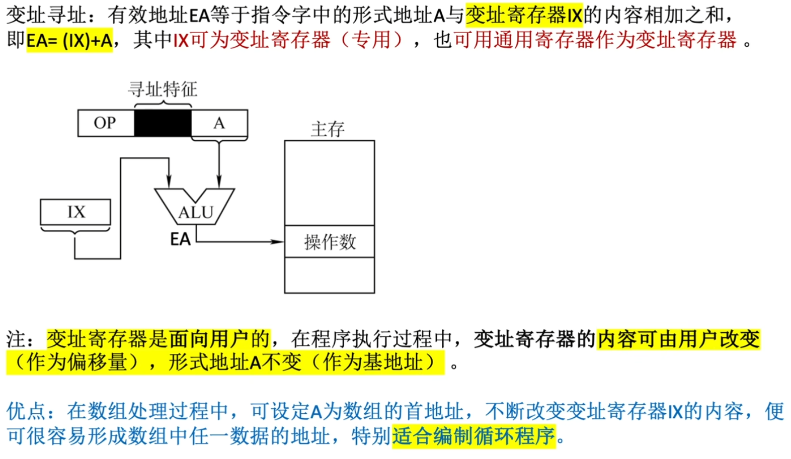

    与基址寻址相反，变址寄存器 $\text{IX}$ 存放偏移量，形式地址 $\text{A}$ 存放基地址。且 $\text{IX}$ 可以由用户控制

    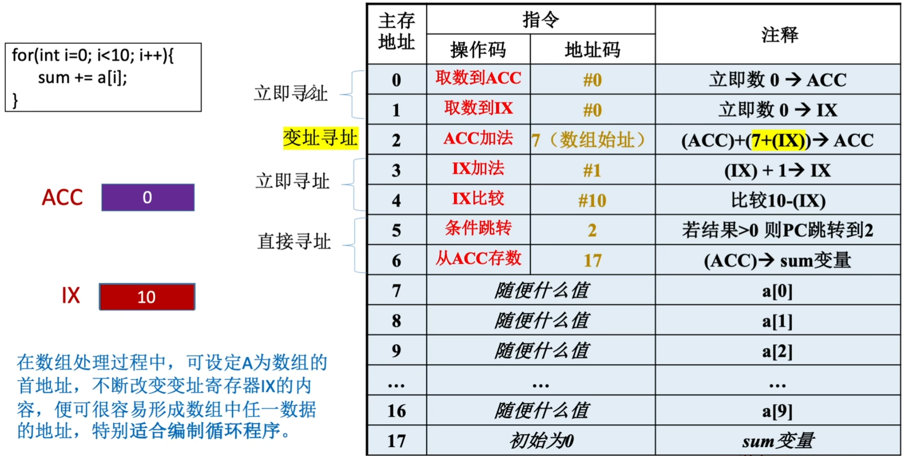

    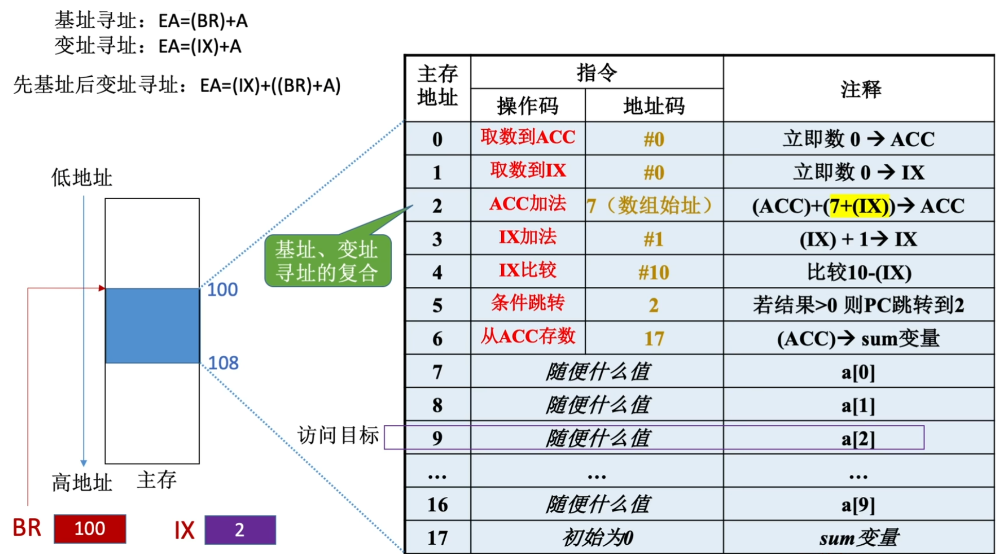

  * 相对寻址

    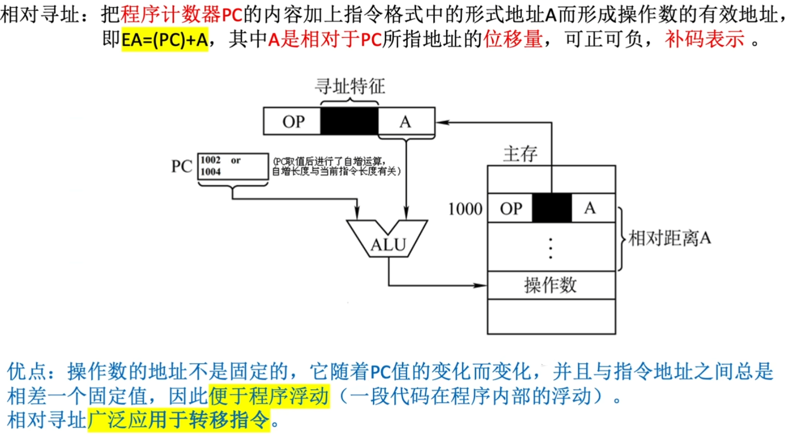

    **相对寻址是对 $\text{PC}$ 进行偏移，每次取出指令后，$\text{PC}$ 立马增加一个指令字长，然后再进行偏移操作。因此偏移后的地址是相对当前指令的下一个指令而言的**

    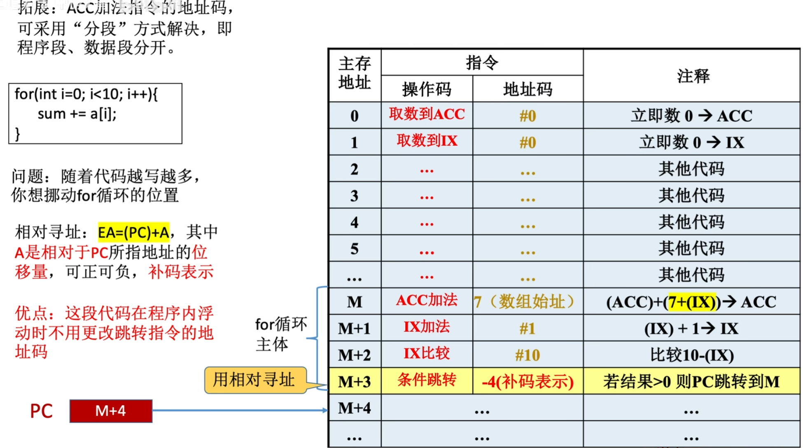

  * 堆栈寻址

    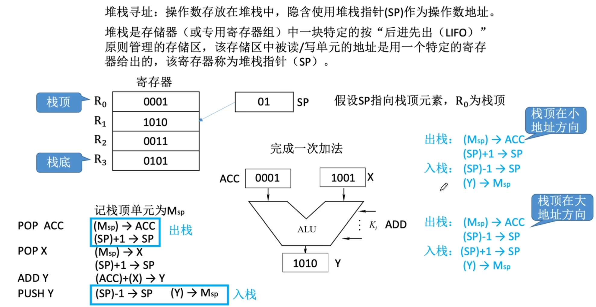

    使用堆栈指针 $\text{SP}$ 指向栈顶元素。硬堆栈以寄存器作为栈，软堆栈以主存中的一片区域作为栈，二者操作方式相同

  * 总结

    |寻址方式|有效地址 $\text{EA}$ |访存次数</br>(指令运行时)|说明|地址码类型|
    |:-:|:-:|:-:|:-:|:-:|
    |**隐含寻址**|不显式给出|0|/|无地址码|
    |**立即寻址**| $\text{A}$ 就是操作数 |0|便捷获取操作数|取决于立即数|
    |**直接寻址**| $\text{A}$ |1|缩短指令长度|无符号数|
    |**间接寻址</br>(一次间接)**| $(\text{A})$ |2|扩大寻址范围，易于子程序返回|无符号数|
    |**寄存器寻址**| $\text{R}_i$ |0|执行速度快|无符号数|
    |**寄存器间接寻址</br>(一次间接)**| $(\text{R})_i$ |1|扩大寻址范围|无符号数|
    |**基址寻址**| $(\text{BR})+\text{A}$ |1|多道程序|均为无符号数|
    |**变址寻址**| $\text{A}+(\text{IX})$ |1|循环程序| $\text{A}$ 为无符号数 </br> $\text{IX}$ 为带符号补码 |
    |**相对寻址**| $(\text{PC})+\text{A}$ |1|指令跳转|$\text{PC}$ 为无符号数 </br> $\text{A}$ 为带符号补码|
    |**堆栈寻址**|由栈指针 $\text{SP}$ 决定|硬堆栈：$0$ </br> 软堆栈：$1$|/|无地址码|

### 1.3 机器级代码表示

* 汇编语言
  * 寄存器分布

    | 寄存器 | 32位名称 | 16位名称 | 高8位名称 | 低8位名称 | 功能描述 | 双字访问(dword ptr) | 单字访问(word ptr) | 字节访问(byte ptr) |
    |:------:|:-------:|:------:|:------:|:--------:|-------|:-------------:|:----------:|:-----------------:|
    | EAX | EAX| AX | AH  | AL  | 累加器   | `EAX` | `AX` | `AH`, `AL` |
    | EBX | EBX| BX | BH  | BL  | 基址寄存器 | `EBX` | `BX` | `BH`, `BL` |
    | ECX | ECX| CX | CH  | CL  | 计数寄存器 | `ECX` | `CX` | `CH`, `CL` |
    | EDX | EDX| DX | DH  | DL  | 数据寄存器 | `EDX` | `DX` | `DH`, `DL` |
    | ESI | ESI| SI | / | / | 源变址寄存器 | `ESI` | `SI` | 不适用 |
    | EDI | EDI| DI | / | / | 目标变址寄存器 | `EDI` | `DI` | 不适用 |
    | EBP | EBP| BP | / | / | 堆栈基址指针寄存器 | `EBP` | `BP` | 不适用 |
    | ESP | ESP| SP | / | / | 堆栈顶址指针寄存器 | `ESP` | `SP` | 不适用 |

    * EAX，EBX，ECX，EDX 是**通用寄存器**，不仅可以在 $32$ 位模式下使用，还可以通过不同的前缀(如 AX，AH，AL)进行更细粒度的操作
    * ESI 和 EDI 主要用于字符串操作，如 MOVSB(移动字符串字节)、STOSB(存储字符串字节)等指令
    * EBP 和 ESP 在函数调用和栈管理中非常重要。EBP 通常用于保存栈帧基址，而 ESP 则是栈指针，指示栈顶的位置
    * 不显式指明`ptr`时，默认为 $32\,\text{bit}$

  * $\text{x86}$ 架构部分指令

    | 指令 | 操作语义 | 描述 |
    |:----:|----------|------|
    | `MOV d, s` | `d ← s` | 数据传送 |
    | `CMP d, s` | `d - s`(不保存结果) | 比较 |
    | `ADD d, s` | `d ← d + s` | 加法 </br> `d`不能是常数`<con>` </br> `d`和`s`不能同时存储在主存`<mem>`中 |
    | `MUL d,s` | `d ← d * s`(无符号乘法) | 乘法(无符号) |
    | `IMUL d,s` | `d ← d * s`(有符号乘法) | 乘法(有符号) |
    | `DIV s` | `EDX:EAX / s`(无符号除法) | 除法(无符号) </br> 商存入`EAX`，余数存入`EAX` |
    | `IDIV s` | `EDX:EAX / s`(有符号除法) | 除法(有符号) </br> 商存入`EAX`，余数存入`EAX` |
    | `INC d` | `d ← d + 1` | 自增 |
    | `DEC d` | `d ← d - 1` | 自减 |
    | `NEG d` | `d ← -d` | 取负 |
    | `NOT d` | `d ← ~d` | 按位取反 |
    | `AND d, s` | `d ← d & s` | 按位与 |
    | `OR  d, s` | `d ← d \| s` | 按位或 |
    | `XOR d, s` | `d ← d ^ s` | 按位异或 |
    | `SHL d, s` | `d ← d << s` | 左移 |
    | `SHR d, s` | `d ← d >> s`(逻辑右移) | 逻辑右移 |
    | `SAR d, s` | `d ← d >> s`(算术右移) | 算术右移 |

  * $\text{AT\&T}$ 架构部分指令

    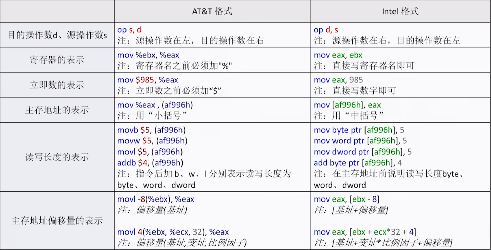

* 选择语句
  * 代码实现

    逻辑代码

    ```python
    a, b = 7, 6

    if a > b:
      c = b
    else:
      c = a
    ```

    使用`cmp`与`je`完成

    ```asm
    mov eax, 7        ; 假设变量a=7，存入eax
    mov ebx, 6        ; 假设变量b=6，存入ebx
    cmp eax, ebx      ; 比较变量a和b
    jle NEXT          ; 若a≤b，转移到NEXT:
    mov ecx, eax      ; 假设用ecx存储变量c，令c=a
    jmp END           ; 无条件转移到END:
    NEXT:
        mov ecx, ebx  ; 假设用ecx存储变量c，令c=b
    END:
    ```

    使用`cmp`与`jg`完成

    ```asm
    mov eax, 7        ; 假设变量a=7，存入eax
    mov ebx, 6        ; 假设变量b=6，存入ebx
    cmp eax, ebx      ; 比较变量a和b
    jg NEXT           ; 若a≤b，转移到NEXT:
    mov ecx, ebx      ; 假设用ecx存储变量c，令c=b
    jmp END           ; 无条件转移到END:
    NEXT:
        mov ecx, eax  ; 假设用ecx存储变量c，令c=a
    END:
    ```

  * ⚠️与`cmp`的配合使用及标志位情况分析
    * 无符号数比较

      | 指令 | 描述 | 条件 |
      | --- | --- | --- |
      | `je`/`jz` | 相等跳转 | ZF = 1 |
      | `jne`/`jnz` | 不相等跳转 | ZF = 0 |
      | `ja`/`jnbe` | 高于（Above）跳转 | CF = 0 && ZF = 0 |
      | `jae`/`jnb`/`jnc` | 高于等于（Above or Equal）跳转 | CF = 0 |
      | `jb`/`jc`/`jnae` | 低于（Below）跳转 | CF = 1 |
      | `jbe`/`jna` | 低于等于（Below or Equal）跳转 | CF = 1 \|\| ZF = 1 |

    * 带符号数比较

      | 指令 | 描述 | 条件 |
      | --- | --- | --- |
      | `je`/`jz` | 相等跳转 | ZF = 1 |
      | `jne`/`jnz` | 不相等跳转 | ZF = 0 |
      | `jg`/`jnle` | 大于（Greater）跳转 | ZF = 0 && SF = OF |
      | `jge`/`jnl` | 大于等于（Greater or Equal）跳转 | SF = OF |
      | `jl`/`jnge` | 小于（Less）跳转 | SF ≠ OF |
      | `jle`/`jng` | 小于等于（Less or Equal）跳转 | ZF = 1 \|\| SF ≠ OF |

      当计算带符号数减法 $A-B$ 时，最终结果可能会因为溢出出现差错，即当 $\text{OF}=1$ 时，$\text{SF}$ 不再单独可信。因此综合考虑带符号数减法运算性质，当 $\text{SF}=\text{OF}$ 时才能说明 $A-B>0$；$A-B<0$ 就需要 $\text{SF}\neq\text{OF}$

* 循环语句

  逻辑代码
  
  ```python
  result = 0
  for i in range(1, 100 + 1):
    result += i
  ```
  
  使用比较跳转

  ```asm
  mov eax, 0          ; 用 eax 保存 result，初值为 0
  mov edx, 1          ; 用 edx 保存 i，初始值为 1

  cmp edx, 100        ; 比较 i 和 100
  jg L2               ; 若 i > 100，转跳到 L2 执行

  L1:                 ; 循环主体
      add eax, edx    ; 实现 result += i
      inc edx         ; inc 自增指令，实现 i++

      cmp edx, 100    ; i 和 100
      jle L1          ; 若 i <= 100，转跳到 L1 执行

  L2:                 ; 跳出循环主体
  ```

  使用`loop`指令

  ```asm
  mov ecx, 100        ; 初始化计数寄存器

  Looptop:            ; 循环标签
    ...
  loop Looptop:       ; 判断循环. 等价于 exc--; exc!=0; jmp Looptop;
  ```

* 过程调用语句
  
  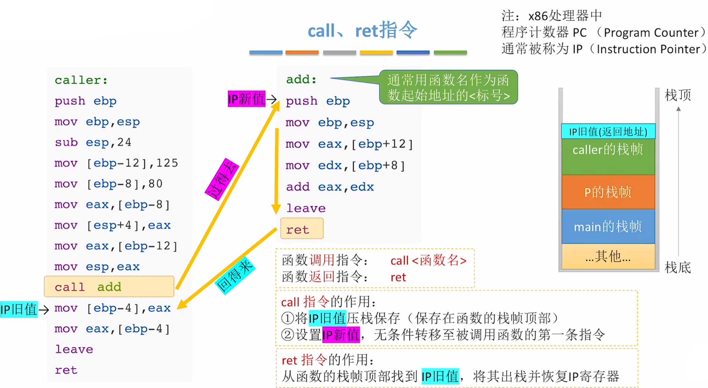

  * 栈帧
    * 访问栈帧

      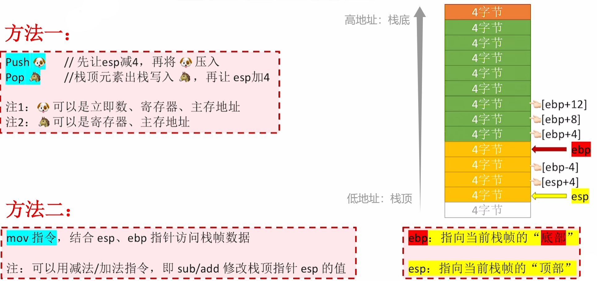

    * 切换栈帧
  
      进入新栈帧`call`、`enter`：开辟了一块新空间用于执行被调函数

      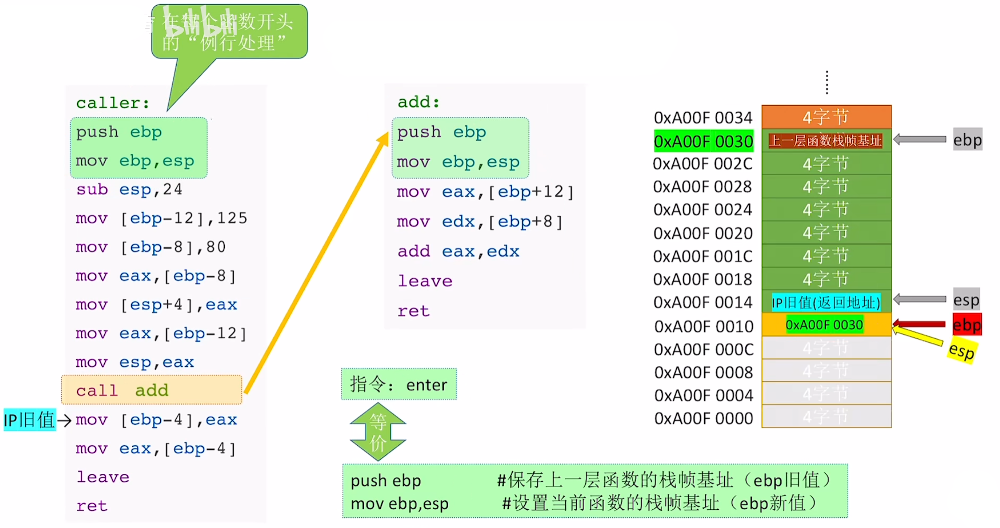

      离开新栈帧`leave`：回收用于执行被调函数的空间，将堆栈指针回退到上层调用

      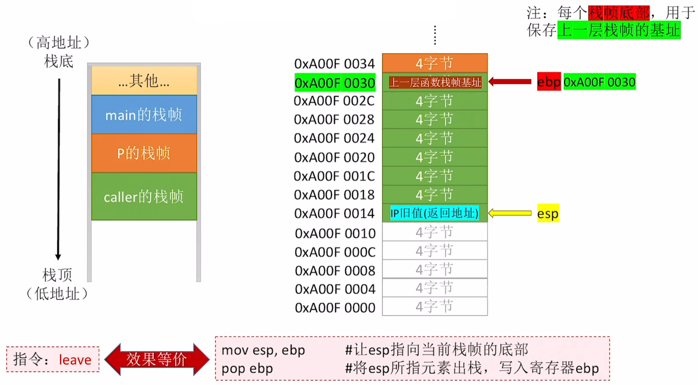

      返回上层调用`ret`：结束调用，使 $\text{PC}(\text{IP})$ 继续执行发起调用后的下一个语句

      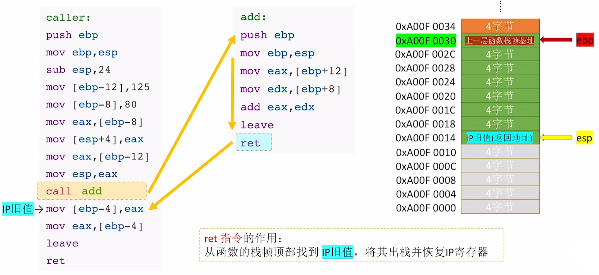

  * 传递参数与返回值

    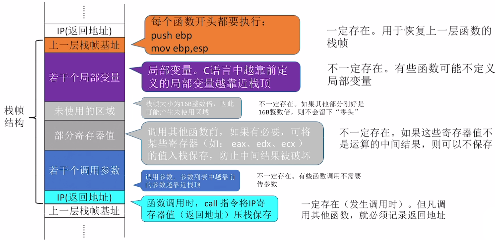

    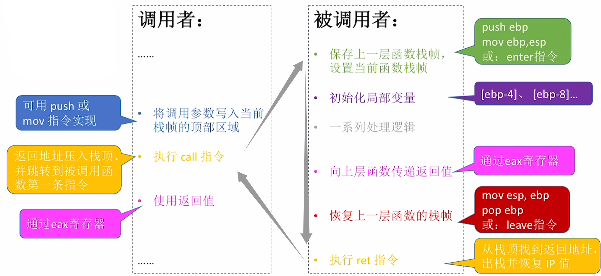

    * 由于不能使用`mov <mem> <mem>`，因此使用寄存器`eax`完成返回值暂存及返回功能

    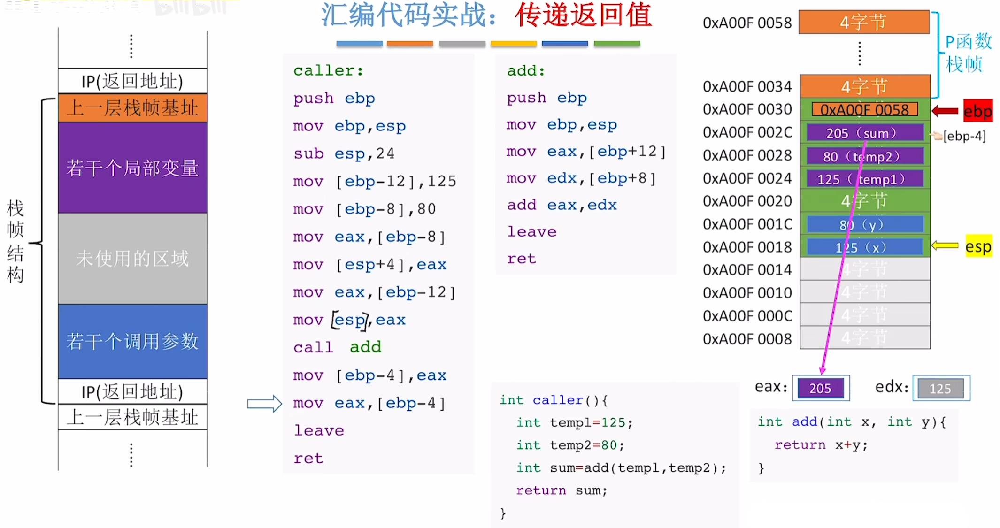

### 1.4 CISC与RISC

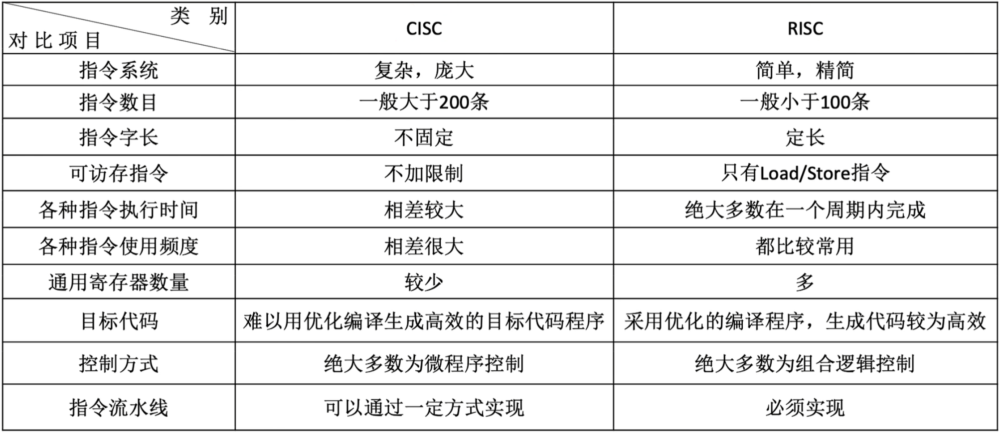

* $\text{CISC (Complex Instruction Set Computer)}$ 设计思路是一条指令完成一个复杂的基本功能，多条指令组合完成一个复杂的基本功能。代表：x86架构，主要用于笔记本、台式机等
* $\text{RISC (Reduced instruction Set Computer)}$ 设计思路是一条指令完成一个基本动作。代表：ARM架构，主要用于手机、平板等

## 2 题目

### 2.1 选择

* 4.1习题
  * 02(ISA)
  * 03(指令的地址码由PC提供)
  * 06(循环指令是转移类指令、中断隐指令由硬件实现)
  * 07(特权指令只能由操作系统和系统级软件使用)
  * 08(堆栈计算机)
  * ***15(最少指令字长)***
* 4.2习题
  * 03(寄存器寻址减少地址位数)
  * 09(堆栈寻址)
  * 17(补码范围)
  * 20(寄存器间接寻址EA)
  * ***24(相对寻址、条件跳转、标志位)***
  * 32(十六进制地址转二进制计算)
  * ***33($[A]_\text{unsigned}+[X]_补=[A]_\text{unsigned}-[-X]_原\,,X<0$)***
  * ***34(直接寻址地址码是无符号数)***
* 4.3习题
  * 01(OF标志位)
  * ***03(小端存储、AX是16位)***
  * ***06(PC偏移起始、指令字长)***
  * 08(`call`会修改esp和PC)
  * ***11(转移指令必须有目标地址)***
* 4.4习题

### 2.2 大题

* 4.1习题
  * ***01(立即数寄存器在指令中的地址码位数就是立即数的位数)***
  * ⭐***02(扩展操作码最大指令条数)***
  
    > 使用扩展操作码时，地址数量最多的指令的最大条数是 $2^{\text{操作码位数}}-1$，留 $1$ 个状态用于扩展地址数少的指令。设单个地址码长度为 $A$ ，有 $n$ 个地址的指令实际有 $N$ 条，有 $n+1$ 个地址的指令留下了 $m_{n+1}$ 个状态，则有 $n-1$ 个地址的指令数量最多为
    >
    > $$
    > (m_{n+1}\cdot 2^A-N)\cdot 2^A=m_n\cdot 2^A
    > $$
  
  * ***03(根据指令数量设计扩展操作码的指令格式)***
* 4.2习题
  * ***06(根据汇编助记符写指令)***
  
    > 不同题目规定可能不一样，根据给的具体汇编助记符来拼指令

  * ⭐***07(转移指令与标志关系、转移指令的电路图(移位器、加法器、IR))***
  * ⭐***08(指令操作码重叠、带符号数左移溢出判断)***
* 4.3习题
  * ⭐***01(判断CISC和RISC、根据地址算代码占的字节数、无符号数加法溢出判断看 $\text{CF}=C_\text{in}\oplus C_\text{out}=C_n\oplus \text{sub}$)***
  * ⭐***02(call指令、相对寻址的偏移量、大小端存储、带符号数乘法溢出判断)***
  
    > 第 $n+1$ 条指令的地址 $=$ 第 $n$ 条指令的地址加上它的长度(数一下机器指令十六进制的长度看看是多少字节)

  * ***03(虚拟地址、Cache地址)***
  
    > 因为虚拟地址的页内偏移部分与物理地址的页内偏移部分肯定相等，且物理地址无论是用分页式表示还是用 $\text{Cache}$ 式表示，都是那一串相同的二进制，所以根据虚拟地址的页内偏移部分就能知道 $\text{Cache}$ 地址的低位信息。但高位信息就不一定了，因为虚拟地址转页式物理地址时，虚拟页号会换成物理页号，如果题目没给对应的关系，就不得而知高位部分的物理页号，进而就不知道 $\text{Cache}$ 式地址的高位二进制码信息

  * ***04(根据机器代码判断指令的数据寻址方式、是否触发缺页异常)***
  
    > * 判断寻址方式主要看机器代码除的地址码部分，如果是立即数就会直接给出，相对寻址就会给出偏移量，自己加一下看看就能判断出来
    > * 看清问的是什么，是问"取指"是否造成缺页(要执行的指令跟之前的代码在不在同一个页里)还是"执行"是否造成缺页(数组载入问题)

  * ***05(带符号加发运算标志位、补码加法位数不同时要先按符号位扩展)***
  
    > * 计算带符号加减法时有 $\begin{cases}\text{OF}=\text{C}_n\oplus\text{C}_{n-1} \\ \text{CF}=\text{C}_\text{out}\oplus\text{sub}\end{cases}$，虽然此时 $\text{CF}$ 没有意义，但如果问了就按公式计算回答
    > * **$\text{ALU}$ 只管把收到的数据按计算要求进行运算，不管语义。不管运算的数是无符号还是带符号，进了 $\text{ALU}$ 就是一串二进制，该加就直接二进制加，要减就直接二进制减，不用遵守取反加一之类的运算规则，因为运算规则是语义上的**

  * ⛔***06(大小端存储、高级代码与汇编代码对应)***

    > 牢记地址公式：$数组元素地址=元素数组基址+数据元素次序\times 数据类型大小$。设数组基址为`&a`，元素次序为`i`，因为`int32`占 $4\text{B}$，所以按字节编址时，偏移量就是`i << 2`，则`a[i]`的地址`&a[i] = &a + i << 2`，据此查看汇编代码确定哪些寄存器存的哪些变量
