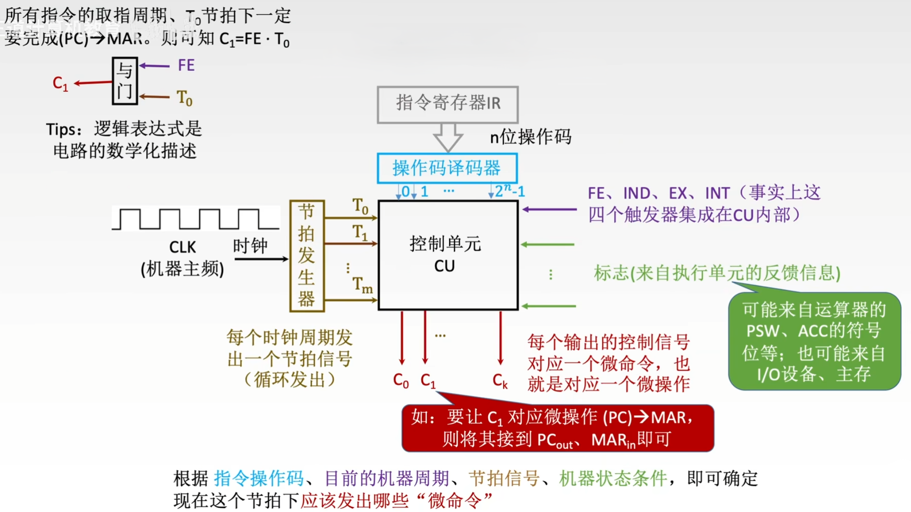
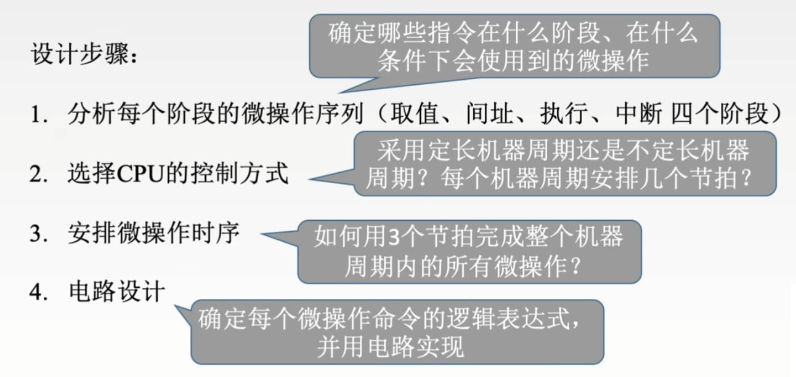
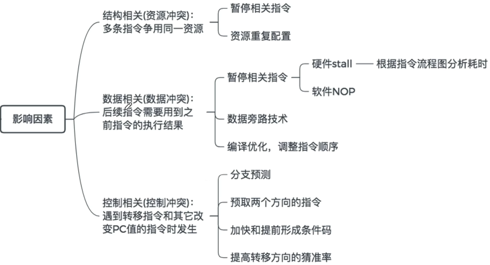
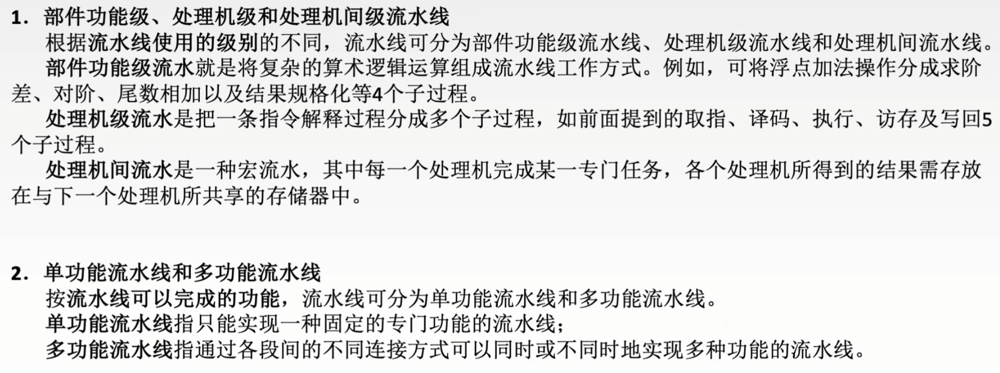
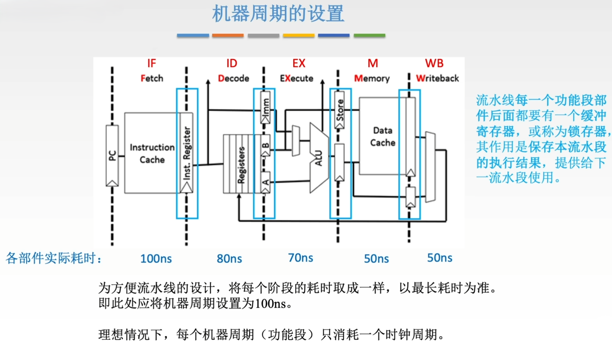
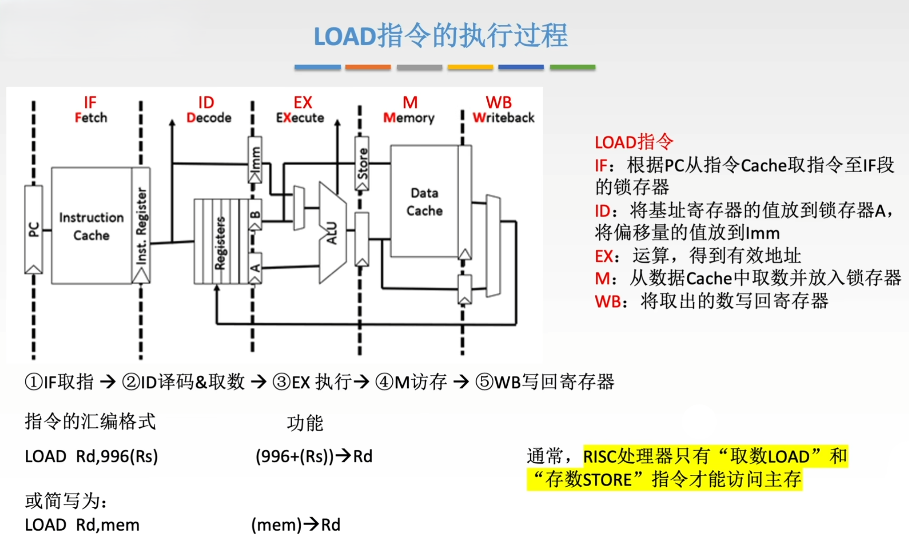

# CPU

## 1 知识点

### 1.1 CPU

* 运算器

  

* 控制器

  

* $\text{CPU}$

  

  * $\text{CPU}$ 的位数即为数据总线位数
  * $\text{PSW}$ 部分可见，用户只能读不能改

### 1.2 指令执行过程

* 指令周期

  
  
  

* 数据流
  * 取指周期

    
  
  * 间址周期
  
    
  
  * 中断周期

    

    先更改 $\text{ESP}$ 开辟新栈帧，再把断点的 $\text{PC}$ 地址压入栈保留断点

* 指令执行方案
  
  | $\text{CPU}$ | 指令执行方案 | 说明 |
  |:-----:|:-----:|:------:|
  | 单周期CPU | 单指令周期 | 所有指令在一个周期内完成，周期时间由最慢指令决定，指令间串行执行 |
  | 多周期CPU | 多指令周期 | 每条指令分多个阶段(至少 $2$ 个)，每个阶段一个周期，不同指令周期数不同，指令间串行执行 |
  | 流水线CPU | 指令流水线 | 多条指令在不同阶段并行执行，每个阶段一个周期，指令间并行执行 |

### 1.3 数据通路

* 数据通路组成
  * 从结构上看

    数据通路分为 $\text{CPU}$ 内部总线、专用数据通路两类。其中 $\text{CPU}$ 内部总线分为单总线和多总线
  
  * 从元件上看

    数据通路由组合逻辑元件(操作元件)、时序逻辑元件(状态元件)组成。其中，  
    **操作元件**：不含存储信号的记忆单元，也不受时钟信号控制，输入输出间无反馈通路。包括 $\text{ALU}$ 、加法器、译码器、多路选择门 $\text{MUX}$、三态门等  
    **状态元件**：含存储信号的记忆单元，输出与输入时间序列有关，元件必须在时钟节拍控制下工作。包括各类寄存器和存储器，如通用寄存器、$\text{PC}$、$\text{IR}$、$\text{PSW}$ 等

* $\text{CPU}$ 内部单总线

  

* $\text{CPU}$ 内部多总线

  单总线每个时钟总线上只能传递一个数据，多总线可以在多个总线上传递不同数据

* 专用数据通路

  

  大部分器件间有线路直接相连

### 1.4 控制器

* 概念
  
  

  * 控制部件向执行部件发出的各种控制命令称为**微命令**，微命令是控制序列最小的单位。微命令对应的操作称为**微操作**，微命令与微操作是一一对应的
    * 一个时钟周期(节拍)内可以并行完成多个相容的微操作
    * 同一个微操作可能在不同指令的不同阶段被使用
    * 采用单指令周期设计时，将微操作安排在末尾的时钟周期上，前面的时钟周期空闲
  * **微指令**是若干微命令的集合，一条微指令至少包含操作控制字段(微操作码字段)、顺序控制字段(微地址码字段、下地址)两部分
    * 微操作码字段：用于产生某一步操作所需的各种操作控制信号
    * 微地址码字段：用于控制产生下一条要执行的微指令地址
  * **微周期**是从控制存储器中取出并执行一条微指令所需的全部时间，通常为一个时钟周期
  * **微程序**是微指令的有序集合，**程序**是指令的有序集合。一条指令的功能由一段微程序实现
  * **控制存储器( $\text{CM}$ )** 用于存放微程序，在 $\text{CPU}$ 内部，用 $\text{ROM}$ 实现；主存储器用于存放程序和数据，在 $\text{CPU}$ 外部，用 $\text{RAM}$ 实现
  * **微指令地址寄存器( $\mu\text{PC}$ 或 $\text{CMAR}$ )** 用于存放下一条要执行的微指令在**控制存储器**中的微地址
  * **微指令寄存器( $\mu\text{IR}$ 或 $\text{CMDR}$ )** 用于存放从**控制存储器**中读出的微指令
  
* 硬布线控制器

  

  

  * 指令越多，设计和实现就越复杂，因此一般用于RISC(精简指令集系统)
  * 如果扩充一条新的指令，则控制器的设计就需要大改，因此扩充指令较困难
  * 由于使用纯硬件实现控制，因此执行速度很快。微操作控制信号由组合逻辑电路即时产生

* 微程序控制器
  
  
  * 结构
    

    

    

    * **取指周期微程序**通常是公用的，若某指令系统中有 $n$ 条机器指令，则 $\text{CM}$ 中微程序段的个数至少是 $n+1$ 个。特别地，在物理上取指周期、执行周期看起来像是两个微程序，但逻辑上应该把它们看作一整体。因此，一条指令 对应一个微程序的说法是正确的
    * 一些早期的 $\text{CPU}$ 、物联网设备的 $\text{CPU}$ 可以不提供间接寻址和中断功能，因此这类 $\text{CPU}$ 可以不包含间址周期中断周期的微程序段

  * 微指令设计

    

    * 操作控制字段编码方式(以水平型微指令为例)

      
      

    * 顺序控制字段编码方式(以水平型微指令为例)

      

  * 微程序控制单元设计

    

* 总结

  

### 1.5 异常与中断

### 1.6 指令流水线

* 概念

  

  

* 指标

  

  

  

  * 效率是所有任务的时空面积与流水线时空面积之比。$T_0=nk\Delta t$ 就是所有任务的时空面积，等同于串行时的算法(串着平铺开)；$T_k$ 是流水线横轴长度，$k$ 是流水线纵轴高度，相乘就是流水线时空面积

* 影响因素

  

  

  * 资源配置法将整个存储分模块，比如分为指令和数据两部分。执行指令时取指访问指令模块，取操作数访问数据模块，就能避免未配置下统一访问的冲突

  

  * 硬件阻塞由硬件自动插入`bubble`，在其时间内不执行本该执行的操作，从而避免冲突；软件实现为插入`NOP`空操作，将冲突操作延后执行
  * 数据旁路技术直接在 $\text{ALU}$ 和寄存器直接设线传送，在上一条指令还未将计算结果存入主存时就通过 $\text{ALU}$ 提前传给下一条指令使用的寄存器
  * 编译优化指令顺序，将无关冲突的操作补到冲突期间执行，既执行了不冲突的指令没有浪费时间空操作，也避免了冲突

  

* 流水线分类

  

  

* 流水线多发技术

  

  * 若 $\text{CPU}$ 支持乱序发射，则指令的顺序可以调整

  

  

* **⚠️五段式指令流水线**

  

  

  

  

  

  

### 1.7 多处理器

## 2 题目

* 5.1习题
  * 02(通用寄存器功能)
  * 11(PC位数不取决于机器字长)
  * 16(PSW表示程序和机器运行状态)
  * 18(PSW部分可见)
  * 21(地址译码器属于主存等存储器)
  * 22(间址周期)
* 5.2习题
  * 02(DMA)
  * 06(取指操作是控制器自动进行的)
* 5.3习题
  * 06(每个时刻只能有一个器件发出信号，但可以有多个器件接收信号)
  * ***07(单周期CPU部件使用次数)***
  * ***10(单周期CPU不能使用单总线)***
* 5.4习题
  * 02(CU主要与译码信号与时钟信号有关)
  * 03(微程序的入口地址由机器指令的操作码形成)
  * 04(微指令设计目标)
  * 18(PSW属于运算器)
  * ***27(基址寄存器可见)***
* 5.5习题
  * 01(空间并行、时间并行)
  * 02(流水线与并行吞吐率)
  * ***08(流水线数据通路在取指阶段、译码阶段不需要控制信号(区别于单总线CPU))***
  * 09(避免资源冲突方法)
  * 13(数据冲突插入空操作数量)
  * ***26(超标量流水线处理速度与运行起来的普通流水线相同)***
  * ***27(流水线数据通路不包含控制部件)***
  * ***28(流水线时钟周期=max(单部件时间)+寄存器延时)***
* 5.6习题
* 5.7习题
  * 05(超线程)
  * 07(双核CPU)
  * 10(UMA、NUMA)
  * 11(多核处理器属于MIMD)
