# 总线系统

## 1 知识点

### 1.1 概念与指标

* 定义与特性

  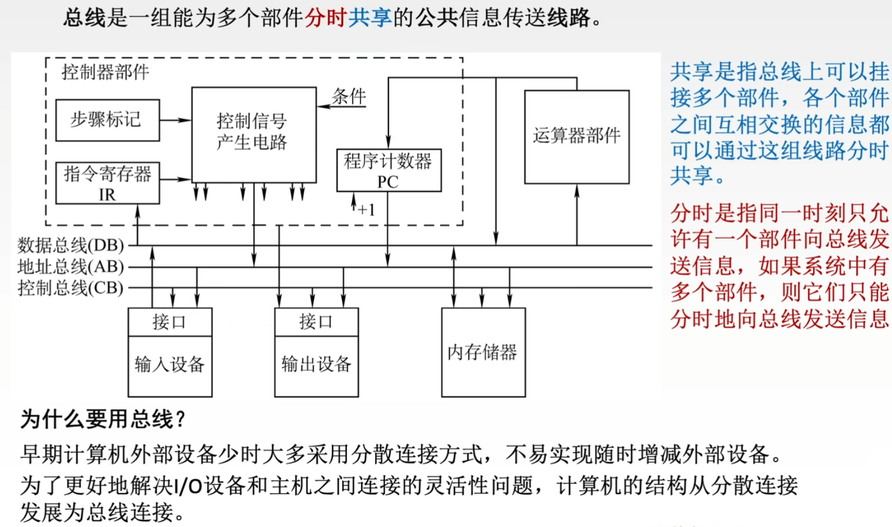

  * **机械特性**：尺寸、形状、管脚数、排列顺序
  * **电气特性**：传输方向和有效的电平范围
  * **功能特性**：每根传输线的功能(地址、数据、控制)
  * **时间特性**：信号的时序关系

* 总线分类
  * 按数据传输格式
  
    按数据传输格式可分为串行总线、并行总线

    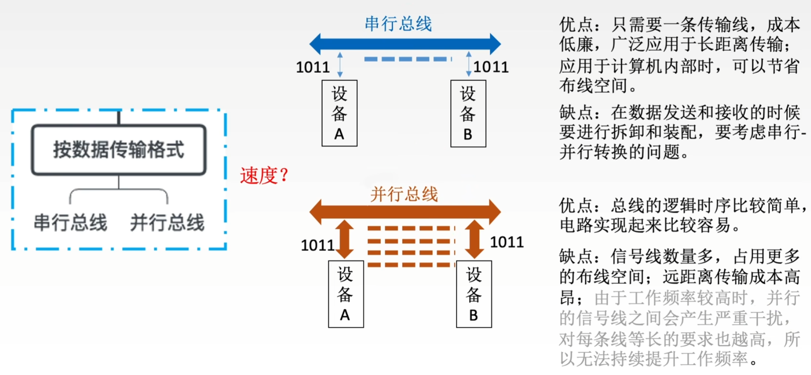
  
  * 按总线功能(连接的部件)

    按总线功能可分为片内总线( $\text{CPU}$ 内部)、系统总线(系统部件之间)、通信总线(不同计算机之间)

    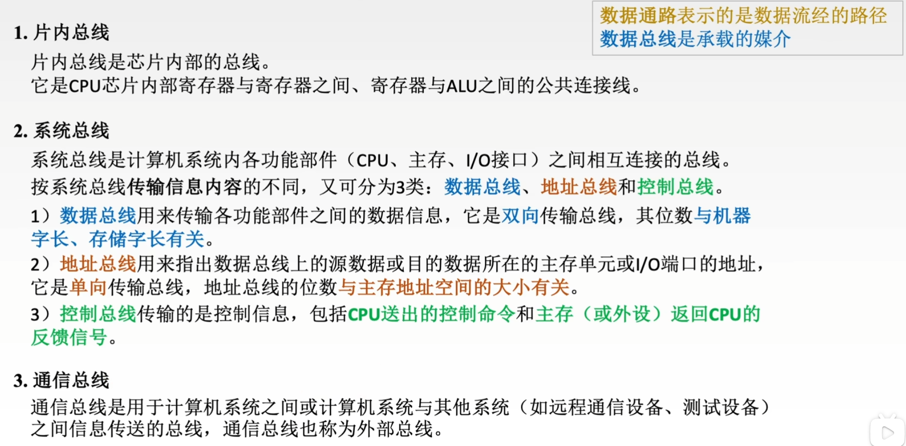

  * 按时序控制方式

    按时序控制方式可分为同步总线、异步总线

* 总线结构
  * 单总线
  
    
  
  * 双总线
  
    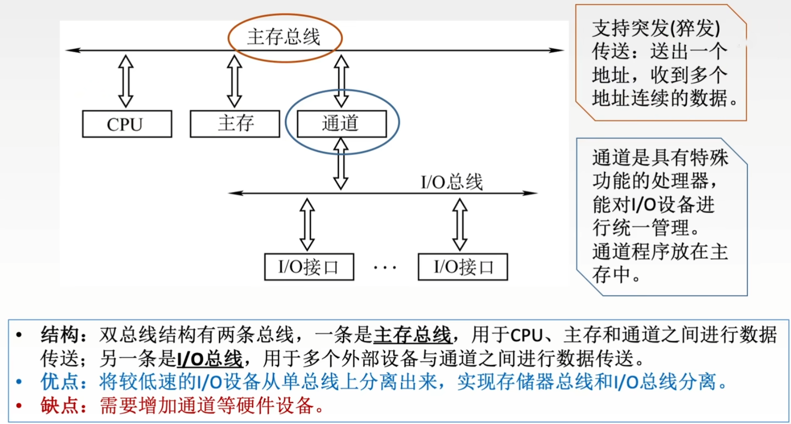
  
  * 三总线
  
    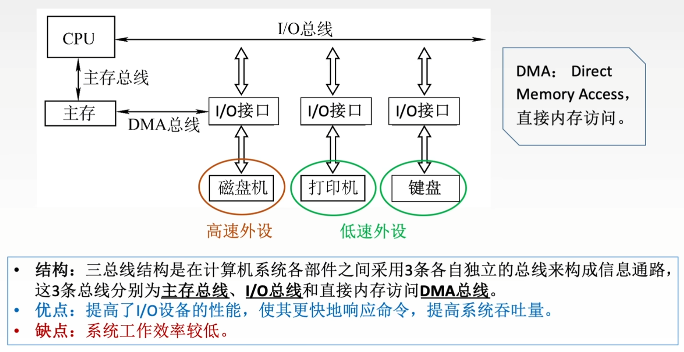

    同一时间只有一个总线能工作，所以效率低
  
  * 四总线

    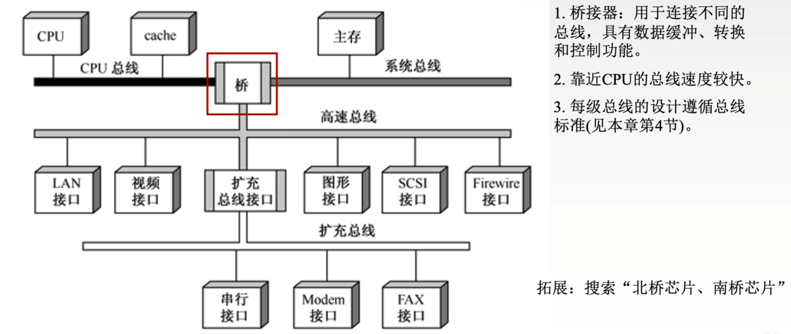

* 指标

  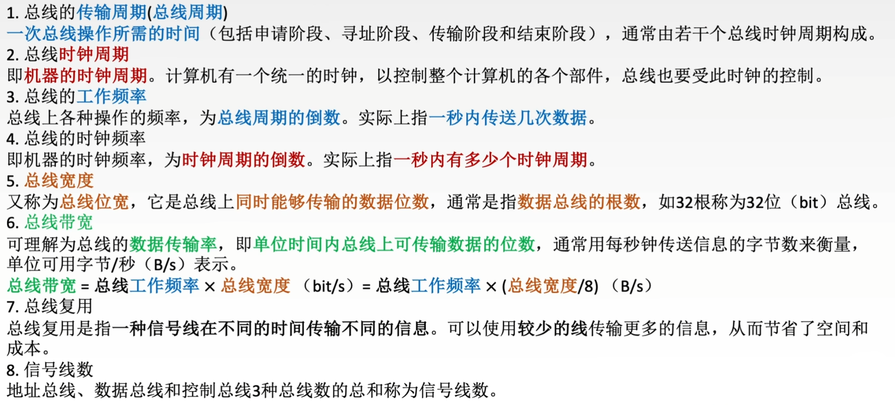

### 1.2 总线操作与定时

* 总线传输四个阶段

  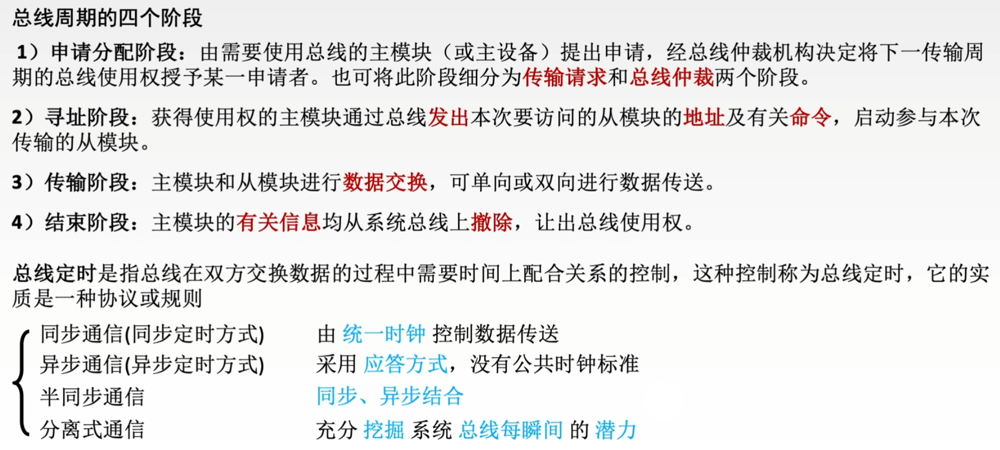

* 定时
  * 同步定时

    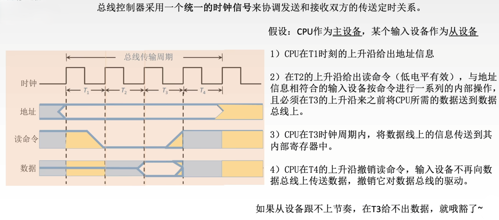

    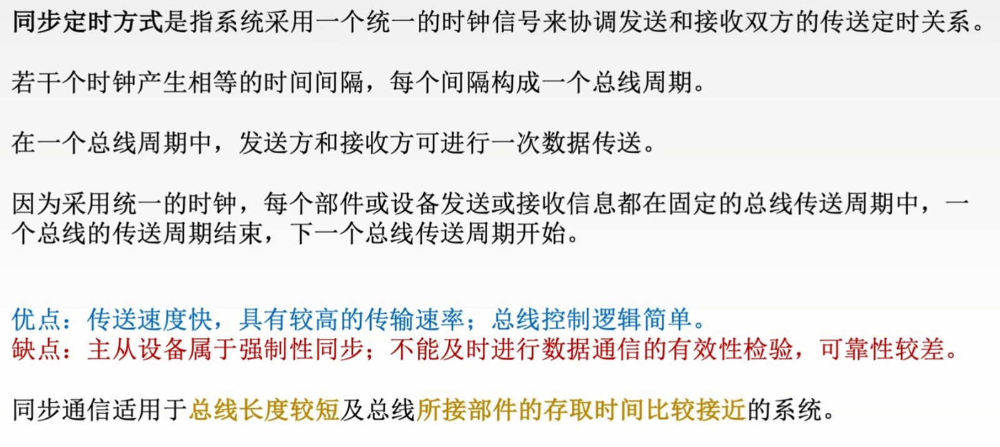

  * 异步定时

    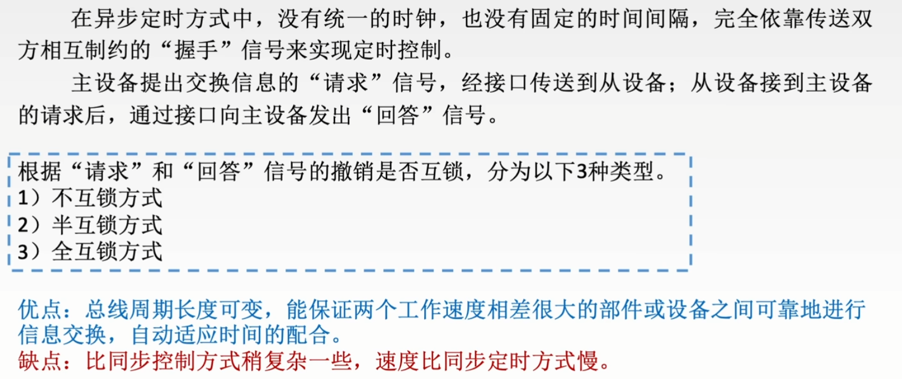

    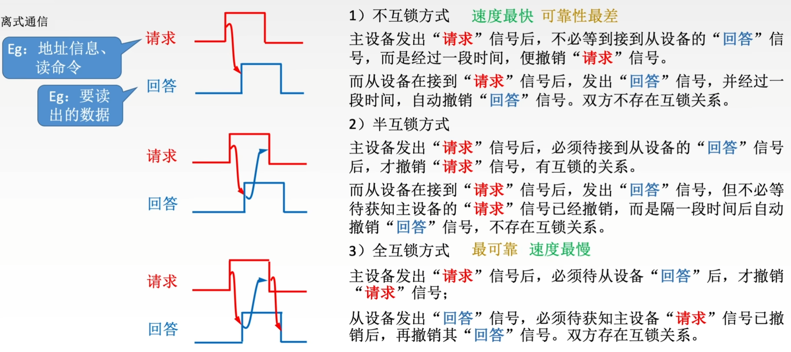

  * 半同步定时

    慢速设备未准备好数据时发送 $\text{WAIT}$ 信号让主设备等待，直到数据就绪可以传输

    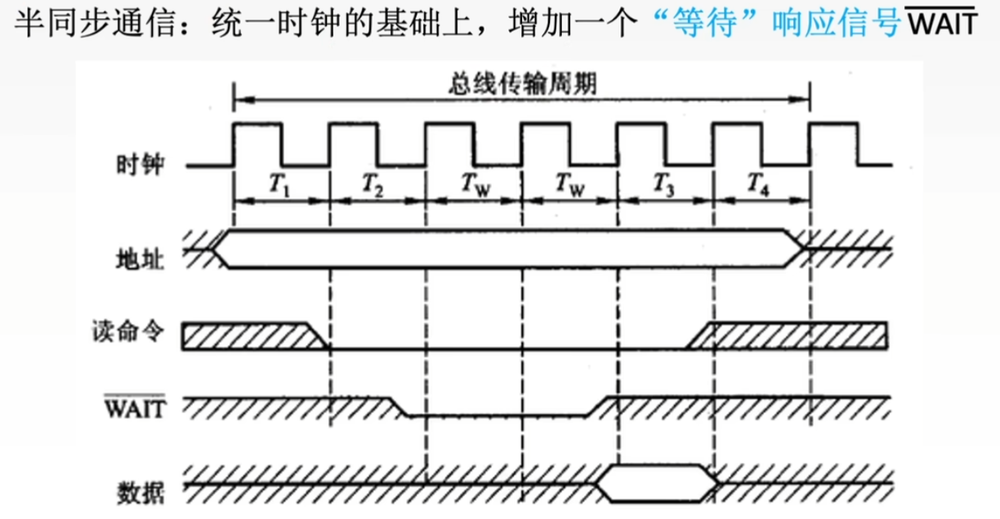

  * 分离式定时

    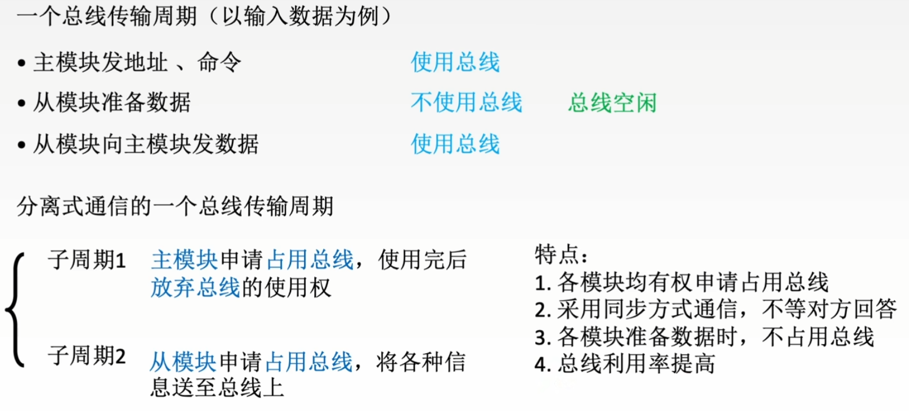

## 2 题目

* 6.1习题
  * ***06(间址寻址EA由数据总线送回CPU、地址总线只能是CPU向主存发)***
  * 10(总线复用技术)
  * 11(主存通过总线类型区分数据或地址)
  * 26(3通道存储器)
  * 27(全双工带宽)
* 6.2习题
  * 03(完整读操作的带宽)
  * 11(速度相差大适合用异步定时)
  * ***12(地址数据线复用)***
  * ***15(并行不一定比串行快)***
  * 16(存储器总线可支持突发传送)
