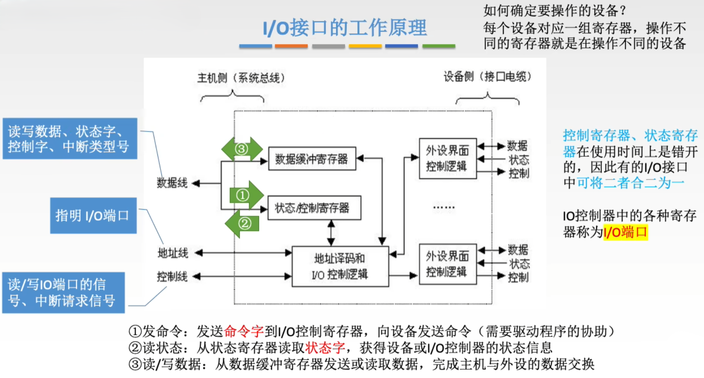

# I/O系统

## 1 知识点

### 1.1 I/O接口

* 接口结构

  

  * 内部接口(主机侧)：内部接口与系统总线连，实质上是与内存、$\text{CPU}$ 相连
  * 外部接口(设备侧)：外部接口通过接口电缆与外设相连，外部接口的数据传输可能是串行方式，因此 $\text{I/O}$ 接口需具有串并转换功能
  * I/O接口的作用
    * 数据缓冲：通过数据缓冲寄存器(DBR)达到主机和外设工作速度的匹配
    * 错误或状态监测：通过状态寄存器反馈设备的各种错误、状态信息，供 $\text{CPU}$ 查用
    * 控制和定时：接收从控制总线发来的控制信号、时钟信号
    * 数据格式转换：串-并、并-串等格式转换
    * 与主机和设备通信：实现主机— $\text{I/O}$ 接口— $\text{I/O}$ 设备之间的通信
  * 选择具体设备可以：
    * 设置对应的不同组设备，总线接通接口时即对应唯一设备
    * 对设备进行编号，接通接口时选择设备

* 接口类型

  

* 端口编址

  

  * $\text{RISC}$ 常用统一编址
  * 独立编址需要额外实现访问 $\text{I/O}$ 设备的命令，如 $\text{Intel x86}$ 的`IN`、`OUT`指令

### 1.2 I/O方式

* 程序查询方式

  

  

* 程序中断方式
  * 中断概念

    

  * 中断流程
    * 中断请求

      

      系统在指令周期的中断周期检查是否有中断，就需要判断有哪些中断源发出了中断请求

      

      使用中断请求标记触发器 $\text{INTR}$ 来记录中断源是否发出了请求信号

    * 中断响应

      

      有多个中断源的情况下需要判断优先级，先执行优先级高的中断请求
      * 硬件故障中断属于最高级，其次是软件中断
      * 非屏蔽中断优于可屏蔽中断
      * $\text{DMA}$ 请求优于 $\text{I/O}$ 设备传送的中断请
      * 高速设备优于低速设备
      * 输入设备优于输出设备
      * 实时设备优于普通设备

    * 中断处理
      * 中断隐指令

        

        关闭中断，保存 $\text{PC}$ 的值并压入栈顶。要响应的中断源的 $\text{INTR}$ 号经过中断向量地址形成部件的映射，变成中断程序在主存中要跳转地址的地址。如图中的`0001 0011`对应向量地址`13H`，`13H`里跳转指令中的中断向量`300`就是中断程序在主存中的地址

      * 中断服务程序

        

        隐指令处理结束后，再运行中断程序前先保护现场，把各类寄存器的值压入栈顶，然后再执行中断服务。执行结束后恢复现场，把各类寄存器的值再写回原样，同时通过保存的 $\text{PC}$ 值回到断点

  * 多重中断

    

    

    使用中断屏蔽技术动态进行中断，当中断程序A运行时，仅允许A不屏蔽的程序再次中断

    > 使用中断屏蔽技术示例  
    > 优先级比自身高的程序，屏蔽字为0，表示无法屏蔽  
    > 比自身低的程序的屏蔽字为1，表示可以屏蔽  
    > 自身的屏蔽字一般为1，表示在自身中断执行结束前，不能再响应自身新的中断请求(如键盘不能还没处理好上一个输入就再中断处理下一个输入)
    > 

  * $\text{I/O}$ 程序中断方式(前边是系统中断基础概念)

    

    * 中断响应阶段
      * 保存**断点**( $\text{PC}$ )、程序状态字( $\text{PSW}$ )
      * 根据**响应优先级**确定响应顺序，其中响应优先级由**硬件电路**确定
      * 送中断向量
    * 中断执行阶段
      * 关中断
      * 保存**现场**(通用寄存器、设置断中断屏蔽字)，其中中断屏蔽字决定**执行优先级**。这些工作由**软件程序**完成
      * (开中断)
      * 执行中断服务程序
      * (关中断)
      * 恢复现场
      * 开中断
      * 返回

    > I/O程序中断方式示例
    > 

    

* $\text{DMA}$ 方式
  * 流程

    

    

    预处理阶段 $\text{CPU}$ 给 $\text{DMAC}$ 对应的主存地址、外设地址、数据计数，然后 $\text{DMAC}$ 开始工作。每准备好一个数据单元， $\text{DMAC}$ 就尝试发起一次 $\text{DMA}$ 传输请求，请求占用总线向主存写入数据， $\text{CPU}$ 在存取周期的末尾让出总线给 $\text{DMA}$ 请求，这样一次数据就写完了，地址对应更改，数据计数-1.往返多次直至整块数据写完，随后 $\text{DMAC}$ 发出中断信号， $\text{CPU}$ 执行后处理程序服务进行收尾工作。整体而言可以近似看作DMA方式只在最后完成传输时发出了一次中断请求，其余时间传输数据不影响 $\text{CPU}$ 工作，因为窃取的是存取周期并非指令周期，$\text{CPU}$ 在被窃取时仍然可以执行指令，只是无法访存而已。

    * **$\text{DMA}$ 在每个总线周期结束后检查有无请求，区别于中断的指令周期末尾检查中断请求**
    * **外设对 $\text{DMA}$ 控制器发出 $\text{DMA}$ 请求；$\text{DMA}$ 控制器对 $\text{CPU}$ 发出总线请求**

  * 总线冲突
    * 单总线

      $\text{DMA}$ 能否使用总线完全由 $\text{CPU}$ 决定，$\text{DMA}$ 使用总线期间 $\text{CPU}$ 不能继续执行程序。不会发生总线冲突

    * 三总线(常用)

      使用三总线且主存不支持双端口的情况下可能发生 $\text{CPU}$ 使用主存总线与 $\text{DMA}$ 使用 $\text{DMA}$ 总线同时争夺主存操作的冲突，采用分配策略解决冲突

      

      **使用三总线结构时主存和 $\text{DMA}$ 接口之间有一条直接数据通路( $\text{DMA}$ 数据总线)。由于 $\text{DMA}$ 方式传送数不需要经过 $\text{CPU}$，因此不必中断现行程序，$\text{I/O}$ 与主机并行工作，程序和传送并行工作**

      使用三总线结构的 $\text{DMA}$ 方式具有下列特点：
      * 主存与 $\text{CPU}$ 的固定联系脱钩，主存既可被 $\text{CPU}$ 访问，又可被外设访问
      * 在数据块传送时，主存地址的确定、传送数据的计数等都由硬件电路直接实现
      * 主存中要开辟专用缓冲区，及时供给和接收外设的数据
      * $\text{DMA}$ 传送速度快， $\text{CPU}$ 和外设并行工作，提高了系统效率
      * $\text{DMA}$ 在传送开始前要通过程序进行预处理，结束后要通过中断方式进行后处理

## 2 题目

* 7.2习题
  * ***06(IO指令格式与通用指令格式不同)***
  * ***18(磁盘驱动器不属于IO接口，磁盘控制器才是IO接口)***
* 7.3习题
  * 02(中断向量地址、向量地址)
  * 03(中断触发事件)
  * ***05(程序中断方式、DMA方式)***
  * 10(访管中断)
  * 15(中断响应周期用硬件不用软件为了正确性和速度)
  * 16(中断触发器)
  * 17(中断隐指令)
  * ***19(响应优先级、处理优先级)***
  * 22(程序查询方式)
  * ***23(DMA请求)***
  * 24(DMA中断是为了检查数据正确性)
  * 25(DMA需要CPU控制初始和后处理阶段)
  * 29(DAM、磁盘)
  * 30(DMA不是程序控制方式)
  * 31(中断隐指令是硬件方式、中断隐指令保存PC)
  * 36(DMA传递信息)
  * ***43(中断响应时间不算IO时间)***
  * ***48(DMA准备阶段由CPU执行设备驱动程序完成)***
  * ***51(DMA方式流程)***
  * ***54(中断结束后直接PC返回，无需发送中断结束信号)***
  * 56(中断优先级)
  * 57(DMA的数据通路是主存到外设)
