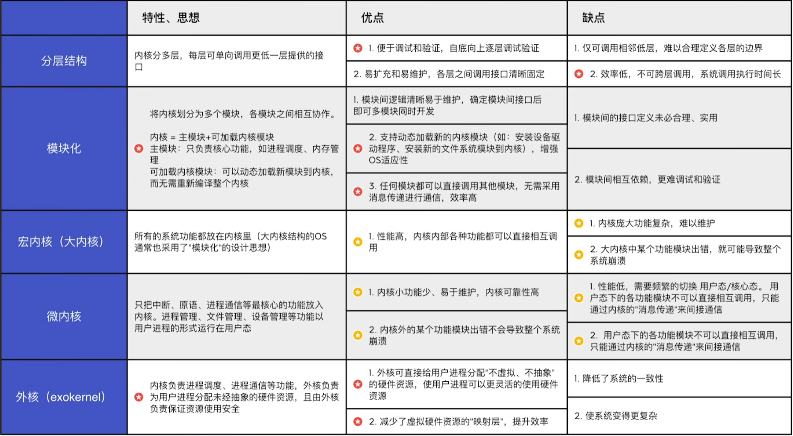

# 绪论

## 1 知识点

### 1.1 操作系统概念

* 命令接口是用户可以直接使用的。其中联机命令接口说一句做一句，脱机命令接口说一堆做一堆。命令接口与程序接口合称用户接口

* 并发指两个或多个事件在**同一时间间隔内**发生。这些事件宏观上是同时发生的，但微观上是交替发生的
* 共享即资源共享，是指系统中的资源可供内存中多个并发执行的进程共同使用
* 虚拟是指把一个物理上的实体变为若干个逻辑上的对应物。物理实体(前者)是实际存在的，而逻辑上对应物(后者)是用户感受到的
* 异步是指在多道程序环境下，允许多个程序并发执行，但由于资源有限，进程的执行不是一贯到底的，而是走走停停，以不可预知的速度向前推进，这就是进程的异步性
* 并发和共享是基本的特征，并发是最基本的特征

* 单道批处理类似单指令，上一个作业处理完才能开始下一个作业；多道批处理类似指令流水线

### 1.2 操作系统运行环境

* 运行机制

  

  * 当前的状态由 $\text{PSW}$ 保存，用于表示是内核态还是用户态
  * $\text{CPU}$ 在生产时就划分了特权指令与非特权指令，因此在执行指令时可以区分特权指令与非特权指令。当应用程序混入特权指令时会立刻引发中断，操作系统强制转为内核态，停止执行该应用程序

* 中断与异常

  

  * 检测到中断后，需要使用对应的中断程序处理，通过查询中断向量表找到对应中断处理程序的地址。显然，中断处理程序应该是内核态中执行
  * **中断会保存 $\text{PC}$ 和 $\text{PSW}$，其中 $\text{PC}$ 由中断隐指令保存(硬件实现)， $\text{PSW}$ 等通用寄存器由操作系统保存，$\text{CPU}$ 切换到内核态(硬件实现)；子程序调用只保存 $\text{PC}$ 不保存 $\text{PSW}$**
  * `INT`指令用于主动引发软中断

  

  * 大部分情况下外中断称为中断，内中断称为异常、例外

* 系统调用

  

  * 应用程序可以通过系统调用来请求获得操作系统内核的服务
  * 应用程序通过系统调用请求操作系统的服务。而系统中的各种共享资源都由操作系统内核统一掌管，因此凡是与**共享资源**有关的操作(如存储分配、$\text{I/O}$ 操作、文件管理等)，都必须通过系统调用的方式向操作系统内核提出服务请求，由操作系统内核代为完成。这样可以保证系统的稳定性和安全性，防止用户进行非法操作
  * 一般调用过程的调用程序和被调程序运行在同一个状态，可能是内核态，也可能是用户态；系统调用一定是内核态；库函数可能是用户态也可能是内核态

  

### 1.3 操作系统体系结构

* 微内核策略与机制分离：上层模块负责设计策略，内核负责实现策略。例如进程调度，上层模块确定调度策略，内核实现进程上下处理机
* $\text{Windows}$ 是宏内核与微内核融合；$\text{Windows NT}$ 是微内核；$\text{Linux},\text{Unix}$ 是宏内核

### 1.4 操作系统开机引导

> ⭐***例题：2021统考题46***

* 计算机开机引导步骤
  * $\text{CPU}$ 加电，$\text{CS:IP}\to$`FFFFF0H`
  * 执行`JMP`跳转到 $\text{BIOS}$
  * 登记 $\text{BIOS}$ 中断程序入口地址
  * 硬件自检
  * 操作系统引导(如上图)
* $\text{BIOS}$ 中的是自举程序，用于启动设备；操作系统引导程序(启动管理器)是在装有操作系统硬盘的活动分区中

### 1.5 虚拟机

* 第一类 $\text{VMM}$ 采用硬件实现；第二类 $\text{VMM}$ 采用软件实现
* $\text{VMM}$ 的代码量少于一个完整的操作系统

## 2 题目

### 2.1 选择

* 1.1习题
* 1.2习题
  * 08(分时系统主要处理交互式作业而非批处理作业)
  * ***16(多道程序的前提是计算机具有中断功能)***
  * 19(多任务具有并行(CPU与外设)和并发(程序间)的特点)
* 1.3习题
  * 14(系统调用、一般过程调用)
  * ***18(中断、子程序调用)***
  * ***21(中断隐指令)***
  * 22(INT软中断)
  * ***27(中断保存断点(PC,PSW)是硬件实现)***
  * ***31(中断保存现场(通用寄存器)是操作系统实现、中断CPU变成内核态是硬件实现)***
* 1.6习题
  * ***05(微内核策略)***
  * 08(典型操作系统的内核)
  * ***14(计算机开机引导步骤)***
  * 15(操作系统开机引导MBR)
  * 16(虚拟机实现)
  * 18(VMM)

### 2.2 大题

* 1.2习题
  * ⭐***01(进程最短时间甘特图、CPU利用率)***
  * ***02(进程甘特图、CPU利用率)***
