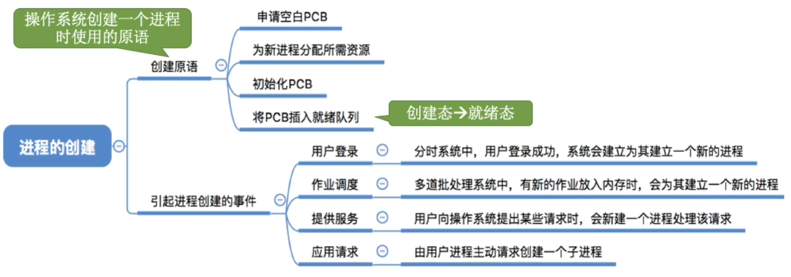
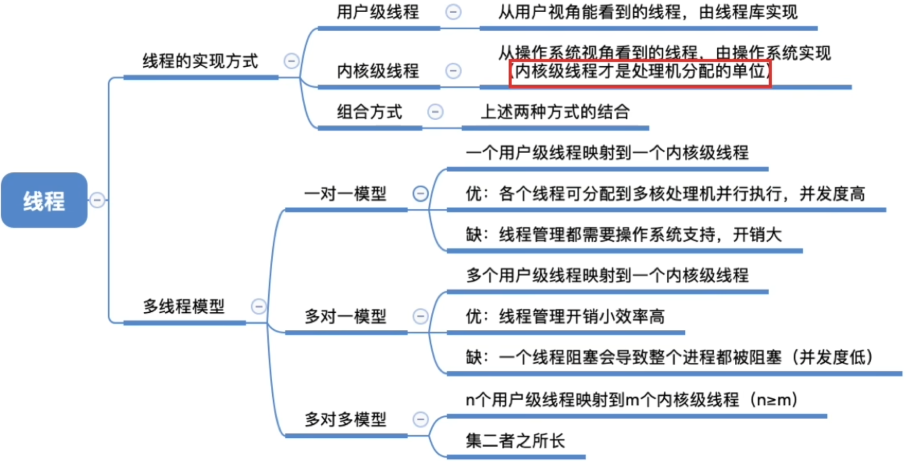
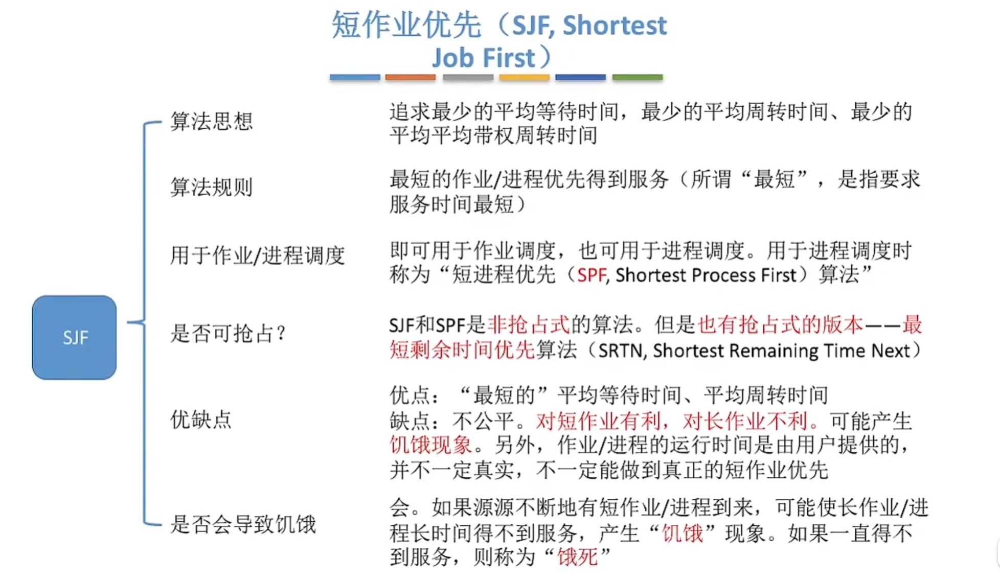

# CPU管理

## 1 知识点

### 1.1 进程与线程

#### 1.1.1 进程

* 进程概念

  **定义**：进程是进程实体的运行过程，是系统进行资源分配和调度的一个独立单位
  
  

  

  * 数据栈段：用来存放程序运行时过程调用的参数、返回地址、过程局部变量等
  * 数据堆段：用于动态申请存储区，例如，C语言中用`malloc()`函数分配的存储区或C++中用`new`操作符分配的存储区
  * 共享库：用来存放公共的共享函数库代码，如`printf()`函数等
  * 共享正文区
    * 可读写数据区：存放进程中的静态全局变量，堆区从该区域的结尾处开始向高地址增长
    * 只读数据和代码区：存放进程中的代码和只读数据，如进程中的程序代码和字符串

  

  

* 进程的状态与转换

  
  
  

  

  

* 进制控制

  

  

  * 进程创建的主要原因：用户登录、高级调度(外存的作业调入内存创建进程)、系统处理用户程序请求

  

  

  

* 进程通信

  

  

  进程通信分为共享存储、消息传递、管道通信、信号(2025+)四种方式

  * 共享存储

    

    * 为避免出错，各进程对共享区的访问是互斥的
    * 共享存储方式是最快的进程通信方式

  * 消息传递
  
    ")

    ")

    * 消息传递方式进程间的数据交换以格式化消息为单位，进程通过发送和接收原语进行数据交换

  * 管道通信

    

    * 管道本质上是一个具有 $\text{FIFO}$ 特性的循环队列。只要管道没满，就可以接着写；只要管道没空，就可以接着读。因此两端可以同时读写

  * 信号

    

    * 收到重复的信号直接简单丢弃
    * 进程可以给自己发信号

    

    

    * 操作系统为每个信号提供了默认处理程序，默认处理程序可能是空操作

    

    * 处理程序可以由进程自定义，自定义处理程序仅作用本进程，若未自定义则使用操作系统提供的默认处理程序
    * 不同进程的 $\text{pending}\,,\text{blocked}$ 各不相同，对同一个信号的处理程序也可能因为自定义而不相同
    * 有些信号不能自定义处理程序，也不能被阻塞，如 $\text{Linux}$ 中的`SIGKILL`、`SIGSTOP`

    

#### 1.1.2 线程

* 线程概念

  

  

  

* 线程实现与多线程模型

  

  * 线程实现

    

    * 系统无法看到线程，因此 $\text{ULT}$ 本质上的资源和调度单位还是进程

    

  * 多线程模型

    

    

    

* 线程的状态与转换

  

  * $\text{ULT}$ 线程切换由程序决定，是在用户态处理的，不能切换内核态

  

  * 操作系统只为内核级线程建立 $\text{TCB}$，不为用户级线程建立，因为操作系统无法感知到用户级线程
  * 线程没有独立的地址空间，线程共享其所属进程的空间

* 资源分配

  | 内存区域 | 所属 | 是否线程共享 | 详细说明 |
  |:-------:|:-----:|:----:|----------|
  | **代码段   （Text Segment / 只读代码区）** | 进程 | ✅ 共享 | 存放程序的机器指令（如 `main`、`printf` 等函数体），所有线程共用同一份代码。 |
  | **只读数据区   （RO Data）** | 进程 | ✅ 共享 | 存放常量、字符串字面量（如 `"Hello"`）、`const` 全局变量等。 |
  | **可读写数据区   （Data & BSS 段）** | 进程 | ✅ 共享 | <ul><li>**Data 段**：已初始化的全局变量和静态变量（如 `int g = 10;`）</li><li>**BSS 段**：未初始化或初始化为0的全局/静态变量</li></ul>所有线程共享。 |
  | **堆区   （Heap）** | 进程 | ✅ 共享 | <ul><li>通过 `malloc()`、`calloc()`、`new` 等动态分配的内存</li><li>由进程维护，所有线程可访问同一块堆内存</li><li>⚠️ 多线程访问需加锁（如互斥量）防止数据竞争</li></ul> |
  | **共享库   （Shared Libraries）** | 进程 | ✅ 共享 | 如 `libc.so` 中的 `printf()`、`scanf()` 等函数代码，映射到进程地址空间，被所有线程共享（通常位于 `mmap` 区域）。 |
  | **内存映射区   （mmap）** | 进程 | ✅ 共享 | 用于文件映射、匿名映射、共享内存等，多个线程可共享访问。 |
  | **栈区   （Stack）** | 线程 | ❌ 独立 | <ul><li>每个线程有**独立的调用栈**</li><li>存放局部变量、函数参数、返回地址、保存寄存器等</li><li>一个线程不能直接访问其他线程的栈</li><li>栈从高地址向低地址增长</li></ul> |
  | **线程局部存储   （TLS, Thread Local Storage）** | 线程 | ❌ 独立 | 用 `__thread`（GCC）或 `thread_local`（C++11）声明的变量，每个线程有自己的一份副本。 |
  | **寄存器状态   （Registers）** | 线程 | ❌ 独立 | 每个线程有自己的程序计数器（PC）、栈指针（SP）、通用寄存器等上下文。 |
  | **线程 ID（TID）、信号掩码等** | 线程 | ❌ 独立 | 线程自身的控制信息，不共享。 |

### 1.2 CPU调度

* 调度概念与指标
  * 概念
  
    

    

    

    * 高级调度：用户向系统提交一个作业，操作系统先将其加入外存的后备队列，通过高级调度决定是否从后备队列将作业调入内存创建 $\text{PCB}$ 。每个作业只调入一次，调出一次，调入时创建 $\text{PCB}$，调出时撤销 $\text{PCB}$
    * 中级调度：内存不够时将某些进程调出内存挂起。中级调度的发生频率比高级调度高
    * 低级调度：选一个进程将处理机分配给它

  * 指标

    

    * 周转时间：从作业被提交给系统开始，到作业完成为止的这段时间间隔
      * 带权周转时间必然 $\geq1$，周转时间都是越小越好
    * 等待时间
      * 对于进程来说，等待时间就是指进程建立后等待被服务的时间之和，在等待 $\text{I/O}$ 完成的期间其实进程也是在被服务的，所以不计入等待时间。对只有 $\text{I/O}$ 操作和计算的进程，其等等时间为

        $$
        \text{等待时间}=\text{周转时间}-\text{运行时间}-\text{I/O时间}
        $$

      * 对于作业来说，不仅要考虑建立进程后的等待时间，还要加上作业在外存后备队列中等待的时间
      * 一个作业总共需要被 $\text{CPU}$ 服务多久、被 $\text{I/O}$ 设备服务多久一般是确定不变的，因此调度算法其实只会影响作业/进程的等待时间

        $$
        \text{平均等待时间}=\dfrac{\text{所有作业等待时间的和}}{\text{作业数}}
        $$

    * 响应时间
      * 响应比为

        $$
        \text{响应比}=\dfrac{\text{等待时间}+\text{要求服务时间}}{\text{要求服务时间}}
        $$

* 调度过程

  

  * 处在内核程序临界区时不允许调度；普通的资源临界区允许调度

  

  

  * 在支持内核级线程的操作系统中，调度程序的处理对象是线程；在不支持内核级线程的操作系统中，调度程序的处理对象是进程
  * 没有其他进程就绪时，处理机运行**闲逛进程**，闲逛进程有如下特点
    * 优先级最低，这样只要有进程就绪，闲逛进程就能立即下处理机腾地方
    * 可以是 $0$ 地址指令，占一个完整的指令周期(指令周期末尾例行检查中断)
    * 能耗低

   

  ***完整的调度过程为：***
  >
  > 1.用户提交作业后，操作系统将其置于外存的后备队列中
  >
  > 2.当内存资源允许且满足优先级等条件时，高级调度（作业调度）将其调入内存，为其创建进程控制块（PCB），并插入内存的就绪队列
  >
  > 3.当低级调度（进程调度）发生时，该进程被选中并分配CPU，进入运行态
  >
  > 4.若进程请求的资源（如I/O）当前不可用，则主动放弃CPU，进入阻塞态
  >
  > 5.若此时系统内存紧张，中级调度可能将其挂起（换出到外存），释放内存
  >
  > 6.当所需资源满足时，该进程被唤醒；若被挂起过，则需由中级调度解挂（换入内存），恢复为就绪态
  >
  > 7.随后再次等待低级调度获得CPU继续执行
  >
  > 8.当进程执行完毕，操作系统回收其资源并撤销PCB，该作业彻底结束

* 调度算法
  * 先来先服务 $\text{FCFS}$
  
    

    
  
  * 短作业优先 $\text{SJF}$
  
    

    

    

    * $\text{SJF}$ 是非抢占式的，只在调度时才比对所有进程的**预期执行时间**，预期执行时间最小的上处理机

    

    * $\text{SRTN}$ 是抢占式的，因此每到达一个进程就要比对所有进程的**剩余执行时间（预期执行时间-已执行时间）**，剩余时间最小的上处理机
  
  * 高响应比优先 $\text{HRRN}$
  
    

    

    * $\text{HRRN}$ 只在调度时才会计算响应比，因此只要上处理机就会连续执行直到结束，中途不会被抢占
  
  * 时间片轮转 $\text{RR}$
  
    

    
  
  * 优先级调度算法
  
    

    

    

    
  
  * 多级队列
  
    
  
  * 多级反馈队列
  
    

    

    * $\text{I/O}$ 密集型进程占 $\text{CPU}$ 时间少，因此在一个时间片内大概率会阻塞并自愿放弃 $\text{CPU}$ 去进行 $\text{I/O}$ 操作，因此完成 $\text{I/O}$ 操作后将**回到原本的队列，而不是去低级队列**。因此多级反馈队列对 $\text{I/O}$ 密集型进程友好

  * 基于公平原则的调度算法

    1
  
  * 多处理机调度
  
    
  
  * 总结

    

    

    | 调度算法 | 对CPU繁忙型任务是否有利 | 原因 | 对I/O繁忙型任务是否有利 | 原因 |
    |:---:|:---:|---|:---:|---|
    | **$\text{FCFS}$ (先来先服务)** | ✅ 是 | CPU繁忙型属于长任务，先来先服务有利于长任务。 | ❌ 否 | I/O执行时间短，大部分时间是I/O设备在与CPU并行地处理I/O请求，因此属于短任务，但被前方CPU长任务阻塞，利用率低（排队买奶茶）。 |
    | **$\text{SJF}$ (最短作业优先)** | ❌ 否 | CPU繁忙型属于长任务。 | ✅ 是 | I/O繁忙型任务通常执行时间较短，只频繁与CPU并行地进行I/O操作，因此属于短作业。 |
    | **$\text{HRRN}$ (最高响应比优先)** | ⚠️ 中等 | 虽倾向短任务，但长任务等待时间增长使响应比显著升高，避免其饥饿，故对CPU任务相对公平。 | ✅ 是 | 提高了I/O繁忙型任务的响应比，使其更有可能得到及时处理，减少等待时间。 |
    | **$\text{RR}$ (轮转法)** | ❌ 否 | 时间片分配机制对I/O繁忙型任务更为友好，因为它们在短时间内完成或进入等待状态，而CPU繁忙型任务会不断被打断。 | ✅ 是 | 轮转法确保所有任务都能公平地获得CPU时间，特别有利于需要快速响应的I/O繁忙型任务。 |
    | **优先级** | ⚠️ 取决于实现方式 | 如果给CPU繁忙型任务分配较高优先级，则对其有利；否则反之。 | ⚠️ 取决于实现方式 | 给I/O繁忙型任务分配更高优先级可以提高系统整体效率；若分配较低则会导致饥饿现象。 |
    | **多级队列** | ✅ 可以优化 | 通过为不同类型的任务设置不同的队列，可以根据需求调整对CPU繁忙型任务的支持。 | ✅ 可以优化 | 类似于CPU繁忙型任务的处理，可以通过调整队列优先级来优化I/O繁忙型任务的处理效率。 |
    | **多级反馈队列** | ✅ 可以优化 | 通过动态调整优先级，可以使CPU繁忙型任务在不影响系统响应速度的情况下得到适当处理。 | ✅ 是 | I/O繁忙型任务由于频繁放弃CPU，往往能够较快提升至较高优先级队列，从而获得更好的服务。 |

     

    | 调度算法 | 用户公平性 | 分时 | 实时 | 用户交互 |
    |:---:|:---:|:---:|:---:|:---:|
    | **$\text{FCFS}$ (先来先服务)** | ⚠️ 较差 （长作业阻塞短作业） | ❌ 不适合 （响应时间不可控） | ❌ 不适合 （无法保证时限） | ⚠️ 较差 （交互任务长时间等待） |
    | **$\text{SJF}$ (最短作业优先)** | ⚠️ 偏向短作业 （长作业易饥饿） | ⚠️ 有限支持 （非抢占式，响应不可靠） | ❌ 不适合 （缺乏时限保障） | ⚠️ 中等 （短任务有利但非抢占导致阻塞） |
    | **$\text{HRRN}$ (最高响应比优先)** | ✅ 较好 （兼顾等待时间，减少饥饿） | ⚠️ 中等 （响应比机制改善但非抢占） | ❌ 不适合 （非抢占，难保障时限） | ⚠️ 中等 （等待久的任务优先但可能阻塞） |
    | **$\text{RR}$ (轮转法)** | ✅ 高 （时间片轮转公平执行） | ✅ 非常适合 （固定时间片保障响应） | ⚠️ 视时间片而定 （小时间片可近似实时） | ✅ 非常好 （快速响应用户输入） |
    | **优先级调度** | ⚠️ 取决于策略 （静态易饥饿，动态较优） | ⚠️ 一般 （高优先级可能垄断CPU） | ✅ 可适合 （抢占式+时限优先级支持） | ⚠️ 取决于优先级 （高优先级交互任务响应快） |
    | **多级队列** | ⚠️ 一般 （队列间可能不公平） | ✅ 可优化 （前台队列专设交互任务） | ✅ 可支持 （实时任务放入高优先级队列） | ✅ 好 （交互任务入高优先级队列） |
    | **多级反馈队列** | ✅ 较好 （动态调整减少饥饿） | ✅ 非常适合 （短任务快速响应） | ✅ 可配置支持 （实时任务独立高优先级队列） | ✅ 非常好 （I/O频繁任务自动升优先级） |

### 1.3 同步与互斥

* 概念

  

* 实现
  * 软件实现
  
    

    

    

    

    

  * 硬件实现

    

    

    

    ")

    

* 信号量
  * 分类

    

    

    

    * 整型信号量利用原语解决了双标志的被打断问题，但仍然不满足让权等待

    

    * 记录型信号量当 $\text{value} < 0$ 时，共有 $\lvert\text{value}\rvert$ 个进程在等待该资源

  * 信号量实现互斥、同步、前驱(多级同步)

    

    

    

    ")

* 经典问题
  * 生产者消费者问题

    

    * 互斥与同步的 $\text{P}$ 操作不能交换顺序，会导致死锁问题；互斥与同步的 $\text{V}$ 操作可以交换顺序
    * 生产产品和消费产品虽然可以放入临界区，但这些操作与临界区逻辑无关，因为临界区应该尽可能的小，所有不将它们放入临界区

    

    * 多生产者多消费者问题若临界资源`mutex=1`，则进出临界区可以不使用互斥操作，因为所有进程同一时刻只会有一个不会被 $\text{P}$ 阻塞(本例即为`plate`、`apple`、`orange`这三个信号量在同一时刻只会有一个满足进入条件不会被 $\text{P}$ 阻塞)。**但`mutex > 1`时进出临界区必须使用互斥操作，否则会出现对同一个地址的资源二次操作的情况。因此最稳妥的操作是无论如何进出临界区都使用互斥操作**
    * 分析同步关系时以"事件"为角度，考虑事件 $A,B$ 之间 $\text{A}\to\text{B}$ 的关系，据此确定 $\text{PV}$ 操作

  * 读写者问题
  * 哲学家进餐问题

* 管程

### 1.4 死锁

## 2 题目

* 2.1习题
  * 11(PCB是进程唯一存在标志，对进程的控制和管理依靠PCB)
  * 15(请求的资源处理结束，阻塞变就绪)
  * ***18(并发进程失去了封闭性：因为共享变量的执行结果与执行速度有关)***
  * ***22(进程实体堆栈段)***
  * ***24(进程共享)***
  * 40(低速场景不适合多线程)
  * 43(进程不能通过全局变量交换数据，因为全局变量仅限于进程内)
  * 61(进程的资源进程可以共享，属于线程的资源线程独享)
  * 69(只有从属于同一进程的不同线程才能共享虚拟地址空间，不同进程(例如父子进程)不能共享虚拟地址空间)
  * ***75(线程共享)***
* 2.2习题
  * 03(调度算法考虑不了互斥性)
  * ***10(有利于IO，不利于CPU)***
  * 21(响应比)
  * 38(饥饿现象)
  * ***52(优先级算法在0时刻也是一次调度)***
* 2.3习题
* 2.4习题
