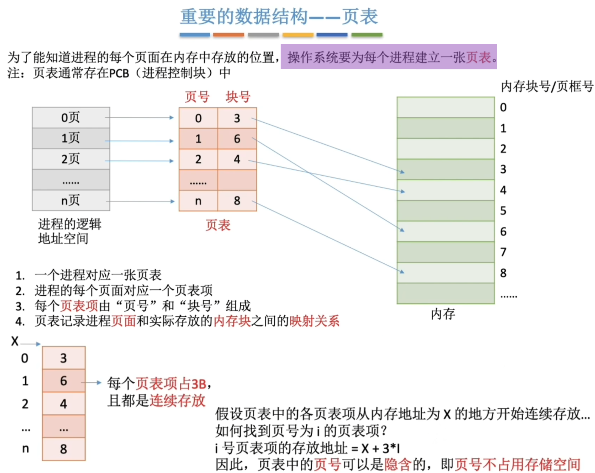
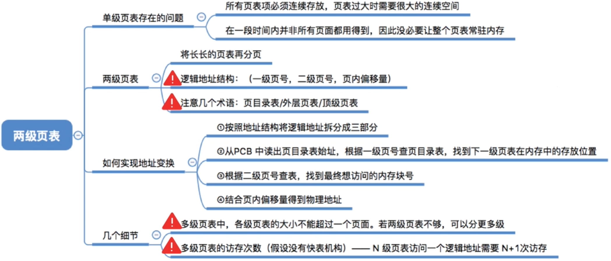
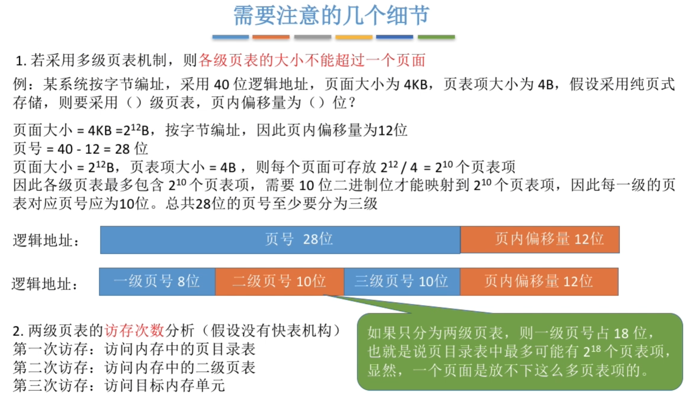
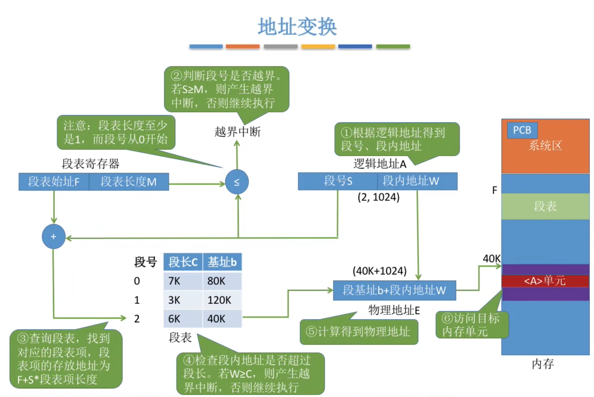
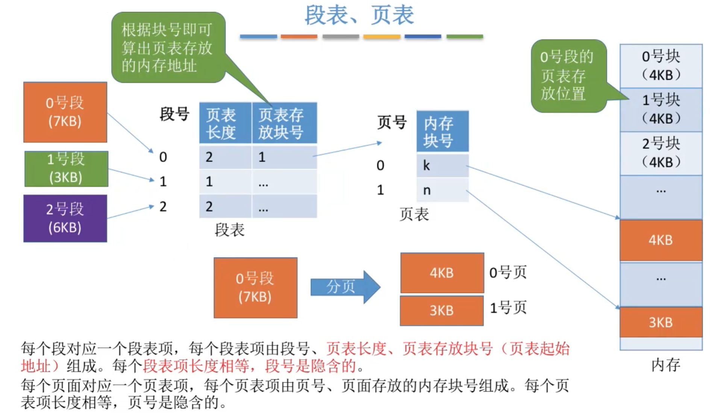

# 内存管理

## 1 知识点

### 1.1 基础内存管理

#### 1.1.1 概念

* 内存保护
  * 方法一：在CPU中设置一对上、下限寄存器，存放进程的上、下限地址。进程的指令要访问某个地址时，CPU检查是否越界
  * 方法二：采用重定位寄存器(又称基址寄存器 $\text{BR}$ )和界地址寄存器(又称限长寄存器)进行越界检查。重定位寄存器中存放的是进程的起始物理地址。界地址寄存器中存放的是进程的最大逻辑地址
  * 内存保护需要操作系统和硬件(各种寄存器)一同完成

* 低地址的 $1\text{G}$ 空间包含堆区、读写数据区、只读区，其中高地址部分为堆区的扩展预留空间
* 中间的 $1\text{G}$ 空间保护栈区、共享库，其中中部区域为二者的扩展预留空间
* 宏定义数在编译时会变成立即数包含在只读区中
* 进程线程资源分配详见[资源分配](./chapter1_cpu_manage.md#112-线程)

#### 1.1.2 连续分配管理

  
内存分配有连续分配和非连续分配方式两种。连续分配为系统给用户进程分配的是一个连续的内存空间

* 单一连续分配

  

  * 属于静态重定位，不需要硬件地址变换机构

* 固定分区分配

  

  * 属于静态重定位，不需要硬件地址变换机构

* 动态分区分配
  * 定义
  
    

    * 分配与回收都遵循合并周围空闲区域的原则，若进程映像的大小正好等于一个空闲区的大小，则在分区表中对应删除或增加该分区
    * 碎片与紧凑
      * 内部碎片，分配给某进程的内存区域中，如果有些部分没有用上
      * 外部碎片，是指内存中的某些空闲分区由于太小而难以利用
      * 紧凑：如果内存中空闲空间的总和本来可以满足某进程的要求，但由于进程需要的是一整块连续的内存空间，因此这些碎片不能满足进程的需求，可以通过紧凑技术将已有的进程映像排列好(挪动内存中的进程映像，修改空闲区表)，将外部碎片规整为一块连续的大空闲区
      * 动态分区只有外部碎片
    * 属于动态重定位，需要硬件地址变化机构
  
  * 动态分配算法
    * 基于顺序搜索

      | 算法 | 算法思想 | 分区排列顺序 | 优点 | 缺点  |
      |--|----|----|----|---|
      | 首次适应 | 从头到尾找适合的分区 | 空闲分区以地址递增次序排列 | 综合看性能最好。**算法开销小**，回收分区后一般不需要对空闲分区队列重新排序 | / |
      | 邻近适应 | 由首次适应演变而来，每次从上次查找结束位置开始查找 | 空闲分区以地址递增次序排列（可排列成循环链表） | 不用每次都从低地址的小分区开始检索。**算法开销小**（原因同首次适应算法） | 会使高地址的大分区也被用完|
      | 最佳适应 | 优先使用更小的分区，以保留更多大分区 | 空闲分区以容量递增次序排列 | 会有更多的大分区被保留下来，更能满足大进程需求  | 会产生很多太小的、难以利用的碎片；**算法开销大**，回收分区后可能需要对空闲分区队列重新排序 |
      | 最坏适应 | 优先使用更大的分区，以防止产生太小的不可用的碎片 | 空闲分区以容量递减次序排列 | 可以减少难以利用的小碎片  | 大分区容易被用完，不利于大进程；**算法开销大**（原因同上） |

    * 基于索引搜索

      当系统很大时，空闲分区链可能很长，此时采用顺序分配算法可能很慢。因此，在大、中型系统中往往采用索引分配算法。索引分配算法的思想是，根据其大小对空闲分区分类，对于每类(大小相同)空闲分区，单独设立一个**空闲分区链**，并设置一张**索引表**来管理这些空闲分区链。当为进程分配空间时，在索引表中查找所需空间大小对应的表项，并从中得到对应的空闲分区链的头指针，从而获得一个空闲分区。索引分配算法有以下三种

      | 算法       | 算法思想   |   分区排列顺序  | 优点     | 缺点     |
      |--|--|------|--------|--------|
      |  快速适应   | 空闲分区分类依据进程常用空间大小划分；分配分两步：①在索引表中找到最小容纳空间链表；②取下第一块分配 | 根据进程长度在索引表中查找对应空闲分区链      | 查找效率高、不产生内存碎片 | 回收分区时需合并分区，算法复杂，系统开销大  |
      | 伙伴系统   | 所有分区大小为 $2$ 的 $k$ 次幂；按需分配时，在相应大小空闲分区链中查找；若当前分区空闲区用完，则将更大分区的一个空闲区一分为二进行分配 | 按 $2$ 的幂次递增查找空闲分区链   | 高效利用内存，易于管理   | 回收时需合并相邻伙伴分区 |
      | 哈希算法   | 根据空闲分区链表分布规律建立哈希函数，构建以空闲分区大小为关键字的哈希表    | 通过哈希函数计算得到哈希表位置| 分配速度快，查找效率高   | 哈希冲突可能导致额外处理 |

#### 1.1.3 非连续分配管理

* 基本分页存储管理
  * 概念

    

    

    

    * 页表实际上只存储进程页面在内存中的页框号，即`page_table: list[int]`存储逻辑为`page_table[page_id]=page_frame_id`。因此，页表项的实际大小由内存中的页框数决定
    * 何时分页是装入作业时决定的

    

  * 基本地址变换机构

    

    * 页表项长度使用最小长度可能导致内存中存储页表项的页面存在内部碎片，使得下一个页表项在下一页，产生计算上的麻烦，因此常会让一个页表项占更多的字节，使得每个页面恰好可以装得下整数个页表项
    * 需要 $2$ 次访存，第一次查页表，第二次访问对应存储单元

    

    

    * 页表长度`M = len(page_table)`，表示页表项的数量。仅当要访问的页号`P`小于`M`时才不会溢出，即`page_id in range(len(page_table))`
    * 根据逻辑地址查找页表的过程由硬件(页表寄存器、内存管理单元)实现

  * 具有快表的地址变换机构

    

    

    * **快表是寄存器，不算访存次数**

  * 两级页表

    

    

    

    * 高级页表中存储低级页表的内存块号，最低级页表存储页面的内存块号。$n$ 级页表查询时需要访存 $n+1$ 次
    * 各级页表的大小不能超过一个页面

* 基本分段存储管理

  

  

  

  * 在段式存储管理中，若有些段可被多个进程共享，则可用一个单独的共享段表来描述这些段，而不需要在每个进程的段表中都保存一份。共享段表的作用是实现多个进程共享同一段代码或数据，这样既能节省内存空间，又能便于实现对共享段的更新和维护
  * 多个进程共享同一段物理内存空间并不需要用到共享段表，只需在各自的段表中指向相同的物理地址即可
  * 多个进程共享同一段逻辑地址空间是不可能的，因为每个进程的逻辑地址空间都是相互独立的
  * 何时分段是在编程时决定的

  

  

* 段页式存储管理

  

  

  

  

### 1.2 虚拟内存管理

* 概念

  

  * 容量与寻址空间

    **能寻址多大空间？** $\to$ 由 CPU 和 OS 的虚拟内存设计决定（虚地址空间）

    **实际能用多大存储？** $\to$ 由物理内存 + 磁盘 swap 空间决定（虚拟存储容量）

    $$
    虚拟内存最大容量=\min(内外存容量之和，\text{CPU}最大寻址范围)
    $$

    所以前者是“逻辑范围”，后者是“物理资源”，**虚地址空间可以远大于实际存储，但不能超过它太多，否则无法有效利用**。

    > ***示例：***
    >
    > 想象你有一本非常厚的书（100 亿页），这是你的**虚拟地址空间**（书的页码从 1 到 100 亿）
    >
    > 但你桌上只能放 10 页纸（**物理内存**）
    >
    > 书架上有个小盒子能存 50 页（**磁盘 swap 空间**）
    >
    > 👉 你可以“假装”有 100 亿页的书（虚地址空间大）
    >
    > 但你**真正能写内容的只有 60 页**（内存 + swap）
    >
    > 其他页码虽然存在，但全是空白或无效的

* 请求分页管理方式

  

  

  

  * 中断类型属于内中断—故障，可被修复

  

* 页面置换算法
  * 最佳置换算法 $\text{OPT}$

    

    * 性能理论上最好，但不能预知未来的页面访问序列，因此无法实现

  * 先进先出 $\text{FIFO}$
  
    

  * 最近最久未使用 $\text{LRU}$
  
    

    * 性能最接近 $\text{OPT}$，但需要维护一个排序队列，为了不增加时间使用硬件实现排序队列，因此算法开销高

  * 时钟置换算法 $\text{CLOCK}\,/$ 最近未使用算法 $\text{NRU}$

    

    * 初始访问位为`1`
    * 需要淘淘时，从队首开始扫描，访问位为`1`的变成`0`，访问位为`0`的淘汰

    

  * 总结

    

    * 需要页面置换时，淘汰的是当前内存中接下来在访问序列最后出现的页面
    * 缺页中断是要调入的页不在内存中；页面置换则是在内存满的情况下需要换页。因此刚开始内存未满时的缺页中断不算页面置换
    * 缺页率 = 缺页中断次数 / 访问序列长度

* 页框分配策略

  

  
  
  

  

  

  * 驻留集的大小不能小于工作集的大小，但驻留集和工作集不一定存在子集关系

* 页框回收策略
  * 页面缓冲算法
    * 实现
  
      为了显著降低页面换入/换出的频率，在内存中设置了如下两个链表：

      * **空闲页面链表**：也称空闲页框链表。当进程需要读入一个页面时，便从空闲页面链表中取链首的页框并装入该页。当有一个未被修改的页面要换出时，实际上并不将它换出到磁盘，而将它所在的页框挂在空闲链表的链尾。注意，这些挂在空闲链表内且未被修改的页框中是有数据的，若以后某个进程需要这些数据，则可从空闲链表上将它们取下，进而避免从磁盘读入的操作，减少页面换入的开销

      * **修改页面链表**：当进程需要将一个已修改的页面换出时，系统并不立即将它换出到磁盘，而将它所在的页框挂在修改页面链表的末尾。这样做的目的是降低将已修改页面写回磁盘的频率，进而降低将磁盘内容读入内存的频率

      上述将物理页面换出的过程即为页框的回收

    * 页面置换效率影响因素
      * **页面置换算法**：好的页面置换算法可使进程在运行过程中具有较低的缺页率，从而减少页面换入/换出的开销。
      * **将已修改页面写回磁盘的频率**：对于已被修改的页面，将其换出时，应写回磁盘。若每当有一个页面要被换出时就将它写回磁盘，则会导致很大的磁盘I/O开销。
      * **将磁盘内容读入内存的频率**：若进程的每次访问都要将磁盘内容读入内存，则会导致非常高的磁盘I/O频率，进而增加页面换入的开销。

    * 页面缓冲算法特点
      * 显著降低页面换入/换出的频率，使磁盘的I/O开销大为减少，进而减小页面换入/换出的开销；
      * 由于换入/换出的开销大幅减小，当其采用一种较简单的置换策略（如FIFO页面置换算法）时，不需要特殊硬件的支持，实现起来非常简单。

  * 页框回收

    当系统可分配的内存不足时，就必须回收一些页框，属于内核的大部分页框（如内核栈、内核代码段、内核数据段和大部分内核使用的页框）都是不能回收的，而由进程使用的页框（如进程代码段、进程数据段、进程堆栈、进程访问文件时映射的文件页、进程间共享内存使用的页框）大部分是可以回收的

    在Linux内核中，设置了一个负责页面换出的守护进程`kswapd`，它定期检查内存的使用情况，当空闲页框数量少于特定的阈值时，便发起页框回收操作。下面解释为什么空闲页框数量少于特定的阈值时就要发起回收操作。例如，要释放一个页框，内核可能需要将页框的数据写回磁盘，为此内核可能要请求一个页框来作为I/O传送的缓冲区，而系统中不存在空闲页框，因此不可能释放页框，导致系统崩溃

    Linux系统采用伙伴算法对内存中具有不同长度的连续空闲页框进行统计和记录

* 内存映射文件

  

  

* 地址翻译

## 2 题目

* 3.1习题
  * ***05(硬件地址变换机构)***
  * 12(动态重定位不依赖目标程序)
  * 16(拼接技术是回收进程空间后合并空闲区，区别于紧凑技术)
  * 26(页表是程序装入时由操作系统建立的)
  * ***27(共享段表)***
  * 29(分段和分页提供的物理地址空间大小关系不确定)
  * ***30(页面只被操作系统感知)***
  * 33(分段是编程序时决定的)
  * 34(分段利于动态链接)
  * ***36(可重入代码)***
  * 42(主存访问以字/字节为单位)
  * ***58(多级页表)***
  * ***62(最佳适应要排序)***
  * ***70(动态分配算法碎片)***
  * ***71(页表基址寄存器存的是页表的物理始址)***
* 3.2习题
  * 01(页数不变，页框大小翻倍，缺页数量减少)
  * ***13(快表是寄存器，不算访存次数)***
  * ***17(虚存最大容量)***
  * ***18(虚拟存储系统页表项数量)***
  * 22(LRU开销)
  * 25(虚拟内存管理基础是程序的局部性，操作系统的虚拟性)
  * ***26(分段更适合动态链接和信息共享)***
  * 28(驻留集工作集)
  * ***39-40(交换操作频繁说明内存不够，经常换入换出)***
  * ***45(越界检查在缺页之前)***
  * ***46(加快虚实转换)***
  * ****已删*** 51(工作集)
  * ***57(虚拟存储空间)***
