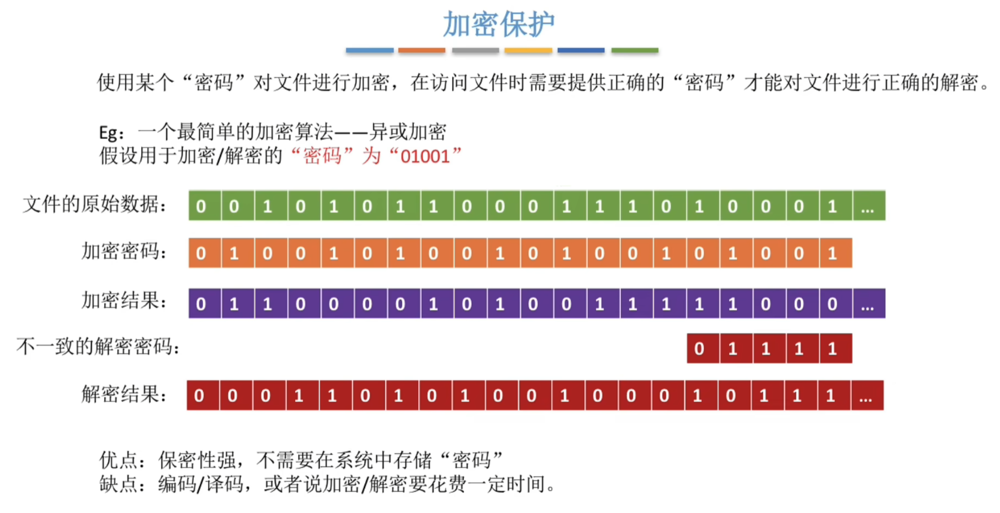
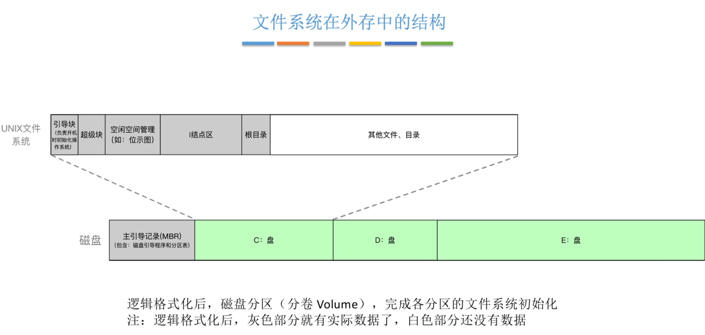

# 文件管理

## 1 知识点

### 1.1 文件

* 概念

  

* 逻辑结构

  

  

  * 无结构文件

    无结构内部的数据就是一系列二进制流或字符流组成。又称流式文件。如 $\text{Windows}$ 操作系统中的`.txt`文件

  * 有结构文件

    有结构文件由一组相似的记录组成，又称记录式文件。每条记录又若干个数据项组成。如数据库表文件。一般来说，每条记录有一个数据项可作为**关键字**。根据各条记录的长度(占用的存储空间)是否相等，又可分为**定长记录**和**可变长记录**两种。按物理结构可分为**顺序文件、索引文件、索引顺序文件**

    

    * 定长记录顺序存储支持随机存取

    

    * 支持在可变长场景下的随机存取，但索引表本身较为庞大

    

    

    * 通过多级分表解决了单个索引表过大的问题，同时多级顺序索引文件的查询效率依然良好

* 物理结构

  物理结构说明的是文件在 **外存** 中的存储形式，即如何管理 **非空闲磁盘块**

  

  

  * 连续分配

    

  * 链式分配

    

    * 读入`i`号块需要访存 $i+1$ 次，找到`i`号块需要访存 $i$ 次
    * 链接分配未说明具体链接形式时，默认为隐式链接

    

    * 想访问`i`号逻辑块时不需要访问(访存)之前的块，逻辑地址转物理地址时不需要访存

  * 索引分配

    

    

    

    

    

* 操作

  

* 文件共享

  

  

  * 每有一个用户查看则`count`就加一，只有一个用户时`count = 1`
  * 所有使用索引节点硬链接的文件共享同一个`count`值
  
  

  * 软链接的`count`值不受被链接文件的影响，无论被链接文件存不存在，软链接计数始终为 $1$

* 文件保护

  

  

  

  

### 1.2 目录

* 文件控制块 $\text{FCB}$ 与索引节点

  

  

* 目录结构

  

  

  

  

* 目录检索
  * 散列法
    * 使用哈希函数将逻辑地址映射成物理地址，需要较大的存储空间
  
  * 顺序检索法
    * 对给出的绝对地址或相对地址，在树形目录中查找。若使用绝对地址，则从根目录开始查找；若使用相对地址，则从相对地址的开头目录查找
    * 只要路径中有一个目录未找到，则停止检索
    * 检索完成后，可能得到文件的物理地址，也可能得到文件的`inode`。具体看文件使用的物理存储方法

### 1.3 文件系统

* 文件系统层次结构

  

* 文件系统布局

  

  * 引导块用于开机引导
  * 超级块用于快速获取空闲块；位示图用于快速检索指定块是否空闲
  * i 结点区存放文件的索引结点

  

  * 打开文件只需要将文件索引结点装入内存一次即可；共享文件时不同进程可以通过系统打开文件表或目录缓存直接获得文件的文件索引结点，因此也只需要将文件索引结点装入内存一次即可
  * **进程读取文件只需要文件描述符，不需要路径**

* 存储空间管理

  存储空间管理主要说明 **外存** 中没有存储文件的磁盘块该如何管理，即如何管理 **空闲磁盘块**

  
  
  

  磁盘分为若干个文件卷，每个文件夹分为目录区和文件区；一个文件卷一般对应一个磁盘，也可以是多个磁盘

  * 空闲表法

    

    * 分配与回收适用内存连续分配—动态分区法的分配回收算法
    * 适用于连续分配方式

  * 空闲链表法

    

    * 空闲盘块链适用于离散分配，连续分配需要多次IO操作效率低
    * 空闲盘区链离散、连续都适用。连续分配时直接分配盘区一整区，效率高
    * 空闲盘区连续分配时，若每个盘区都不满足要求，可以跨区合并分配

  * 位示图法

    

    * 连续、离散分配都适用

  * 成组链接法

    

    * 成组链接法将所有空闲盘块分成若干组，每组的第一个盘块记录下一组的空闲盘块总数和空闲盘块号。第一组的空闲盘块总数和空闲盘块号存放在内存的专用栈中，称为 **空闲盘块号栈**

    

    > 在前一张图的基础上，需要100个块，因此将第一组的201~300全部分配出去，但300记录了信息，因此让超级块的记录变为300的内容，300清空内容作为空闲块分配出去

    

    > 在前一张图的基础上，回收块300，但第一组已满，因此将超级块的内容复制到300，用300建立连接，并更新超级块指向300

    * 分配
      * 若第一组足够分配，则直接在第一组中分配，并修改剩余空闲块数量
      * 若第一组不够分配，则将第一组全部分配出去，不够的部分使用下一组补充。超级块保存下一组记录信息的块的内容，建立新的链接
    * 回收
      * 若第一组未满，则回收块直接挂载到第一组中
      * 若第一组已满，则将超级块内容复制到回收块中，回收块建立与其他组的链接，更新超级块的指向

* 虚拟文件系统 $\text{VFS}$

  

  * 特点
    * $\text{VFS}$ 向上层用户进程提供统一标准的系统调用接口，屏蔽底层具体文件系统的实现差异
    * $\text{VFS}$ 要求下层的文件系统必须实现某些规定的函数功能，如`open()`、`read()`、`write()`等。一个新的文件系统想要在某操作系统上被使用，就必须满足该操作系统 $\text{VFS}$ 的要求
    * 每打开一个文件，$\text{VFS}$ 就在主存中新建一个`vnode`，用统一的数据结构表示文件，无论该文件存储在哪个文件系统。`vnode`中存储对应文件系统的操作函数地址列表
  * 对象类型
    * 索引结点对象`inode`：表示一个单独的文件
    * 文件对象`file`：表示一个已打开的文件
    * 超级块对象`superblock`：表示整个文件系统
    * 目录项对象`dentry`：表示单个目录项

* 文件系统挂载

  

  * 将新文件系统的对应系统信息提交注册，包括文件系统类型、文件大小等
  * 提供对应的操作函数地址列表，如`open()`、`read()`等系统内操作函数地址组成的列表
  * 操作系统将新文件系统加到挂载点处，一般是某个父目录下。如 $\text{Windows}$ 系统将 $\text{U}$ 盘文件系统挂载到根目录下

## 2 题目

* 4.1习题
* 4.2习题
  * 01(目录检索)
  * 03(多级目录主要目的是解决命名冲突)
  * ***05(存取控制矩阵用于标识用户对文件的操作权限)***
  * ***13(读入与找到的访存次数)***
* 4.3习题
  * 04(Unix的索引结构存在索引节点(也称 i 结点))
  * ***06(外存文件区以提高存储空间利用率为主要目标)***
  * 12(数据对象不是VFS定义的对象)
  * ***14(位示图法块号)***
  * ***15(FAT也能用于空闲链表法的数据结构)***
