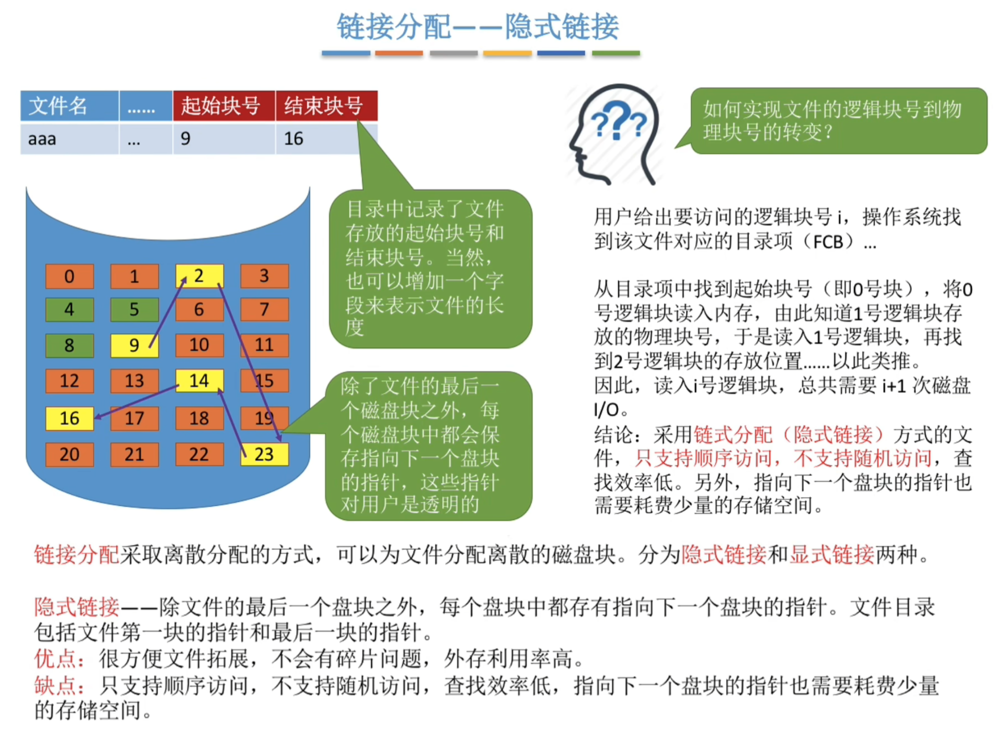
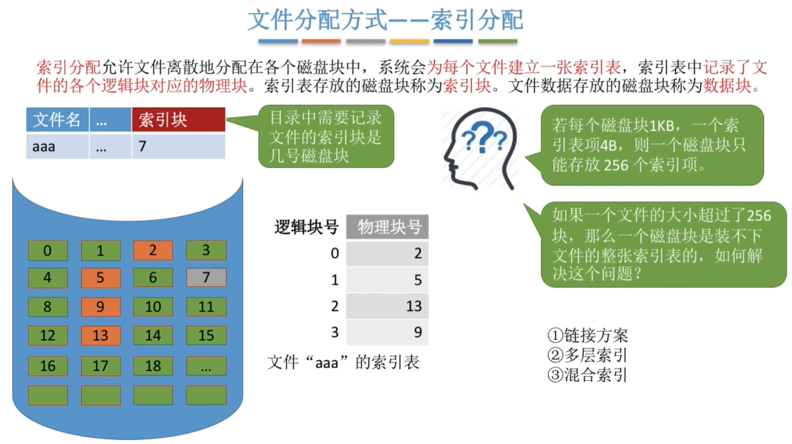
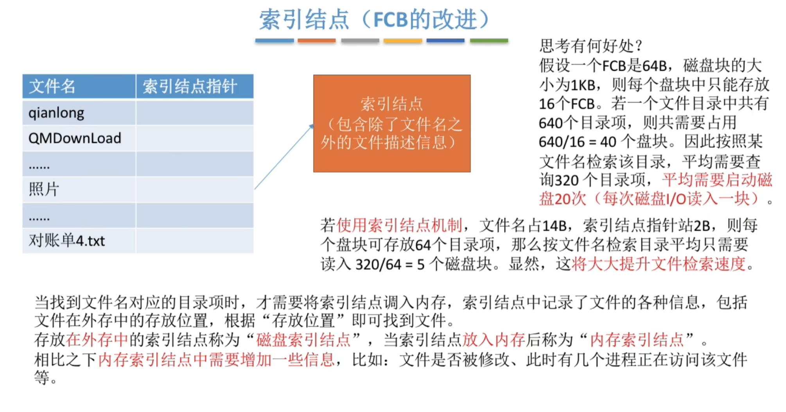
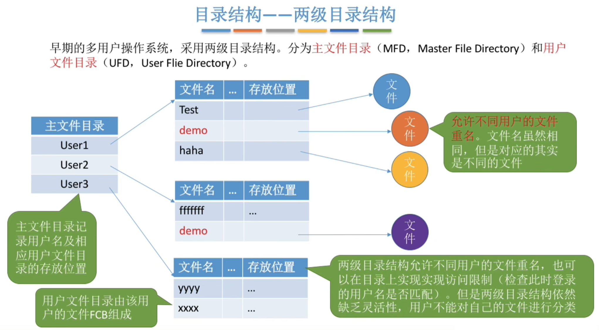

# 文件管理

## 1 知识点

### 1.1 文件

* 概念

  

* 逻辑结构

  

  

  * 无结构文件

    无结构内部的数据就是一系列二进制流或字符流组成。又称流式文件。如 $\text{Windows}$ 操作系统中的`.txt`文件

  * 有结构文件

    有结构文件由一组相似的记录组成，又称记录式文件。每条记录又若干个数据项组成。如数据库表文件。一般来说，每条记录有一个数据项可作为**关键字**。根据各条记录的长度(占用的存储空间)是否相等，又可分为**定长记录**和**可变长记录**两种。按物理结构可分为**顺序文件、索引文件、索引顺序文件**

    

    * 定长记录顺序存储支持随机存取

    

    * 支持在可变长场景下的随机存取，但索引表本身较为庞大

    

    

    * 通过多级分表解决了单个索引表过大的问题，同时多级顺序索引文件的查询效率依然良好

* 物理结构

  物理结构说明的是文件在 **外存** 中的存储形式

  

  

  * 连续分配

    

  * 链式分配

    

    * 读入`i`号块需要访存 $i+1$ 次，找到`i`号块需要访存 $i$ 次
    * 链接分配未说明具体链接形式时，默认为隐式链接

    

    * 想访问`i`号逻辑块时不需要访问(访存)之前的块，逻辑地址转物理地址时不需要访存

  * 索引分配

    

    

    

    

    

* 操作

* 文件共享

* 文件保护

### 1.2 目录

* 文件控制块 $\text{FCB}$ 与索引节点

  

  

* 目录结构

  

  

  

  

### 1.3 文件系统

* 系统结构

* 系统布局

* 存储空间管理

* 虚拟文件系统

* 文件系统挂载

## 2 题目

* 4.1习题
* 4.2习题
* 4.3习题
