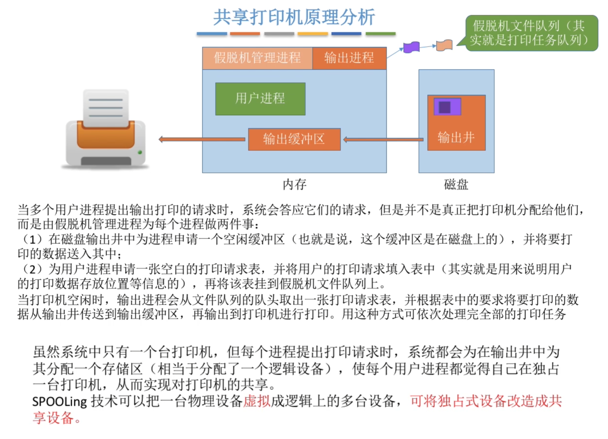
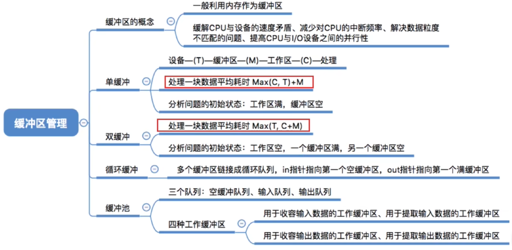
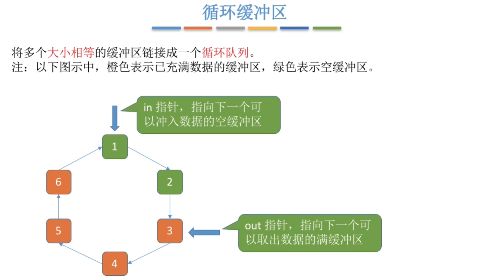
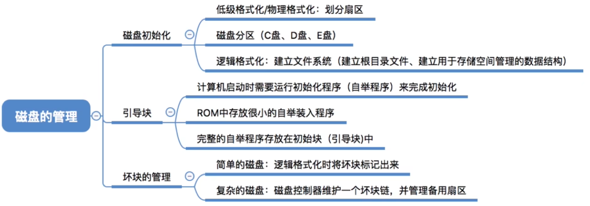

# I/O 管理

## 1 知识点

### 1.1 概念

* 定义与分类

  

  * 低速设备例如键盘、鼠标；高速设备例如磁盘；中速设备例如打印机
  * 虚拟设备不会死锁。例如 $\text{SPOOLing}$ 技术改造打印机
  * **共享设备必须是可寻址且可随机访问的设备**

* $\text{I/O}$ 控制方式

  本节内容( $\text{I/O}$ 控制器、 $\text{I/O}$ 控制方式)详见[计算机组成原理-io](../organization/chapter6_io.md#)
  
  

  
  
  * $\text{I/O}$ 端口可以独立编址，也可与内存统一编址

* $\text{I/O}$ 软件层次结构

  

  

  * 操作系统可以采用两种方式管理设备独立性软件用到的逻辑设备表 $\text{LUT}$
    * 整个系统只设置一张 $\text{LUT}$，这就意味着所有用户不能使用相同的逻辑设备名，因此这种方式只适用于单用户操作系统
    * 为每个用户设置一张 $\text{LUT}$，各个用户使用的逻辑设备名可以重复，适用于多用户操作系统。系统会在用户登录时为其建立一个用户管理进程，而 $\text{LUT}$ 就存放在用户管理进程的 $\text{PCB}$ 中
    * 这两种方法类似单级目录与两级目录，主要为了解决不同用户的设备从逻辑名到物理名映射混乱的问题
  * 设备驱动程序负责将上层软件发来的抽象 $\text{I/O}$ 要求转换为具体要求，发送给设备控制器，控制设备工作。设备驱动程序需要向设备寄存器写入命令，以控制设备的工作状态和数据传输方式

* 接口

  

  
  
  

### 1.2 设备独立性软件

* 假脱机技术 $\text{SPOOLing}$

  

  

  * $\text{SPOOLing}$ 由**预输入程序、井管理程序、缓输出程序**组成
  * 采用 $\text{SPOOLing}$ 技术的计算机不需要专门的外围控制机，因为 $\text{SPOOLing}$ 中的输入进程、输出进程采用软件模拟实现了外围控制机

  

* 设备分配与回收

  

  

  * 设备分配算法：先来先服务、优先级高者优先、短任务优先等。详见[操作系统-cpu管理-调度算法](./chapter1_cpu_manage.md#12-cpu调度)
  * 静态分配与动态分配——详见[操作系统-cpu管理-死锁预防](./chapter1_cpu_manage.md#14-死锁)
    * 静态分配：进程运行前为其分配全部所需资源，运行结束后归还资源破坏了“请求和保持”条件，不会发生死锁
    * 动态分配：进程运行过程中动态申请设备资源
    * 独占设备一般采用静态分配方式，共享设备一般采用动态分配方式

  

  

  

  * 使用逻辑设备名请求设备。第一次请求随机分一个要求类型的空闲设备，并将其物理设备名与请求中的逻辑设备名进行映射绑定，将映射项添加到 $\text{LUT}$ 中，下次使再用这个逻辑设备名请求就固定分配此设备

* 缓冲区

  

  * 分类

    

    * $T>C$：$\text{CPU}$ 处理完数据后暂时不能将下一块数据传送到工作区，必须等待缓冲区中冲满数据
    * $T<C$：缓冲区中冲满数据后暂时不能继续冲入下一块数据，必须等待 $\text{CPU}$ 处理结束后再将数据从缓冲区传送到工作区，因为 $\text{CPU}$ 运行需要使用工作区的数据
    * 两台主机通信，若使用单缓冲，则同一时刻只能单向传递信息，因为一方必须接收到数据后腾空缓冲区才能准备回复信息

    

    * 两个相互通信的机器设置双缓冲区，一对缓冲区用于发送数据，一对缓冲区用于接收数据，则同一时刻可以实现双向的数据传输

    

    

    * **输入进程** 请求输入数据：从 **空缓冲队列** 队首取出一块作为 **收容输入( $\text{hin}$ )** 数据的工作缓冲区，冲满数据后将缓冲区挂到 **输入队列** 队尾
    * **计算进程** 想要取得一块输入数据：从 **输入队列** 队首取得一块冲满输入数据的缓冲区作为 **提取输入( $\text{sin}$ )** 数据的工作缓冲区，缓冲区读空后挂到 **空缓冲队列** 队尾
    * **计算进程** 想要将准备好的数据冲入缓冲区：从 **空缓冲队列** 队首取出一块作为 **收容输出( $\text{hout}$ )** 数据的工作缓冲区，数据冲满后将缓冲区挂到 **输出队列** 队尾
    * **输出进程** 请求输出数据：从 **输出队列** 队首取得一块冲满输出数据的缓冲区作为 **提取输出( $\text{sout}$ )** 数据的工作缓冲区，缓冲区读空后挂到 **空缓冲队列** 队尾

  * 总结
    * 单缓冲、双缓冲、循环缓冲都是专用缓冲，需要指明使用者；缓冲池是共用缓冲，适合多个进程同时 $\text{I/O}$
    * 缓冲区既可用于块设备，也能用于字符设备

### 1.3 磁盘与固态硬盘

* 磁盘

  
  
  磁盘结构详见[组成原理-存储-外部存储器](../organization/chapter2_memory.md#13-外部存储器)

* 磁盘管理

  

  

  * 逻辑格式化也称高级格式化。在此期间文件系统被创建，操作系统存储引导程序

  

  

* 磁盘调度

  

  
  
  * 调度时间

    

    * $\dfrac{1}{r}$ 表示转一圈所需的时间
    * 延迟时间、传输时间与磁盘的固有属性有关，调度算法影响的是寻道时间
    * **影响最大的是寻道时间**
  
    

    * 采用`(驱动器号, 柱面号, 盘面号, 扇区号)`的地址格式时，当一个盘面的所有扇区读完时，下一个连续地址就是下一个盘面的初始扇区，只需要激活不同的磁头即可
    * 采用`(驱动器号, 盘面号, 柱面号, 扇区号)`的地址格式时，当一个柱面的所有扇区读完时，下一个连续地址需要切换柱面，带来额外的磁头启动时间和寻道时间，因此不如上一个方案

    

    * 由于磁头每读入一个扇区的数据就要进行处理，但处理时磁盘仍在旋转，因此如果逻辑连续的数据存在物理连续的扇区上，读完前一个扇区还在处理数据时，磁盘就已经转过了该读的下一个扇区，想要读入就得重新转一圈回来。因此采用交替编号，处理数据时转过的扇区不是要读的扇区，处理完数据磁头能够接着读入时正好转到对应的扇区

    

    * 采用`(驱动器号, 柱面号, 盘面号, 扇区号)`的地址格式时，当一个盘面的所有扇区读完时，下一个连续地址就是下一个盘面的初始扇区。同交替编号的思想一样，为避免处理数据时转过该读的扇区，不同盘面间也错位命名，使上下同一位置的扇区号不一样，流出时间进行数据处理

  * 调度算法

    

    

    

    

    

    

* 固态硬盘 $\text{SSD}$

  详见[组成原理-存储-外部存储器](../organization/chapter2_memory.md#13-外部存储器)

## 2 题目

* 5.1习题
  * 01(共享设备)
  * 05(IO逻辑用于实现设备控制器的控制功能、接口只负责传数据)
  * ***11(DMA预处理后处理细节)***
  * 13(绝对号)
  * 19(主机获得设备输入是中断服务程序(软件)操作的)
* 5.2习题
  * 01(设备独立性定义)
  * 18(提高单机资源利用率关键技术是多道程序设计技术)
  * ***22(SPOOLing外围控制机是软件实现的)***
  * ***31(设备独立性软件功能)***
  * ***32(设备驱动程序负责处理与设备相关的中的处理过程)***
  * ***34(设备驱动程序处理流程)***
  * ***45(内核缓冲区)***
* 5.3习题
  * ***06(操作系统已簇为单位给文件分配空间，1个簇(逻辑块)=1到多个物理块，1个物理块=1个扇区)***
  * 24(SSD容易磨损)
  * ***32(SSTF、SCAN、CSCAN都有磁臂黏着现象)***
